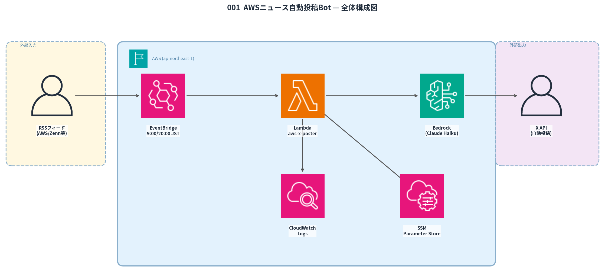

# 001 AWS News Auto-Poster

> AWS最新ニュースを4ソースのRSSから収集し、Bedrock Claude で @Zer0_Infra の口調に変換してXへ毎日2回自動投稿するサーバーレスBot。3段階の重複フィルタで品質を担保。

[](https://aws.amazon.com)
[](https://python.org)
[](https://aws.amazon.com/pricing)

## 概要

| 項目       | 内容                                                      |
| ---------- | --------------------------------------------------------- |
| 投稿頻度   | 毎日 9:00 JST（朝）・20:00 JST（夜）の計2回               |
| 情報ソース | AWS公式ブログ / クラスメソッド / Zenn / Qiita（4ソース）  |
| 取得期間   | 過去14日以内の記事のみ                                    |
| 重複排除   | URL完全一致 → キーワード → AWSサービス名の3段階           |
| AI変換     | Amazon Bedrock Claude Haiku（口調変換・ハッシュタグ生成） |
| IaC        | CloudFormation（全リソース管理）                          |
| 月額コスト | ~$1.2（約180円）                                          |

## アーキテクチャ



```text
EventBridge Scheduler（9:00 / 20:00 JST）
  └─▶ Lambda（Python 3.14）
        ├─ RSS/Atom 取得（AWS公式・Classmethod・Zenn・Qiita）
        ├─ 14日フィルタ + 3段階重複排除
        ├─ Bedrock Claude Haiku（口調変換・ハッシュタグ生成）
        ├─ SSM Parameter Store（投稿済み URL 記録）
        └─ X API v2（POST）
```

## 技術スタック

| レイヤー         | 技術                                                                                 |
| ---------------- | ------------------------------------------------------------------------------------ |
| 実行基盤         | AWS Lambda（Python 3.14 / 256MB / 120秒）                                            |
| スケジューリング | Amazon EventBridge Scheduler（JST タイムゾーン対応）                                 |
| AI変換           | Amazon Bedrock **Claude Haiku 4.5**（`jp.anthropic.claude-haiku-4-5-20251001-v1:0`） |
| 状態管理         | AWS Systems Manager Parameter Store                                                  |
| 投稿先           | X（旧Twitter）API v2                                                                 |
| IaC              | AWS CloudFormation                                                                   |

## 実装のこだわり

### 1. Qiita の Atom 形式対応

Qiita は RSS ではなく Atom 形式でフィードを配信する。RSS パーサーのみ実装していたため記事が0件になる障害が発生。Atom 名前空間（`{http://www.w3.org/2005/Atom}`）を個別処理するパーサーを追加して解決。フォーマット違いを吸収する設計にしたことで、今後ソース追加時も対応しやすい構造を実現。

### 2. 3段階の重複排除ロジック

単純な URL 一致だと「別 URL の同内容記事」を投稿してしまうケースがあった。

- **第1段階**: 投稿済み URL 完全一致チェック（SSM 保存）
- **第2段階**: タイトルキーワード類似度チェック
- **第3段階**: AWS サービス名抽出 + 直近投稿との重複チェック

### 3. 時間帯別プロンプト設計

朝（9:00）は「情報提供型」、夜（20:00）は「振り返り・考察型」でプロンプトを切り替え。同じ記事でも読み手の文脈に合ったコンテンツを生成。

### 4. IAM 最小権限設計

`AmazonBedrockFullAccess` から特定モデル ARN のみ許可するカスタムポリシーに変更。SSM も `/xposter/*` パスのみ読み取り許可に絞り込み、最小権限の原則を実装。

## ディレクトリ構成

```text
001_aws-x-poster/
├── src/
│   ├── lambda_function.py   # メインロジック
│   └── deploy.sh            # デプロイスクリプト
├── cloudformation-aws-x-poster.yaml
└── images/
    └── 001_architecture.png
```

## デプロイ

```bash
# 初回（CloudFormation + Lambda コード）
bash src/deploy.sh --full

# コードのみ更新
bash src/deploy.sh

# DRY_RUN テスト（実投稿なし）
FORCE_SLOT=morning bash src/deploy.sh --test
```

## 運用コマンド

```bash
# 最新ログ確認
aws logs tail /aws/lambda/aws-x-poster --follow --region ap-northeast-1

# EventBridge 一時停止
aws events disable-rule --name aws-x-poster-morning --region ap-northeast-1
aws events disable-rule --name aws-x-poster-evening --region ap-northeast-1
```

## コスト内訳

| サービス                               | 月額                 |
| -------------------------------------- | -------------------- |
| Lambda 実行（60回/月 × ~3秒）          | ~$0.001              |
| Bedrock Claude Haiku（~500 tokens/回） | ~$1.2                |
| EventBridge・SSM                       | ~$0                  |
| **合計**                               | **~$1.2（約180円）** |

## トラブルシューティング

| 症状           | 原因                          | 対処                                   |
| -------------- | ----------------------------- | -------------------------------------- |
| 投稿が0件      | RSS/Atom フィード取得失敗     | CloudWatch Logs で HTTP ステータス確認 |
| 重複投稿       | SSM パラメータ破損            | `/xposter/posted_urls` を手動クリア    |
| Bedrock エラー | IAM 権限不足                  | カスタムポリシーのモデル ARN を確認    |
| X API 403      | レート制限                    | 15分後に再実行                         |
| Qiita 記事0件  | Atom パーサー未対応の旧コード | `parse_atom()` 関数の有無を確認        |
