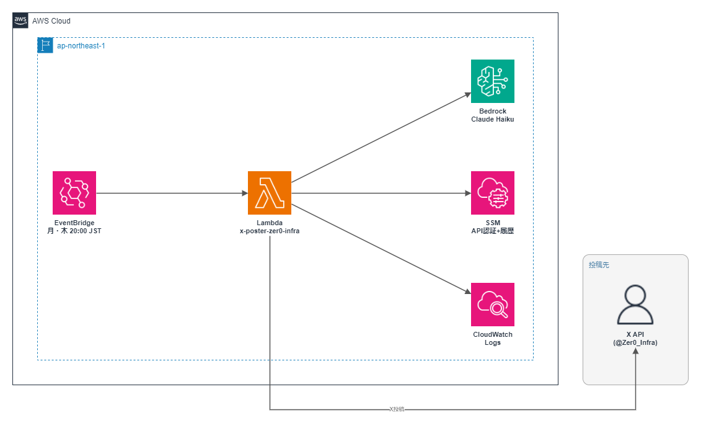

# 001 X Poster Bot (@Zer0_Infra)

> AWS最新ニュースを5ソースのRSSから収集し、Bedrock Claude で @Zer0_Infra の口調に変換してXへ毎週月・木20時に自動投稿するサーバーレスBot。3段階の重複フィルタで品質を担保。

[](https://aws.amazon.com)
[](https://python.org)
[](https://aws.amazon.com/pricing)

## 概要

| 項目       | 内容                                                                    |
| ---------- | ----------------------------------------------------------------------- |
| 投稿頻度   | 毎週月・木 20:00 JST（夜）の週2回                                       |
| 情報ソース | AWS公式ニュース / AWSブログ / クラスメソッド / Zenn / Qiita（5ソース）  |
| 取得期間   | 過去14日以内の記事のみ                                                  |
| 重複排除   | URL完全一致 → キーワード → AWSサービス名の3段階                         |
| AI変換     | Amazon Bedrock Claude Haiku（①口調変換 → ②記事本文との事実検証の2段階） |
| IaC        | CloudFormation（全リソース管理）                                        |
| 月額コスト | ~$0.7（約105円）                                                        |

## アーキテクチャ



```text
EventBridge ルール（月・木 20:00 JST）
  └─▶ Lambda（Python 3.14）
        ├─ RSS/Atom 取得（AWS公式ニュース・AWSブログ・Classmethod・Zenn・Qiita）
        ├─ 14日フィルタ + 3段階重複排除
        ├─ メイン記事本文の取得（事実確認用グラウンディング）
        ├─ Bedrock Claude Haiku ①投稿文生成 → ②事実検証（2段階呼び出し）
        ├─ SSM Parameter Store（投稿済み URL 記録）
        └─ X API v2（本文投稿 → 記事URLをリプライにぶら下げ / スレッド連投）
```

## 技術スタック

| レイヤー         | 技術                                                                                 |
| ---------------- | ------------------------------------------------------------------------------------ |
| 実行基盤         | AWS Lambda（Python 3.14 / 256MB / 120秒）                                            |
| スケジューリング | Amazon EventBridge ルール（UTC cron、JST 換算）                                      |
| AI変換           | Amazon Bedrock **Claude Haiku 4.5**（`jp.anthropic.claude-haiku-4-5-20251001-v1:0`） |
| 状態管理         | AWS Systems Manager Parameter Store                                                  |
| 投稿先           | X（旧Twitter）API v2                                                                 |
| IaC              | AWS CloudFormation                                                                   |

## 実装のこだわり

### 1. Qiita の Atom 形式対応

Qiita は RSS ではなく Atom 形式でフィードを配信する。RSS パーサーのみ実装していたため記事が0件になる障害が発生。Atom 名前空間（`{http://www.w3.org/2005/Atom}`）を個別処理するパーサーを追加して解決。フォーマット違いを吸収する設計にしたことで、今後ソース追加時も対応しやすい構造を実現。

### 2. 3段階の重複排除ロジック

単純な URL 一致だと「別 URL の同内容記事」を投稿してしまうケースがあった。

- **第1段階**: 投稿済み URL 完全一致チェック（SSM 保存）
- **第2段階**: タイトルキーワード類似度チェック
- **第3段階**: AWS サービス名抽出 + 直近投稿との重複チェック

### 3. IAM 最小権限設計

`AmazonBedrockFullAccess` から特定モデル ARN のみ許可するカスタムポリシーに変更。SSM も `/xposter/*` パスのみ読み取り許可に絞り込み、最小権限の原則を実装。

### 4. 投稿前の事実検証（2段階 Bedrock 呼び出し）

RSS の概要150文字だけを根拠に生成すると、対応リージョン・料金・制限値などをモデルが推測で補ってしまうリスクがある。対策として、

- **グラウンディング**: メイン記事ページの本文（最大2,500文字）を取得してプロンプトに渡し、「記事に書いてあることだけを事実として使う」ルールを徹底
- **事実検証パス**: 生成された投稿を記事本文と突き合わせる2回目の Bedrock 呼び出しで検証。根拠のない事実主張は削除または感想・疑問形に書き換えてから投稿（出力はプリフィル + JSON 形式で本文のみを確実に抽出）

### 5. リーチ最適化（万垢運用の定石を反映）

- **URLはリプライにぶら下げ**: Xのアルゴリズムは外部リンク入り投稿のリーチを抑制するため、本文にはURLを入れず投稿直後にリプライとして付ける
- **ハッシュタグは最大1個・約35%はタグなし**: Xではタグの流入効果が薄く、毎回複数タグはBot感・スパム感のシグナルになるため
- **スレッド形式のTips投稿（thread_tips）**: 「〜で詰まった話🧵」のようなフック＋実用ポイントの連投。保存・フォロー転換率が高い形式を投稿タイプローテーションに追加

### 6. 人間味のランダム化

毎回同じ長さ・同じ「問いかけ締め」になる AI っぽさを消すため、投稿ごとに「目安文字数」と「締め方（問いかけ/共感/感想/余韻の4パターン）」をコード側で抽選してプロンプトに注入。同義ハッシュタグ（`#Bedrock` と `#AmazonBedrock` 等）の重複排除も実装。

## ディレクトリ構成

```text
001_x-poster_zer0-infra/
├── src/
│   ├── lambda_function.py          # メインロジック
│   ├── cfn-x-poster-zer0-infra.yaml
│   └── deploy.sh                   # デプロイスクリプト
└── images/
    └── 001_architecture.png
```

## デプロイ

```bash
# 初回（CloudFormation + Lambda コード）
bash src/deploy.sh --full

# コードのみ更新
bash src/deploy.sh

# DRY_RUN テスト（実投稿なし）
bash src/deploy.sh --test
```

## 運用コマンド

```bash
# 最新ログ確認
aws logs tail /aws/lambda/x-poster-zer0-infra --follow --region ap-northeast-1

# EventBridge 一時停止・再開
aws events disable-rule --name x-poster-zer0-infra-evening --region ap-northeast-1
aws events enable-rule  --name x-poster-zer0-infra-evening --region ap-northeast-1

# 投稿履歴リセット（重複投稿が起きた場合）
aws ssm delete-parameter --name "/xposter/posted-history" --region ap-northeast-1
```

## ロールバック

```bash
# デプロイ済みバージョン一覧確認
aws lambda list-versions-by-function --function-name x-poster-zer0-infra \
  --region ap-northeast-1 --query "Versions[-5:].[Version,LastModified]" --output table

# 前バージョンに戻す（GitHub から該当コミットを checkout → 再デプロイ）
bash src/deploy.sh
```

## コスト内訳

| サービス                                   | 月額                 |
| ------------------------------------------ | -------------------- |
| Lambda 実行（30回/月 × ~3秒）              | ~$0.001              |
| Bedrock Claude Haiku（生成+検証 2回/投稿） | ~$0.05               |
| X API（$0.02/件 × 30件/月）                | ~$0.60               |
| EventBridge・SSM                           | ~$0                  |
| **合計**                                   | **~$0.7（約105円）** |

## トラブルシューティング

| 症状           | 原因                          | 対処                                   |
| -------------- | ----------------------------- | -------------------------------------- |
| 投稿が0件      | RSS/Atom フィード取得失敗     | CloudWatch Logs で HTTP ステータス確認 |
| 重複投稿       | SSM パラメータ破損            | `/xposter/posted-history` を手動クリア |
| Bedrock エラー | IAM 権限不足                  | カスタムポリシーのモデル ARN を確認    |
| X API 403      | レート制限                    | 15分後に再実行                         |
| Qiita 記事0件  | Atom パーサー未対応の旧コード | `parse_atom()` 関数の有無を確認        |

## 変更履歴

| 日付       | バージョン | 内容                                                                                                                                                                                                                                                                                                         |
| ---------- | ---------- | ------------------------------------------------------------------------------------------------------------------------------------------------------------------------------------------------------------------------------------------------------------------------------------------------------------ |
| 2026-07-04 | v2.3       | **Fableブラッシュアップ②**: 純関数群（加重文字数・clamp・投稿タイプ選択等）にpytest24件を新設。deploy.shの依存インストールをrequirements.txt（バージョン固定）参照に変更し再現性を担保                                                                                                                        |
| 2026-07-04 | v2.4       | **Fableブラッシュアップ③④**: 投稿タイプ別の効果測定用ログ（直近30件）を履歴に追加。全RSSフィード同時取得不能時に記事なしでAWS Tipsを投稿するフォールバックを追加（欠投防止）                                                                                                                                |
| 2026-07-04 | v2.5       | **Fableブラッシュアップ⑤**: スレッド投稿末尾のURL付加で実URL長を差し引いていたバグ修正。XはURLを実際の長さに関わらず一律weighted23として数えるため、本文が必要以上に短く切られていた                                                                                                                       |

全履歴は [CHANGELOG.md](./CHANGELOG.md) を参照してください。
