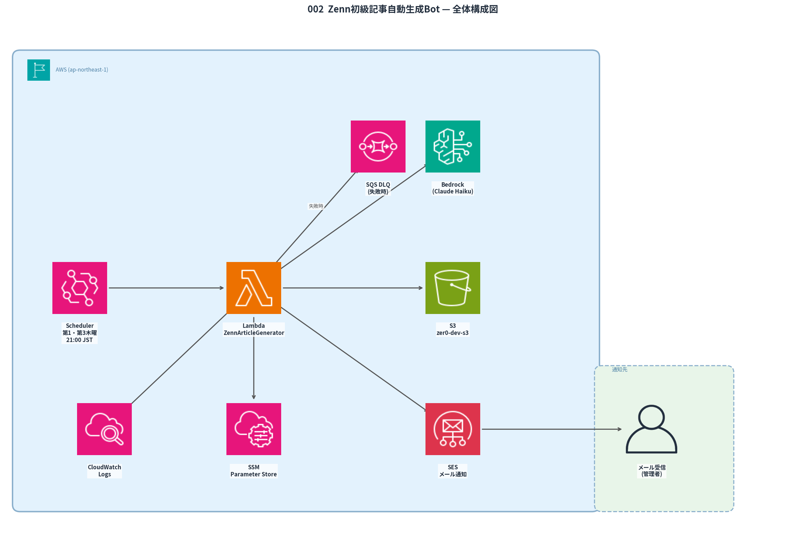

# 002_Zenn_Auto_Article_Bot — Zenn技術記事自動生成ボット

AWSとBedrockで構築したZenn技術記事の自動生成システム。  
毎週木曜21時（JST）にBedrockがAWSトピックをランダム選択し、3,000〜5,000文字の記事と構成図PNG×2枚を生成する。  
SSM Parameter Storeで直近5件のトピックを管理し、同じテーマの連続投稿を防止する。

## フォルダ構成

```text
002_Zenn_Auto_Article_Bot/
├── README.md              # このファイル
├── build_layer.sh         # matplotlib Lambda Layer をビルド&アップロードするスクリプト
├── download_article.sh    # S3からoutput/にダウンロードするスクリプト
├── src/                   # 実装コード
│   ├── aws_icons/         # AWS公式アイコンPNG（38枚、Lambda関数コードに同梱）
│   └── ...
├── output/                # 生成された記事・画像の出力先
├── logs/                  # download_article.sh の実行ログ
└── article/               # このボットを紹介するZenn記事
```

### src/

| ファイル               | 役割                                                                           |
| ---------------------- | ------------------------------------------------------------------------------ |
| `lambda_function.py`   | メイン処理（トピック選択・SSM重複除外・記事生成・S3保存・メール通知）          |
| `diagram_generator.py` | 22トピック × 2枚（計44パターン）のAWSアーキテクチャ図をPNG生成                 |
| `template.yaml`        | SAMテンプレート（Lambda・EventBridge・IAMロール・Lambda Layer）                |
| `deploy.sh`            | SAMビルド〜デプロイ〜動作確認手順のスクリプト                                  |
| `requirements.txt`     | Pythonパッケージ（`matplotlib>=3.8.0`）                                        |
| `aws_icons/`           | AWS公式アイコンPNG 38枚（AWS公式アーキテクチャアイコンパッケージ 2026年1月版） |

### output/

S3からダウンロードした記事が `YYYYMMDD_HHMMSS_{トピックID}` の命名規則で保存される。

```text
output/
├── 001_20260403_233457_sqs/
│   ├── 20260403_233457_sqs.md          # 記事本文（Zenn Markdown、frontmatter付き）
│   └── images/
│       ├── 20260403_233457_sqs_diagram_1.png   # 構成図①（はじめに直後・よく使われる構成）
│       └── 20260403_233457_sqs_diagram_2.png   # 構成図②（ハンズオン冒頭・構築する構成）
├── 002_20260410_210000_ec2/
│   ├── 20260410_210000_ec2.md
│   └── images/
│       └── ...
└── ...
```

記事ごとに `NNN_YYYYMMDD_HHMMSS_トピックID/` フォルダが作成される。連番はローカルの既存フォルダ数から自動採番。

### article/

このボットの構築過程を解説したZenn掲載用の記事一式。

```text
article/
├── note_bot_article.md       # 「作った話」Zenn記事本文
└── images/
    └── （Zenn記事用画像）
```

## システム構成



| サービス                       | 役割                                                      |
| ------------------------------ | --------------------------------------------------------- |
| EventBridge                    | 毎週木曜21時（UTC 12時）に起動                            |
| Lambda                         | メイン処理（Python 3.14、タイムアウト15分、256MB）        |
| Bedrock（Claude Haiku 4.5 JP） | 記事生成・トピックランダム選択                            |
| SSM Parameter Store            | 直近5件のトピックIDを保存し、同一トピックの連続投稿を防止 |
| S3（zer0-dev-s3）              | 生成記事・PNG画像の一時保存（`zenn-articles/`）           |
| SES                            | 完了メール通知（S3保存先URL・次のアクション記載）         |
| Lambda Layer（matplotlib）     | matplotlib + numpy + pillow（`matplotlib_layer.zip`）     |

## 自動化フロー

```
木曜21:00 JST  EventBridge → Lambda自動実行
                    ↓ SSMから直近5トピックを取得（除外リスト）
                    ↓ Bedrockでトピック選択（除外リスト以外から）
                    ↓ SSMに選択トピックを保存
                    ↓ Bedrockで記事生成（3,000〜5,000文字）
                    ↓ matplotlib でPNG×2枚生成（AWS公式アイコン使用）
                    ↓ {DIAGRAM_N}マーカーを画像プレースホルダーに置換（はじめに直後・ハンズオン冒頭）
                    ↓ S3に保存（zer0-dev-s3/zenn-articles/...）
                    ↓ SESメール送信（S3保存先URL・手順記載）
```

> **ダウンロードはメール受信後に手動で実行する。**  
> S3に保存されているため、いつ実行しても記事・画像は消えない。

## 対応トピック（22種類）

**基本サービス（12）:** EC2 / S3 / IAM / VPC / RDS / Lambda / CloudWatch / ECS / DynamoDB / CloudFront / API Gateway / SQS

**AI / ML（4）:** Bedrock / SageMaker / Rekognition / Textract

**その他主要サービス（6）:** Step Functions / SNS / ElastiCache / Route 53 / Kinesis / CloudTrail

各トピックにつき構成図を**2枚**生成（合計44パターン）。

| トピック        | 図①                                    | 図②                                |
| --------------- | -------------------------------------- | ---------------------------------- |
| EC2             | ALB + EC2×2 + RDS                      | CloudWatch + Auto Scaling          |
| S3              | S3 → CloudFront 配信                   | S3 イベント → Lambda → DynamoDB    |
| IAM             | ユーザー / ロール構成                  | EC2 インスタンスプロファイル       |
| VPC             | パブリック/プライベートサブネット      | NAT Gateway アウトバウンド         |
| RDS             | Multi-AZ（AZ-a/b）                     | Read Replica（読み取り分離）       |
| Lambda          | EventBridge → Lambda → DDB/S3          | SQS トリガー → Lambda → DDB        |
| CloudWatch      | メトリクス監視 + SNS 通知              | Alarm + EventBridge 自動修復       |
| ECS             | ALB + Fargate + RDS                    | CloudWatch + Auto Scaling          |
| DynamoDB        | Streams + Lambda トリガー              | DAX インメモリキャッシュ           |
| CloudFront      | S3 + ALB オリジン                      | WAF 統合                           |
| API Gateway     | Lambda + DynamoDB                      | Cognito 認証統合                   |
| SQS             | Producer / Consumer                    | デッドレターキュー（DLQ）          |
| **Bedrock**     | API GW + Lambda → Claude               | Knowledge Base（RAG構成）          |
| **SageMaker**   | Training Job → S3 → Endpoint           | API GW 経由の推論API公開           |
| **Rekognition** | S3 + Lambda 画像解析パイプライン       | API GW リアルタイム顔認証          |
| **Textract**    | S3 非同期文書解析 → DynamoDB           | Textract + Comprehend テキスト解析 |
| **Step Func**   | Lambda 順次実行ワークフロー            | Retry/Catch エラーハンドリング     |
| **SNS**         | Pub/Sub ファンアウト                   | CloudWatch Alarm → メール + Lambda |
| **ElastiCache** | Lambda + Redis + RDS キャッシュ        | ALB + EC2 セッション共有           |
| **Route 53**    | フェイルオーバールーティング           | CloudFront + S3/ALB エイリアス     |
| **Kinesis**     | Data Streams + Lambda リアルタイム処理 | Firehose + S3 + Athena 分析        |
| **CloudTrail**  | 操作ログ S3保存 + CloudWatch Logs      | EventBridge セキュリティ自動対応   |

## 生成記事のフォーマット（Zenn Markdown）

ZennはMarkdownテーブル・`:::message`・`:::details`・コードブロックのファイル名指定に対応しており、これらを積極活用したプロンプトになっている。

```markdown
# テーブル（料金比較など）
| プラン | 料金 |
| ------ | ---- |
| 標準キュー | $0.40/100万 |

# メッセージボックス
:::message
重要ポイント
:::

:::message alert
コスト・セキュリティの注意
:::

# アコーディオン
:::details 応用設定
補足内容
:::
```

生成されたMDファイルはZenn YAML frontmatter付きで出力される。

```yaml
---
title: "Amazon SQS：メッセージキューで疎結合アーキテクチャを実現するガイド"
emoji: "📬"
type: "tech"
topics: ["aws", "sqs", "メッセージキュー", "クラウド"]
published: false
---
```

## MDファイルの画像挿入について

Bedrockが記事中に `{DIAGRAM_1}` / `{DIAGRAM_2}` マーカーを書き、Pythonがそのマーカーを画像プレースホルダーに置換する（マーカーなしの場合は見出し名でフォールバック挿入）。

| 図  | 挿入位置             | キャプション                                |
| --- | -------------------- | ------------------------------------------- |
| 図① | `## はじめに` 直後   | `{サービス名} – よく使われる全体構成図`     |
| 図② | `## ハンズオン` 冒頭 | `{サービス名} – ハンズオンで構築する構成図` |

**ローカルでは `./images/ファイル名` の相対パスで画像がそのまま表示される。**  
Zenn投稿時は `:::message` の指示に従い、Zenn CDN URLに差し替える。

```markdown
:::message
📷 **【Zenn投稿時】** `20260403_233457_sqs_diagram_1.png` をZennエディタでアップロードし、下の画像パスをZenn CDN URLに置き換えてください。
:::


*Amazon SQS – よく使われる全体構成図*
```

## AWSサービス名の最新化

プロンプトに以下のルールを組み込み済み。

- 記事内では**現在の正式名称**を使用する
- 改名があった場合は「○○とは？」冒頭に `:::message` で旧称→新称テーブルを挿入する
- コードブロック内のサンプル日付は**Lambda実行日（JST）を自動注入**する（`2024`等の過去年は出力されない）

### 主な改名済みサービス（対応トピック内）

| 現在の正式名称                          | 旧称                   | 改名時期   |
| --------------------------------------- | ---------------------- | ---------- |
| Amazon SageMaker AI                     | Amazon SageMaker       | 2024年11月 |
| Amazon Data Firehose                    | Kinesis Data Firehose  | 2024年     |
| Amazon Managed Service for Apache Flink | Kinesis Data Analytics | 2023年     |

## SSM トピック重複除外

`/note-article-bot/recent-topics` に直近5件のトピックIDをJSON配列で保存。

```
1回目実行: ["sqs"]
2回目実行: ["sqs", "ec2"]
...
6回目実行: ["ec2", "s3", "iam", "rds", "lambda"]  ← sqs が解禁
```

手動でリセットする場合:

```bash
aws ssm delete-parameter --name "/note-article-bot/recent-topics" --region ap-northeast-1
```

## ユニットテスト

```bash
cd ~/Zer0/002_Zenn_Auto_Article_Bot/src
python3 -m pytest tests/ -v
```

テスト内容（4件）: プロンプトformat / SSM読み込み（空・有・不正JSON） / モデル切替

## ローカル実行（手動生成）

```bash
cd ~/Zer0/002_Zenn_Auto_Article_Bot/src
export SES_SENDER_EMAIL=your@gmail.com
export SES_RECIPIENT_EMAIL=your@gmail.com
python3 lambda_function.py
```

生成物は `output/` に保存される。

## S3からの手動ダウンロード

```bash
bash ~/Zer0/002_Zenn_Auto_Article_Bot/download_article.sh
```

- S3の `zenn-articles/` 以下を全て `output/` にダウンロード
- ダウンロード完了後、S3オブジェクトを自動削除

## デプロイ

```bash
cd ~/Zer0/002_Zenn_Auto_Article_Bot

# [1] matplotlibレイヤーをビルド&アップロード（初回またはrequirements.txt変更時のみ）
bash build_layer.sh

# [2] SAMでLambdaをデプロイ
cd src
export SENDER_EMAIL=your@gmail.com
export RECIPIENT_EMAIL=your@gmail.com
./deploy.sh
```

### Lambda Layer の構成

```
matplotlib_layer.zip
└── python/
    ├── matplotlib/
    ├── numpy/
    └── PIL/（pillow）
```

> `aws_icons/` は関数コードZIPに同梱されるため、Layerには含まない。

## 技術スタック

| 項目           | 内容                                                          |
| -------------- | ------------------------------------------------------------- |
| 構成図描画     | matplotlib + AWS公式アイコンPNG（公式パッケージ 2026年1月版） |
| 依存排除       | Graphviz・diagrams ライブラリへの依存ゼロ                     |
| Lambda互換     | `matplotlib.use('Agg')` でGUIバックエンドを無効化             |
| 日本語フォント | Noto Sans CJK JP を優先使用、なければデフォルト               |
