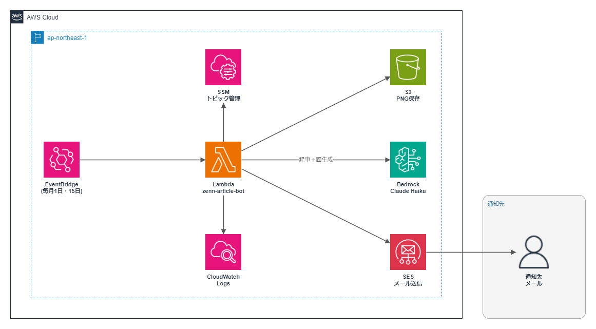

# 002 Zenn Article Bot（初級）

> AWS初学者向け技術記事を毎月2回、Bedrock Claude で 2,000〜3,500文字自動生成し、matplotlib + AWS公式アイコンでアーキテクチャ図PNG×2枚を同時生成してS3に保存するシステム。

[](https://aws.amazon.com)
[](https://python.org)
[](https://zenn.dev/zer0_infra)
[](https://aws.amazon.com/pricing)

## 概要

| 項目           | 内容                                                      |
| -------------- | --------------------------------------------------------- |
| 生成頻度       | 毎月第1・第3木曜 21:00 JST                                |
| 対応トピック   | 28種類のAWSサービス（EC2/S3/Lambda/RDS 等22種 + サービス特化サブトピック6種） |
| 記事ボリューム | 2,000〜3,500文字 + Zenn Markdown 完全対応                 |
| 切り口         | コスト/セキュリティ/連携/つまずきポイントの4種からランダム選択（同トピック2周目以降の重複緩和） |
| 生成画像       | アーキテクチャ図 PNG × 2枚（AWS公式アイコン使用、記事本文とプロンプトレベルで整合） |
| 重複防止       | SSM でトピック直近20件・切り口直近3件を記録、連続生成を防止 |
| 出力先         | Amazon S3（`zer0-dev-s3/zenn-articles/`）+ SES メール通知 |
| 月額コスト     | ~$0.16（約24円）                                          |

## アーキテクチャ



```text
EventBridge Scheduler（第1・第3木曜 21:00 JST）
  └─▶ Lambda（Python 3.14 / 256MB / 900秒）
        ├─ SSM からトピック履歴（直近20件）・切り口履歴（直近3件）取得 → ランダム選択
        ├─ diagram_generator.py（記事生成より先に実行）
        │   ├─ matplotlib + AWS公式アイコン（64px PNG）
        │   └─ PNG 生成 × 2枚（メイン構成図 + 詳細図）+ 各図のタイトルを取得
        ├─ Bedrock Claude Haiku（切り口・図の内容をプロンプトに注入して記事本文生成 ~8,000 tokens出力）
        ├─ 記事品質チェック（文字数・Zenn記法対応・CLIコマンド体裁・構成図枚数）
        ├─ S3 PUT（MD + PNG × 2）※ dry_run時はスキップ
        ├─ SSM PUT（トピック・切り口履歴更新）※ dry_run時はスキップ
        └─ SES（生成完了メール通知：タイトル・見出し一覧・コスト概算等を含む）※ dry_run時はスキップ
```

## 技術スタック

| レイヤー     | 技術                                                                                                     |
| ------------ | -------------------------------------------------------------------------------------------------------- |
| 実行基盤     | AWS Lambda（Python 3.14 / 256MB / 900秒）                                                                |
| AI生成       | Amazon Bedrock **Claude Haiku 4.5**（`jp.anthropic.claude-haiku-4-5-20251001-v1:0` / max_tokens: 8,192） |
| 図生成       | matplotlib（Graphviz・diagrams 依存ゼロ）                                                                |
| アイコン     | AWS公式アイコン 64px PNG（Lambda Layer に同梱）                                                          |
| 状態管理     | SSM Parameter Store（トピック履歴 + 記事カウンター）                                                     |
| ストレージ   | Amazon S3（ライフサイクル90日自動削除設定済み）                                                          |
| 通知         | Amazon SES                                                                                               |
| IaC          | CloudFormation                                                                                           |
| Lambda Layer | matplotlib / numpy / Pillow（50MB 以内 / 直接アップロード）                                              |

## 実装のこだわり

### 1. Lambda 環境での図生成（Graphviz 不使用）

`diagrams` や `graphviz` はシステムバイナリが必要なため Lambda では動作しない。**matplotlib のみで AWS公式アイコンを配置・矢印描画するカスタムエンジン**（`diagram_generator.py`）を自前実装。ノード間の矢印衝突回避・クラスター枠の自動パディング調整・日本語フォントの動的ロードまで独自で実装している。

### 2. Zenn Markdown 完全対応

単純な Markdown ではなく、Zenn 独自の記法（`:::message`・`:::details`・コードタイトル付きブロック）をプロンプトに組み込み。Few-shot で出力フォーマットを固定し、Bedrock がフォーマット違反を起こさないよう制御。

### 3. AWSサービス名の最新化

古い名称（例: `SageMaker` → `SageMaker AI`）の対応表をプロンプトに埋め込み、Bedrock に生成時点で最新の正式名称を使うよう指示。学習データが古くても記事内では公式名称での出力を促す。

### 4. `output/` 自動クリーンアップ

記事保存のたびに `_cleanup_old_articles()` が実行され、最新5件（`OUTPUT_KEEP_MAX=5`）を超えた古いフォルダを自動削除。ローカル容量の肥大化を防ぎ、S3 側も90日ライフサイクルで自動削除。

### 5. 構成図とハンズオン本文の整合性

以前は構成図（`diagram_generator.py`が固定生成）と記事本文（Bedrockが自由生成）が独立していたため、図とハンズオン手順の構成が食い違うことがあった。構成図を先に生成してタイトルを取得し、記事生成プロンプトに「図1/図2はこの構成を示す」と注入することで、本文の該当箇所を図と一致させている。

### 6. トピック選定はrandom.choice（Bedrock不使用）

以前はBedrockにトピックをランダム選択させていたが、LLMのランダム選択は先頭・有名サービスに偏りやすく、フォールバックも常に`random.choice`だったため実質的な効果がなかった。Bedrock呼び出し1回分のコスト・レイテンシ・障害点を削減するため`random.choice`に統一（重複除外ロジックは維持）。

## 対応トピック（28種）

| カテゴリ               | トピック                              |
| ---------------------- | ------------------------------------- |
| コンピューティング     | EC2、Lambda、ECS                      |
| ストレージ             | S3、EBS（EC2連携含む）                |
| データベース           | RDS、DynamoDB、ElastiCache            |
| ネットワーク           | VPC、CloudFront、Route53、API Gateway |
| セキュリティ           | IAM                                   |
| メッセージング         | SQS、SNS、Kinesis、Step Functions     |
| 運用監視               | CloudWatch（Logs Insights含む）、CloudTrail |
| AI/ML                  | Bedrock、SageMaker AI、Rekognition、Textract |
| サービス特化サブトピック | EC2×SSM、EC2×EBS、Lambda Layers、S3ライフサイクル、VPCエンドポイント、CloudWatch Logs Insights |

## ディレクトリ構成

```text
002_Zenn_Auto_Article_Bot/
├── src/
│   ├── lambda_function.py    # メインロジック
│   ├── diagram_generator.py  # matplotlib 図生成エンジン
│   ├── deploy.sh             # デプロイスクリプト
│   └── tests/
│       └── test_lambda.py    # ユニットテスト（14件）
├── scripts/
│   ├── build_layer.sh        # Lambda Layer ビルド
│   └── download_article.sh   # S3 から生成記事をローカルに取得
├── cfn-article-generator.yaml
└── images/
    └── 002_architecture.png
```

> **Note**: `src/fonts/NotoSansCJK-Regular.ttc`（図解PNGの日本語描画用フォント、約19MB）はファイルサイズの都合上このリポジトリには含まれていません。ローカルでデプロイする場合は [Noto Sans CJK](https://github.com/notofonts/noto-cjk) から取得し `src/fonts/` に配置してください。

## デプロイ

```bash
# 初回デプロイ（CloudFormation + Lambda）
SENDER_EMAIL=your@email.com RECIPIENT_EMAIL=your@email.com ./src/deploy.sh

# Layer も更新する場合
DEPLOY_LAYER=1 SENDER_EMAIL=your@email.com RECIPIENT_EMAIL=your@email.com ./src/deploy.sh
```

## テスト / 動作確認

```bash
# ユニットテスト（14件）
cd src && python -m pytest tests/ -v

# Lambda 手動実行（dry_run: S3保存・SES送信・SSM書き込みをスキップし記事生成のみプレビュー）
aws lambda invoke --function-name ZennArticleGenerator \
  --payload '{"dry_run": true}' --cli-binary-format raw-in-base64-out \
  /tmp/out.json --region ap-northeast-1
aws logs tail /aws/lambda/ZennArticleGenerator --region ap-northeast-1 --since 5m

# S3 から生成記事をローカルに取得
bash scripts/download_article.sh
```

## コスト内訳

| サービス                                 | 月額                 |
| ---------------------------------------- | -------------------- |
| Lambda 実行（2回/月 × ~90秒 × 256MB）    | ~$0.001              |
| Bedrock Claude Haiku（~8,000 tokens/回） | ~$0.12               |
| S3 ストレージ・PUT                       | ~$0.01               |
| SES 送信（2通/月）                       | ~$0                  |
| **合計**                                 | **~$0.16（約24円）** |

## 変更履歴

| 日付       | バージョン | 内容                                                                                                                                                                                                                                                                    |
| ---------- | ---------- | ----------------------------------------------------------------------------------------------------------------------------------------------------------------------------------------------------------------------------------------------------------------------- |
| 2026-04-01 | v1         | 初版リリース                                                                                                                                                                                                                                                            |
| 2026-04-10 | v1.1       | matplotlib アーキテクチャ図自動生成追加                                                                                                                                                                                                                                 |
| 2026-04-20 | v1.2       | `{DIAGRAM_N}` マーカー方式導入                                                                                                                                                                                                                                          |
| 2026-04-28 | v1.3       | AWS公式ドキュメント自動取得（Step 2.5）追加                                                                                                                                                                                                                             |
| 2026-05-05 | v1.4       | DLQ + CloudWatch Alarm によるアラート体制整備                                                                                                                                                                                                                           |
| 2026-05-21 | v1.5       | `output/` 自動クリーンアップ（最新5件保持）追加                                                                                                                                                                                                                         |
| 2026-06-01 | v1.6       | CFn `validate_template` 検証機能追加・バグ修正5件（重複トピック・TemplateBody上限・HTMLエスケープ・CFn例外取得・マーカー自動除去）・処理時間計測・Bedrockコスト概算ログ追加                                                                                             |
| 2026-06-15 | v1.7       | コードレビューによるバグ修正3件（PNG未生成時のマーカー除去が正規表現の波括弧不一致で機能していなかった不具合・見出しなし記事でのフォールバック `IndexError`・記事番号カウンターSSMの値破損/書込失敗ガード）・構成図クラスター枠を実線へ統一・回帰テスト3件追加          |
| 2026-06-16 | v1.8       | 記事内構築手順をCFnテンプレート→AWS CLI中心に変更。プロンプト改修（AWS CLIコマンド変数化・コード例更新）・CFnバリデーション廃止→CLIコマンド存在チェックに置換・`cfn` Lambdaクライアント削除                                                                             |
| 2026-06-16 | v1.9       | コードレビュー反映：`cloudformation:ValidateTemplate` IAM権限を削除（CLAUDE.md step5対応・CFnスタック再デプロイ済み）                                                                                                                                                   |
| 2026-06-18 | v2.0       | サブトピック追加（ec2_ssm / ec2_ebs / lambda_layers / s3_lifecycle / vpc_endpoint / cloudwatch_insights）・トピック重複除外数を5→28（全トピック数）に拡大・記事生成モデルをHaiku→Opus 4.8に変更・動的タイトル生成（`TITLE:` 行をBedrockが出力→フロントマターに反映）    |
| 2026-06-27 | v2.1       | IAM最小権限化（コードレビュー反映）：未使用の `ses:SendRawEmail`・本番未使用の Opus モデル ARN・未使用の `aws-marketplace` Statement を削除し、Bedrock 権限を実使用の Haiku のみに限定。テンプレート Description の "Claude Opus" 誤記を修正。CFnスタック再デプロイ済み |
| 2026-07-01 | v2.2       | diagram_generator.py：`try/finally` で `plt.close(fig)` を保証（figure リーク防止）・`plt.tight_layout()` 削除。lambda_function.py：孤立 `{DIAGRAM_N}` マーカークリーンアップ追加。005 のコードレビュー結果を 002 にも反映                                              |
| 2026-07-03 | v2.3       | **第2巡Fableレビュー HIGH2件修正**: Bedrock IAM ARNを2リージョン明示に修正（ap-northeast-3ルーティング時のAccessDenied対策）。Bedrock応答content空時のIndexErrorを安全抽出関数で修正。MEDIUM: `RECENT_TOPICS_LIMIT` を28→20に修正（重複除外の恒久ロック解消）           |
| 2026-07-03 | v2.4       | **構成図6トピック追加**: v2.0で追加した6サブトピックが構成図未対応で画像なしのまま記事生成されていた問題を修正。各2枚・計12枚の構成図関数を追加し、SSM/EBS/PrivateLink/S3 Glacierの公式アイコンを `aws_icons/` にローカル同梱。本番Lambda実行でPNG生成を確認済み        |
| 2026-07-05 | v2.5       | **Fableブラッシュアップ**: dry_run実装（S3/SES/SSM書込スキップ）・構成図タイトルを記事プロンプトに注入し本文と整合・切り口4種のランダム変化を追加・トピック選定をBedrock→random.choiceに変更（コスト・偏り解消）・記事品質チェックを実質化（文字数/Markdown対応/CLI体裁等）・メール通知にタイトル/見出し/コスト等追加・Bedrockリトライ設定追加・構成図エッジラベルへ白背景bbox付与・構造化サマリーログ追加。本番Lambdaでdry_run実行検証済み |
