# 002 Zenn Article Bot（初級）

> AWS初学者向け技術記事を毎月2回、Bedrock Claude で 4,000〜8,000文字自動生成しS3に保存するシステム。画像は2026-09-08よりGPTに質確認・生成・配置を依頼する手動ワークフローに変更し、Bot側での構成図PNG自動生成は廃止した。

[](https://aws.amazon.com)
[](https://python.org)
[](https://zenn.dev/zer0_infra)
[](https://aws.amazon.com/pricing)

## 概要

| 項目           | 内容                                                      |
| -------------- | --------------------------------------------------------- |
| 生成頻度       | 毎月第1・第3木曜 21:00 JST                                |
| 対応トピック   | 28種類のAWSサービス（EC2/S3/Lambda/RDS 等22種 + サービス特化サブトピック6種） |
| 記事ボリューム | 4,000〜8,000文字 + Zenn Markdown 完全対応                 |
| 切り口         | コスト/セキュリティ/連携/つまずきポイントの4種からランダム選択（同トピック2周目以降の重複緩和） |
| 画像           | Bot側では生成しない（2026-09-08〜）。GPTに記事の質確認と合わせて生成・最適配置を依頼する手動ワークフロー |
| 重複防止       | SSM でトピック直近20件・切り口直近3件を記録、連続生成を防止 |
| 出力先         | Amazon S3（`zer0-dev-s3/zenn-articles/`）+ SES メール通知 |
| 月額コスト     | ~$0.16（約24円）                                          |

## アーキテクチャ



```text
EventBridge Scheduler（第1・第3木曜 21:00 JST）
  └─▶ Lambda（Python 3.14 / 256MB / 900秒）
        ├─ SSM からトピック履歴（直近20件）・切り口履歴（直近3件）取得 → ランダム選択
        ├─ Bedrock Claude Haiku（切り口をプロンプトに注入して記事本文生成 ~8,000 tokens出力）
        ├─ 軽微な問題を自動修正（古いランタイム表記・h1見出し・コードブロック言語指定・--region漏れ。Bedrock再呼び出しなし）
        ├─ 記事品質チェック（文字数・Zenn記法対応・CLIコマンド体裁。自動修正で直らない問題のみメールで警告）
        ├─ S3 PUT（MD）※ dry_run時はスキップ
        ├─ SSM PUT（トピック・切り口履歴更新）※ dry_run時はスキップ
        └─ SES（生成完了メール通知：タイトル・見出し一覧・コスト概算等を含む）※ dry_run時はスキップ
```

## 技術スタック

| レイヤー     | 技術                                                                                                     |
| ------------ | -------------------------------------------------------------------------------------------------------- |
| 実行基盤     | AWS Lambda（Python 3.14 / 256MB / 900秒）                                                                |
| AI生成       | Amazon Bedrock **Claude Haiku 4.5**（`jp.anthropic.claude-haiku-4-5-20251001-v1:0` / max_tokens: 8,192） |
| 画像         | Bot側では生成しない。GPTに手動で生成・配置を依頼（2026-09-08〜）                                         |
| 状態管理     | SSM Parameter Store（トピック履歴 + 記事カウンター）                                                     |
| ストレージ   | Amazon S3（ライフサイクル90日自動削除設定済み）                                                          |
| 通知         | Amazon SES                                                                                               |
| IaC          | CloudFormation                                                                                           |
| Lambda Layer | matplotlib / numpy / Pillow（構成図生成廃止に伴い2026-09-08〜未使用。スタックにはまだ接続されたまま、取り外しは別途判断） |

## 実装のこだわり

### 1. 画像はGPTによる手動ワークフローへ移行（2026-09-08〜）

以前は`diagram_generator.py`（matplotlib + AWS公式アイコンの自前描画エンジン）でアーキテクチャ図PNGを2枚自動生成していたが、GPTに記事の質確認と合わせて画像生成・最適配置を依頼する運用に切り替え、Bot側の自動生成は廃止した。`diagram_generator.py`自体は将来の再利用に備えて削除せず残しているが、Lambdaからは呼び出していない。

### 2. Zenn Markdown 完全対応

単純な Markdown ではなく、Zenn 独自の記法（`:::message`・`:::details`・コードタイトル付きブロック）をプロンプトに組み込み。Few-shot で出力フォーマットを固定し、Bedrock がフォーマット違反を起こさないよう制御。

### 3. AWSサービス名の最新化

古い名称（例: `SageMaker` → `SageMaker AI`）の対応表をプロンプトに埋め込み、Bedrock に生成時点で最新の正式名称を使うよう指示。学習データが古くても記事内では公式名称での出力を促す。

### 4. S3の自動クリーンアップ

`download_article.sh`でローカルにダウンロードした記事はS3から即時削除される。ダウンロードされないまま残った記事もS3バケット（`zer0-dev-s3`）の90日ライフサイクルルールで自動削除される。ローカルの`output/`配下は投稿履歴として残すため自動削除しない。

### 5. 構成図とハンズオン本文の整合性（廃止・履歴）

以前は構成図（`diagram_generator.py`が固定生成）と記事本文（Bedrockが自由生成）の整合を取るため、構成図を先に生成してタイトルを記事生成プロンプトに注入する仕組みを持っていたが、2026-09-08の画像生成廃止に伴いこの仕組みも不要になった。画像と本文の整合性は、埋め込みを担当するGPT側が記事全体を読んだ上で判断する。

### 6. トピック選定はrandom.choice（Bedrock不使用）

以前はBedrockにトピックをランダム選択させていたが、LLMのランダム選択は先頭・有名サービスに偏りやすく、フォールバックも常に`random.choice`だったため実質的な効果がなかった。Bedrock呼び出し1回分のコスト・レイテンシ・障害点を削減するため`random.choice`に統一（重複除外ロジックは維持）。

## 対応トピック（28種）

| カテゴリ                 | トピック                                                                                       |
| ------------------------ | ---------------------------------------------------------------------------------------------- |
| コンピューティング       | EC2、Lambda、ECS                                                                               |
| ストレージ               | S3、EBS（EC2連携含む）                                                                         |
| データベース             | RDS、DynamoDB、ElastiCache                                                                     |
| ネットワーク             | VPC、CloudFront、Route53、API Gateway                                                          |
| セキュリティ             | IAM                                                                                            |
| メッセージング           | SQS、SNS、Kinesis、Step Functions                                                              |
| 運用監視                 | CloudWatch（Logs Insights含む）、CloudTrail                                                    |
| AI/ML                    | Bedrock、SageMaker AI、Rekognition、Textract                                                   |
| サービス特化サブトピック | EC2×SSM、EC2×EBS、Lambda Layers、S3ライフサイクル、VPCエンドポイント、CloudWatch Logs Insights |

## ディレクトリ構成

```text
002_Zenn_Auto_Article_Bot/
├── src/
│   ├── lambda_function.py    # メインロジック
│   ├── diagram_generator.py  # matplotlib 図生成エンジン（2026-09-08〜未使用、削除せず保管）
│   ├── deploy.sh             # デプロイスクリプト
│   └── tests/
│       └── test_lambda.py    # ユニットテスト（23件）
├── scripts/
│   ├── build_layer.sh        # Lambda Layer ビルド
│   ├── download_article.sh   # S3 から生成記事をローカルに取得
│   └── generate_diagram.py   # 構成図生成（matplotlib版、2026-08-10以降は未使用）
├── cfn-article-generator.yaml
└── images/
    ├── 002_architecture_plugin.drawio        # 構成図（draw.ioで手動編集する一次情報源）
    └── 002_architecture_plugin_flowdot.svg   # 上記からエクスポートした画像（本ドキュメントで表示）
```

> **Note**: `src/fonts/NotoSansCJK-Regular.ttc`（図解PNGの日本語描画用フォント、約19MB）はファイルサイズの都合上このリポジトリには含まれていません。ローカルでデプロイする場合は [Noto Sans CJK](https://github.com/notofonts/noto-cjk) から取得し `src/fonts/` に配置してください。

## デプロイ

```bash
# 初回デプロイ（CloudFormation + Lambda）
SENDER_EMAIL=your@email.com RECIPIENT_EMAIL=your@email.com ./src/deploy.sh

# Layer も更新する場合
DEPLOY_LAYER=1 SENDER_EMAIL=your@email.com RECIPIENT_EMAIL=your@email.com ./src/deploy.sh
```

## テスト / 動作確認

```bash
# ユニットテスト（23件）
cd src && python -m pytest tests/ -v

# Lambda 手動実行（dry_run: S3保存・SES送信・SSM書き込みをスキップし記事生成のみプレビュー）
aws lambda invoke --function-name ZennArticleGenerator \
  --payload '{"dry_run": true}' --cli-binary-format raw-in-base64-out \
  /tmp/out.json --region ap-northeast-1
aws logs tail /aws/lambda/ZennArticleGenerator --region ap-northeast-1 --since 5m

# S3 から生成記事をローカルに取得
bash scripts/download_article.sh
```

## コスト内訳

| サービス                                 | 月額                 |
| ---------------------------------------- | -------------------- |
| Lambda 実行（2回/月 × ~90秒 × 256MB）    | ~$0.001              |
| Bedrock Claude Haiku（~8,000 tokens/回） | ~$0.12               |
| S3 ストレージ・PUT                       | ~$0.01               |
| SES 送信（2通/月）                       | ~$0                  |
| **合計**                                 | **~$0.16（約24円）** |

## 変更履歴

直近1日分のみ表示。全履歴は [CHANGELOG.md](./CHANGELOG.md) を参照。

### 2026-09-08

#### 構成図PNG自動生成を廃止、GPTによる手動ワークフローへ移行

- 記事の画像は今後GPTに質確認と合わせて生成・最適配置を依頼する運用に変更し、Bot側の構成図PNG自動生成（`diagram_generator.py`呼び出し）を停止した
- メール通知・記事保存後の案内文言を「GPTに記事の質確認と画像生成・最適配置を依頼してから埋め込む」に変更
- `diagram_generator.py`本体・Lambda Layer `matplotlib-aws-icons`は削除せず残置（Layerの取り外しは別途判断）
- 詳細は[CHANGELOG.md](./CHANGELOG.md)参照
