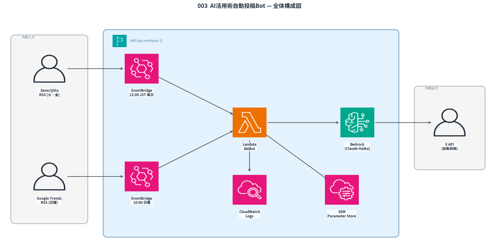

# X AI Bot - AI活用術 自動投稿Bot

AI活用術・会社員あるある系コンテンツをXに1日1回自動投稿するサーバーレスBot。

## アーキテクチャ



```
EventBridge Scheduler（21:00 JST 毎日 + 日曜 10:00 JST）
    ↓
Lambda（XAiBot）
    ├── SSM Parameter Store → X APIキー取得
    ├── SSM Parameter Store → カテゴリ使用履歴・投稿キーワード履歴・URL履歴 読み込み
    ├── [火・金] Zenn/Qiita RSS → AI記事取得 → url_reaction カテゴリ
    ├── [日曜 trend モード] Google Trends RSS → AIと絡めやすいキーワード取得
    ├── Bedrock（Claude Haiku 4.5）でツイート生成
    │   └── url_reaction: 記事感想本文のみ生成（URL・ハッシュタグはlambda_handler側で付加）
    ├── [url_reaction] HASHTAG_POOLから文章に合うハッシュタグを自動選択
    ├── X API v2 投稿
    └── SSM Parameter Store → 投稿履歴を更新して保存
```

## ファイル構成

```
003_X_AI_Bot/
├── README.md              # このファイル
├── システム仕様書.md        # 詳細仕様・コスト試算
├── scripts/
│   └── test_invoke.sh     # 手動テスト実行スクリプト
└── src/
    ├── lambda_function.py # Lambda本体（投稿ロジック）
    ├── template.yaml      # CloudFormationテンプレート（IaC）
    ├── requirements.txt   # Python依存関係（外部パッケージなし）
    ├── setup_ssm.sh       # SSMパラメータ初期設定スクリプト
    └── deploy.sh          # デプロイスクリプト
```

---

## セットアップ手順

### Step 1: Xアカウント・APIキーの準備（手動）

1. Xアカウントを作成
2. [X Developer Portal](https://developer.twitter.com) でAppを作成
3. 以下4つのキーを取得:
   - Consumer Key (API Key)
   - Consumer Secret (API Key Secret)
   - Access Token
   - Access Token Secret
4. App権限を **Read and Write** に設定（デフォルトはReadのみ）

### Step 2: SSMパラメータ投入

```bash
cd ~/Zer0/003_X_AI_Bot/src
bash setup_ssm.sh
```

投入されるパラメータ（全てSecureString）:

| パラメータ名                          | 内容                  |
| ------------------------------------- | --------------------- |
| `/ai_bot/twitter_api_key`             | X API Key             |
| `/ai_bot/twitter_api_secret`          | X API Key Secret      |
| `/ai_bot/twitter_access_token`        | X Access Token        |
| `/ai_bot/twitter_access_token_secret` | X Access Token Secret |

※ `/ai_bot/history/*` は Lambda 初回実行時に自動作成される。

### Step 3: デプロイ

```bash
cd ~/Zer0/003_X_AI_Bot/src
bash deploy.sh
```

### Step 4: 動作テスト

```bash
# テストスクリプトで実行（DRY_RUN=true に自動切替・終了後に自動復元）
bash ~/Zer0/003_X_AI_Bot/scripts/test_invoke.sh          # ランダムカテゴリ
bash ~/Zer0/003_X_AI_Bot/scripts/test_invoke.sh trend    # トレンドモード
```

または手動で：

```bash
# DRY RUN モードに切替
aws lambda update-function-configuration \
  --function-name XAiBot \
  --environment "Variables={SSM_PREFIX=/ai_bot,DRY_RUN=true}" \
  --region ap-northeast-1

# ランダムカテゴリで手動テスト
aws lambda invoke \
  --function-name XAiBot \
  --region ap-northeast-1 \
  --log-type Tail \
  --payload '{"mode": "random"}' \
  --cli-binary-format raw-in-base64-out \
  --query "LogResult" --output text /dev/null | base64 -d

# 本番に戻す
aws lambda update-function-configuration \
  --function-name XAiBot \
  --environment "Variables={SSM_PREFIX=/ai_bot,DRY_RUN=false}" \
  --region ap-northeast-1

# ログ確認
aws logs tail /aws/lambda/XAiBot --since 5m --region ap-northeast-1
```

---

## 投稿スケジュール

| 時刻（JST）  | 曜日        | モード        | 内容                                           |
|--------------|-------------|---------------|------------------------------------------------|
| 21:00        | 毎日        | `random`      | 4カテゴリ（shigoto/fukugyo/kyokan/question）ローテーション |
| 21:00        | 火・金      | url_reaction  | Zenn/QiitaのAI記事に感想コメント＋URL投稿       |
| 10:00        | 日曜        | `trend`       | Google Trendsトレンド連動（フォールバックあり） |

- 火・金に記事取得失敗した場合は通常ローテーションにフォールバック

---

## 投稿カテゴリ

| カテゴリ       | 内容                              | ハッシュタグ              |
|----------------|-----------------------------------|---------------------------|
| `shigoto`      | 仕事×AIのあるある・本音           | `#AI活用`                 |
| `fukugyo`      | 副業の現実・稼ぎ系リアル          | `#副業`                   |
| `kyokan`       | 会社員の共感・本音・愚痴          | なし                      |
| `question`     | 問いかけ・共感を誘う質問系        | `#AI活用` or `#副業`      |
| `url_reaction` | Zenn/Qiita AI記事への感想コメント | HASHTAG_POOLから自動選択  |
| `trend`        | Google Trendsトレンド連動         | `#AI活用`                 |

- `url_reaction` は `fire・金曜` 専用。ローテーション対象外
- カテゴリローテーション: 直近7投稿で同じカテゴリを使わない（SSM管理）

### ハッシュタグプール（url_reaction用）

文章の内容キーワードに基づいて以下10個から自動選択:

`#AI活用` `#生成AI` `#ChatGPT` `#副業` `#時短` `#仕事術` `#エンジニア` `#働き方` `#プロンプト` `#AI副業`

---

## SSM 投稿履歴管理

| パラメータ名                            | 内容                                       |
| --------------------------------------- | ------------------------------------------ |
| `/ai_bot/history/shigoto`               | shigotoカテゴリの投稿キーワード履歴        |
| `/ai_bot/history/fukugyo`               | fukygyoカテゴリの投稿キーワード履歴        |
| `/ai_bot/history/kyokan`                | kyokanカテゴリの投稿キーワード履歴         |
| `/ai_bot/history/question`              | questionカテゴリの投稿キーワード履歴       |
| `/ai_bot/history/url_reaction`          | url_reactionカテゴリの投稿キーワード履歴   |
| `/ai_bot/history/trend`                 | trendカテゴリの投稿キーワード履歴          |
| `/ai_bot/history/used_categories`       | カテゴリ使用順履歴（直近7件）              |
| `/ai_bot/history/url_reaction_urls`     | 使用済みURL履歴（直近28件）                |

- 投稿後にキーワードを3〜5個抽出してSSMに保存
- 7日以上古いエントリは自動削除
- 過去7日分のキーワードをプロンプトに渡して繰り返し防止

---

## 運用メモ

- 投稿頻度: 1回/日（21:00）＋ 日曜10:00
- 完全自動化（人手不要）
- Lambdaコスト目安: 無料枠内（月34回実行）
- Bedrockコスト目安: 月$0.04程度（Claude Haiku 4.5）
- X API: Free tier（月500投稿まで）で十分

---

## トラブルシューティング

| エラー                                  | 原因                       | 対処                                                          |
| --------------------------------------- | -------------------------- | ------------------------------------------------------------- |
| 投稿エラー 403                          | X App の権限が `Read Only` | `Read and Write` に変更してトークン再生成・SSM再投入          |
| SSMパラメータエラー                     | パラメータ未登録           | `bash setup_ssm.sh` を再実行                                  |
| Bedrockエラー                           | モデルアクセス未申請       | Bedrockコンソールでモデルアクセスを有効化                     |
| `AccessDeniedException` on PutParameter | IAMにSSM書き込み権限なし   | `template.yaml` を再デプロイ（`ssm:PutParameter` が追加済み） |
| url_reaction で記事が取れない           | RSS取得失敗                | 通常ローテーションにフォールバック（自動）                    |
