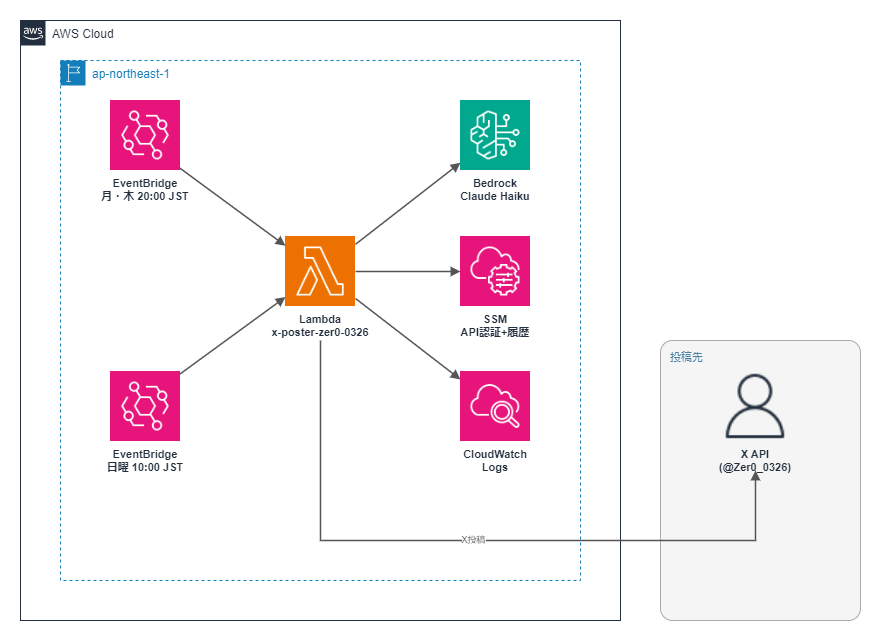

# 003 X Poster Bot (@Zer0_0326)

> 「なんとか生きてる普通の会社員」目線のあるある系コンテンツを毎週月・木20:00に自動投稿するBot（2026-07-05にAI活用系から一般テーマへ全面転換）。言い回しレシピ・数字入り実録・比較・失敗談の実用4カテゴリ＋副業・問いかけで構成し、賛否が分かれる強い意見も辞さないバズ狙い設計。曜日別投稿ロジック・Google Trends連動・重複回避つき。

[](https://aws.amazon.com)
[](https://python.org)
[](https://aws.amazon.com/pricing)

## 概要

| 項目       | 内容                                                                                                            |
| ---------- | --------------------------------------------------------------------------------------------------------------- |
| 投稿頻度   | 週3回実行（月・木20:00 JST + 日曜10:00 JST）。**1回の実行での投稿数は1〜3件**（下記「投稿カテゴリ」の注記参照） |
| カテゴリ数 | 6カテゴリ（recipe/jissoku/hikaku/shippai/fukugyo/question）+ 固定2スロット（url_reaction/trend）                |
| 重複防止   | 直近4投稿で同カテゴリが連続しないようSSMで履歴管理                                                              |
| 曜日別制御 | 月曜: url_reaction 50% / ローテーション 50% ・木曜: question固定 ・日曜: trend                                  |
| 生成AI     | Amazon Bedrock **Claude Haiku 4.5**（`jp.anthropic.claude-haiku-4-5-20251001-v1:0` / temperature=0.95）         |
| 月額コスト | ~$0.38（約57円）                                                                                                |

## アーキテクチャ



```text
EventBridge Scheduler（月・木 20:00 JST / 日曜 10:00 JST・リトライ0回）
  └─▶ Lambda（Python 3.14・Timeout 90秒）失敗時 → SNS → メール通知
        ├─ 曜日判定 → カテゴリ選択（SSM 履歴参照）
        │   └─ recipe/jissoku: お題、question: テーマ軸もSSM履歴除外つきで選択
        ├─ カテゴリ別データ取得
        │   ├─ url_reaction: Yahoo!ニュースRSS（経済/国内/エンタメ）から記事取得
        │   └─ trend: Google Trends RSS から急上昇ワード取得（訃報・事件等はNGワードで除外、話題は問わない）
        ├─ Bedrock Claude Haiku（カテゴリ別プロンプトで生成、3案自己採点→ベスト選択）
        ├─ リプライ営業（大手ニュース10アカウントへ1件・SSM管理でコード変更不要に更新可・NGワード判定つき）
        ├─ SSM 投稿履歴更新（used_categories / history / recipe_tasks / question_themes / reply_targets / replied_tweets）
        └─ X API v2（POST）
```

## 投稿カテゴリ

| カテゴリ       | 内容                                                               | 曜日                                |
| -------------- | ------------------------------------------------------------------ | ----------------------------------- |
| `recipe`       | コピペで使える言い回し・テンプレのレシピ（12お題をローテーション） | 月曜ローテーション枠（50%）         |
| `jissoku`      | 仕事・生活のbefore/after実録（数字必須・盛らない）                 | 月曜ローテーション枠（50%）         |
| `hikaku`       | 働き方・お金・生活の比較とどっち派（断定・返信誘発）               | 月曜ローテーション枠（50%）         |
| `shippai`      | 仕事・お金・人間関係の失敗談＋回避法（共感×実用）                  | 月曜ローテーション枠（50%）         |
| `fukugyo`      | 副業の現実（数字・やり方入り）                                     | 月曜ローテーション枠（50%）         |
| `question`     | 問いかけ・議論系                                                   | **木曜固定** + 月曜ローテーション枠 |
| `url_reaction` | Yahoo!ニュース記事への率直な反応（URLはリプライへ）                | 月曜固定枠（50%）                   |
| `trend`        | Google Trends トレンド連動（話題を問わず何にでも反応）             | 日曜固定                            |

> **注: 「1回の実行＝1投稿」ではない。** `url_reaction`は本文＋URLリプライで**2件**、それ以外のカテゴリは本文のみで**1件**。さらに全カテゴリ共通で、実装のこだわり12「リプライ営業」が**必ず+1件**上乗せされる。そのため実際の投稿数は `url_reaction`実行時=3件、それ以外=2件。

## 実装のこだわり

### 1. カテゴリローテーション設計

単純なランダム選択では同じカテゴリが連続するケースが発生する。SSM Parameter Store に直近4件の投稿カテゴリを記録し、**現在候補から直近履歴を除外**することで均等なローテーションを実現（`MAX_CATEGORY_HISTORY=4`・v2.0で7→4に変更）。フォロワーに同じトーンの投稿が続かないようコンテンツの多様性を担保。

### 2. 曜日別固定スロットの設計思想

投稿頻度を毎日→週2回（月・木）に減らすにあたり、固定枠を「最もエンゲージメントが見込めるモード」に寄せつつ、**月曜は `url_reaction` と通常ローテーションを50%ずつ出し分けてコンテンツの予測可能性を下げる**設計に変更（固定一辺倒だと逆に「Bot感」が強まるため）。

- **木曜 `question`**: 調査の結果、最もインプレッションが伸びやすい曜日と判明。返信エンゲージメント最大化を狙う問いかけ投稿で固定
- **月曜 `url_reaction` / ローテーション 50%**: 週明けの情報収集ニーズに合わせて Zenn/Qiita 記事感想を投入しつつ、半分はローテーションプールから選び多様性を担保
- **日曜 `trend`**: 週末の話題と会社員の日常を絡めてバズりやすいコンテンツを投入

### 3. Bedrock システムプロンプトの導入

カテゴリ別の「一行目フック必須」「体言止め禁止」「絵文字の使用箇所制限」を**システムプロンプト**として設定。temperature=0.95 の高い多様性設定と組み合わせ、毎回異なる表現ながらも口調が崩れない投稿を生成。

### 4. `url_reaction` の記事概要拡張

当初 150 文字の記事概要では Bedrock が感想の根拠を生成しにくい問題があった。記事本文冒頭を 300 文字に拡張し、具体的な感想付きで投稿できるよう改善。

### 5. ハッシュタグの動的ローテーション

`#会社員あるある` / `#仕事術` / `#働き方` など10個のハッシュタグプールから投稿ごとに選択し、特定タグへの依存を避ける。アルゴリズムの変動に対してリスク分散。

### 6. 実行失敗のSNS通知（2026-07-05追加）

Scheduler・Lambda双方のリトライを0にしているため、失敗した回の投稿は静かに消えログを見ない限り気づけなかった。001と同じ`EventInvokeConfig.DestinationConfig.OnFailure → SNS → email`パターンを移植し、`RecipientEmail`パラメータ設定時のみ有効化（未設定なら通知設定自体をスキップ）。

### 7. recipe/jissoku・questionのお題/テーマ重複回避（2026-07-05追加）

カテゴリ自体は直近4件除外があるが、recipe/jissokuが共有する12業務お題・questionの10テーマ軸には重複回避がなく、確率1/12や1/10で近い内容が連続しうる問題があった。002のトピック除外方式と同じくSSM履歴（recipe_tasksは直近5件、question_themesは直近4件、いずれも総数より必ず小さい値）で直近使用分を除外してから選択する。

### 8. trendカテゴリのNGワードフィルタ（2026-07-05追加）

Google Trends急上昇には訃報・事件・災害・政治が頻繁に入るため、「訃報トレンド×軽いつぶやき」が生成されるとアカウントの信頼を損なうリスクがあった。Tier1〜3の全候補から、訃報・逮捕・災害・政治関連のNGワードを含むキーワードを事前除外する。

### 9. AIコンセプトの全面撤廃とバズ狙いへの転換（2026-07-05）

投稿頻度がほとんど変わらず反応が薄かったため、ユーザーの意向で「AI活用系Bot」という前提を撤廃し、話題をAIに限らない「なんとか生きてる普通の会社員」のあるある系バズ狙いコンテンツへ全面転換した。

- **フックを強化**: 「1行目が命」の書き出しパターンに挑発型（「〜はもう終わってる」等）を追加し、断定・強い意見で終わる投稿を許容するよう`ABSOLUTE_RULES`/`STYLE_GUIDE`を改訂（ただし個人・企業攻撃や誤情報の断定は禁止）
- **話題を仕事・お金・人間関係・トレンド全般に拡大**: 全カテゴリ（recipe/jissoku/hikaku/shippai/fukugyo/question/trend/url_reaction）のプロンプト・few-shot例・お題・ハッシュタグ・キーワードリストを非AI一般テーマに書き換え
- **url_reactionのRSSフィードを一般ニュースに変更**: Zenn/Qiita（AI関連タグ）からYahoo!ニュース（経済・国内・エンタメ）へ切り替え
- **trendのAI紐付けを撤廃**: `pick_ai_relatable_trend`→`pick_relatable_trend`にリネームし、Tier1/2キーワードを仕事・お金・生活全般に変更。Tier3（任意の日本語キーワード）フォールバックは維持のため実質どんな話題も拾える
- リスク許容度は「積極的」（賛否が分かれてもいい）とユーザーが明示。ただし誹謗中傷・差別・誤情報の断定は引き続き禁止

### 10. 複数案生成→自己採点→ベスト選択（2026-07-05追加）

一発生成では「上振れ」の投稿を引けないというFableの指摘を受け、`invoke_bedrock`を1回のBedrock呼び出しで3案生成する構成に変更。`_score_tweet`（ヘッジ表現で終わっていないか・数字の有無・情報密度）で機械採点し、`pick_best_tweet`で最良の1案を採用する。Bedrock呼び出し回数は変えず（1回のプロンプトに「3つ生成して`===`区切りで出力」と指示）追加コストを最小化している。

### 11. ハッシュタグ原則廃止・ヘッジ表現の排除（2026-07-05追加）

Fableの評価で「現在のXでハッシュタグはリーチを生まずBot感のシグナルになる」「『たまには』『毎回じゃなくていい』という指示はLLMが安全側に倒れ実質発動しない」と指摘され、`NO_HASHTAG_RATE`を0.35→0.9に引き上げ、`ABSOLUTE_RULES`/`STYLE_GUIDE`のヘッジ指示を「原則断定」に書き換えた。

### 12. リプライ営業機能（2026-07-05追加）

大手ニュースアカウント（現在10件、すべてユーザーが明示的に承認した実在アカウント。一覧は下記フォロワー数の項を参照）の最新投稿に、既存の週3回スケジュールへ相乗りする形で1件返信する。X APIのRead系エンドポイント（`GET /2/users/by/username/:username`・`GET /2/users/:id/tweets`）が現行プランで追加料金なしに使えることを実地テストで確認した上で実装。

- **対象アカウントは自動選定しない**: 対象リストはユーザーが指定したもののみで、AIが対象を判断・追加することはない
- **対象アカウントはSSMパラメータ管理（2026-07-05変更）**: `load_reply_target_accounts()`が`/ai_bot/reply_target_accounts`（SSM）を読み込む方式に変更。ユーザーが「対象を定期的に入れ替えたい」と要望したため、コード変更・再デプロイ不要で`aws ssm put-parameter --overwrite`だけでリストを更新できるようにした（未設定時はコード内の`DEFAULT_REPLY_TARGET_ACCOUNTS`が自動でSSMに書き込まれる）
- **除外履歴の件数はアカウント数に応じて動的に決定**: `_reply_target_history_limit()`が対象数-1件（上限5件）を算出するため、SSMでアカウント数を変えても恒久ロックバグが起きない
- **フォロワー数（2026-07-05確認、計10アカウント）**: `@nikkei` 391万・`@livedoornews` 217.4万・`@asahi` 127.8万・`@mainichi` 97.6万・`@sankei_news` 87.3万・`@toyokeizai` 62.7万・`@itmedia_news` 34.6万・`@dol_editors` 32万・`@itmedia` 9.2万・`@PRE_ONLINE` 7.2万
- **ハンドル誤りの訂正（2026-07-05）**: 当初の候補`diamond_online`・`PRESIDENT_Online`はそれぞれ「無関係な個人アカウント（フォロワー15人）」「Xのユーザー名文字数上限15文字を超える無効な文字列」だったことがフォロワー数確認時に発覚し、正しい公式ハンドル`dol_editors`・`PRE_ONLINE`に訂正した
- **災害警報の見落としを修正**: 本番検証で朝日新聞の実際の投稿に進行中の災害警報（線状降水帯予測）が含まれ`REPLY_NG_WORDS`をすり抜けていたため、警報・線状降水帯・洪水・土砂災害・避難指示・避難勧告・津波を追加
- **安全設計**: リプ先ローテーション（対象数に応じた動的件数を除外）・返信済みツイートの重複回避（履歴50件保持）・政治/災害/訃報等のNGワードフィルタ（`REPLY_NG_WORDS`、トレンド用NGワードに大統領・政権・外交・災害警報等を追加）でセンシティブな投稿への返信を回避
- **失敗時はメイン投稿に影響させない**: `attempt_reply_outreach`は例外を内部で捕捉し、ユーザー検索・タイムライン取得・生成のどこで失敗してもログに残すだけでメインのカテゴリ投稿処理は継続する
- **本番検証で判明した穴と対処**: 実地テストでニュースアカウントの投稿に政治色の強い内容（トランプ大統領関連）が含まれるケースを発見し、`REPLY_NG_WORDS`を拡充して除外するよう修正済み

## 技術スタック

| レイヤー         | 技術                                                                                                    |
| ---------------- | ------------------------------------------------------------------------------------------------------- |
| 実行基盤         | AWS Lambda（Python 3.14）                                                                               |
| スケジューリング | Amazon EventBridge Scheduler（JST対応・2スロット）                                                      |
| 生成AI           | Amazon Bedrock **Claude Haiku 4.5**（`jp.anthropic.claude-haiku-4-5-20251001-v1:0` / temperature=0.95） |
| 状態管理         | SSM Parameter Store（10パラメータで履歴管理）                                                           |
| 外部データ       | Yahoo!ニュース RSS / Google Trends RSS                                                                  |
| 投稿先           | X API v2                                                                                                |
| IaC              | CloudFormation                                                                                          |

## ディレクトリ構成

```text
003_x-poster_zer0-0326/
├── src/
│   ├── lambda_function.py              # メインロジック
│   ├── cfn-x-poster-zer0-0326.yaml
│   ├── deploy.sh                       # デプロイスクリプト
│   └── tests/
│       └── test_lambda_function.py     # ユニットテスト（36件）
├── scripts/
│   └── test_invoke.sh                  # テストスクリプト（dry_runペイロード対応）
└── images/
    └── 003_architecture.png
```

## デプロイ

```bash
# 初回: X APIキーをSSMに登録 → CFn + コードを一括デプロイ
bash src/setup_ssm.sh
bash src/deploy.sh

# コードのみ更新
bash src/deploy.sh

# dry_run テスト（実投稿・SSM履歴更新なし。ペイロードで指定するため本番環境変数は変更しない）
bash scripts/test_invoke.sh
# mode指定（random / trend）
bash scripts/test_invoke.sh trend

# ユニットテスト（36件）
cd src && python -m pytest tests/ -v
```

## 運用コマンド

```bash
# 最新ログ確認
aws logs tail /aws/lambda/x-poster-zer0-0326 --follow --region ap-northeast-1

# カテゴリ履歴リセット（同カテゴリ連続投稿が起きた場合）
aws ssm delete-parameter --name "/ai_bot/history/used_categories" --region ap-northeast-1

# リプ先アカウントの変更（コード修正・再デプロイ不要）
aws ssm put-parameter --name "/ai_bot/reply_target_accounts" \
  --value '["nikkei","toyokeizai","dol_editors","PRE_ONLINE","itmedia_news","itmedia","livedoornews","asahi","sankei_news","mainichi"]' \
  --type String --overwrite --region ap-northeast-1

# 現在のリプ先アカウント一覧を確認
aws ssm get-parameter --name "/ai_bot/reply_target_accounts" --region ap-northeast-1 --query "Parameter.Value" --output text
```

## SSMパラメータ

| パラメータ名                          | 種別         | 管理                                                                                                                                    |
| ------------------------------------- | ------------ | --------------------------------------------------------------------------------------------------------------------------------------- |
| `/ai_bot/twitter_api_key`             | SecureString | setup_ssm.sh                                                                                                                            |
| `/ai_bot/twitter_api_secret`          | SecureString | setup_ssm.sh                                                                                                                            |
| `/ai_bot/twitter_access_token`        | SecureString | setup_ssm.sh                                                                                                                            |
| `/ai_bot/twitter_access_token_secret` | SecureString | setup_ssm.sh                                                                                                                            |
| `/ai_bot/history/used_categories`     | String       | Lambda自動更新                                                                                                                          |
| `/ai_bot/history/{category}`          | String       | Lambda自動更新                                                                                                                          |
| `/ai_bot/history/url_reaction_urls`   | String       | Lambda自動更新                                                                                                                          |
| `/ai_bot/history/recipe_tasks`        | String       | Lambda自動更新（2026-07-05追加）                                                                                                        |
| `/ai_bot/history/question_themes`     | String       | Lambda自動更新（2026-07-05追加）                                                                                                        |
| `/ai_bot/history/reply_targets`       | String       | Lambda自動更新（2026-07-05追加、リプ営業のローテーション）                                                                              |
| `/ai_bot/reply_target_accounts`       | String       | **手動更新可**（2026-07-05追加）。リプ先アカウント一覧本体。`aws ssm put-parameter --overwrite`でコード変更・再デプロイなしに更新できる |
| `/ai_bot/history/replied_tweets`      | String       | Lambda自動更新（2026-07-05追加、返信済みツイートID）                                                                                    |

## トラブルシューティング

| 症状                   | 原因                              | 対処                                                                    |
| ---------------------- | --------------------------------- | ----------------------------------------------------------------------- |
| 投稿されない           | 環境変数 `DRY_RUN=true` のまま    | Lambda 環境変数 `DRY_RUN` を `false` に更新                             |
| 同カテゴリが連続投稿   | SSM履歴破損                       | `/ai_bot/history/used_categories` を削除してリセット                    |
| X API 403 Forbidden    | APIクレジット不足                 | developer.x.com でクレジット残高確認・チャージ                          |
| X API 401 Unauthorized | アクセストークン期限切れ          | `bash src/setup_ssm.sh` で4キーを再登録                                 |
| Bedrock エラー         | モデルアクセス未承認              | AWS Console → Bedrock → モデルアクセスで Haiku 4.5 を有効化             |
| url_reaction 記事が0件 | Yahoo!ニュースRSSフィード取得失敗 | CloudWatch Logs で HTTP ステータス確認                                  |
| 実行失敗に気づかない   | 通知メール未設定                  | CFn `RecipientEmail` パラメータを設定してスタック更新（2026-07-05追加） |

## コスト内訳

| サービス                               | 月額                 |
| -------------------------------------- | -------------------- |
| Lambda 実行（~35回/月）                | ~$0.001              |
| Bedrock Claude Haiku（~400 tokens/回） | ~$0.04               |
| X API（$0.01/件 × 34件/月）            | ~$0.34               |
| EventBridge・SSM                       | ~$0                  |
| **合計**                               | **~$0.38（約57円）** |

## 変更履歴

| 日付       | 内容                                                                                                                                                                                    |
| ---------- | ----------------------------------------------------------------------------------------------------------------------------------------------------------------------------------- |
| 2026-07-05 | v3.2: Fable最終レビュー全件反映。トレンドに関連ニュース見出しを文脈注入、NGワード拡充、ヘッジ判定回避バグ修正、リプ品質スコアゲート追加等。テスト6件追加（42件） |
| 2026-07-05 | v3.3: リプ文字数上限を80→120に緩和。実測で生成が頻繁に上限超過しスキップが多発していたため。リプ成立率が体感1〜2割→実測100%に改善 |
| 2026-07-05 | v3.4: 仕様書の分かりにくさを修正（コード変更なし）。「1回の実行＝1投稿」ではない点（url_reactionは2件・リプ営業込みで最大3件）が表に反映されていなかったため、投稿カテゴリ表に注記を追加し明記 |

全履歴は [CHANGELOG.md](./CHANGELOG.md) を参照してください。
