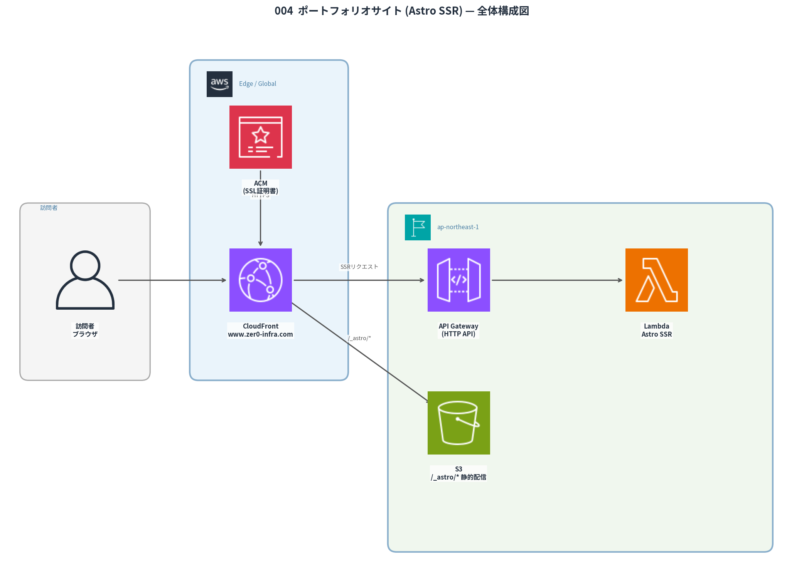

# 004 Portfolio Site

> Astro SSR + Lambda + CloudFront で構築した日英2言語対応の動的ポートフォリオサイト。月額ほぼ$0のサーバーレス構成で Zenn/note の RSS をサーバーサイドで動的取得して表示。

[](https://aws.amazon.com)
[](https://astro.build)
[](https://www.zer0-infra.com)
[](https://aws.amazon.com/pricing)

## 概要

| 項目           | 内容                                                   |
| -------------- | ------------------------------------------------------ |
| URL            | `https://www.zer0-infra.com`                           |
| フレームワーク | Astro（SSR / `output: 'server'` / Node.js adapter）    |
| 対応言語       | 日本語（`/ja/`）・英語（`/en/`）                       |
| ホスティング   | CloudFront + S3（静的） + API Gateway + Lambda（SSR）  |
| 動的コンテンツ | Zenn・note の RSS をリクエスト時にサーバーサイドで取得 |
| IaC            | CloudFormation（全リソース管理）                       |
| 月額コスト     | ~$0（Lambda・CloudFront 無料枠内）                     |

## アーキテクチャ



```text
[ブラウザ] HTTPS
  └─▶ CloudFront（www.zer0-infra.com）
        ├─ /_astro/* → S3（CSS/JS/画像 / 長期キャッシュ）
        └─ /* → API Gateway → Lambda（Astro SSR）
                  └─ リクエスト時に Zenn/note RSS を並列取得
```

## 技術スタック

| レイヤー       | 技術                                                           |
| -------------- | -------------------------------------------------------------- |
| フレームワーク | Astro 6.x（SSR / `@astrojs/node` adapter）                     |
| スタイリング   | Tailwind CSS v4（`@tailwindcss/vite` プラグイン）              |
| 実行基盤       | AWS Lambda（Node.js 24.x / 256MB / 30秒）                      |
| API            | Amazon API Gateway HTTP API                                    |
| CDN            | Amazon CloudFront（静的: 1年キャッシュ / SSR: キャッシュ無効） |
| ストレージ     | Amazon S3（OAC 署名付きアクセス）                              |
| IaC            | CloudFormation                                                 |
| デプロイ       | `scripts/deploy.sh`（6ステップ自動化）                         |

## 実装のこだわり

### 1. Organizations SCP による Lambda Function URL 問題の解決

AWS Organizations の SCP（Service Control Policy）により Lambda Function URL が 403 ブロックされる環境だった。当初は Function URL で実装していたが、本番デプロイ時に初めて制約を発見。**API Gateway HTTP API に切り替え**ることで解決。この経験から「組織レベルのポリシーと Lambda 呼び出し方式の関係」を深く理解。

### 2. 静的アセット vs SSR の分離キャッシュ戦略

| パス        | オリジン | キャッシュ       | 理由                                 |
| ----------- | -------- | ---------------- | ------------------------------------ |
| `/_astro/*` | S3       | 1年（immutable） | ハッシュ付きファイル名のため変更不要 |
| `/images/*` | S3       | 1日              | 更新頻度が低い                       |
| `/*`（SSR） | API GW   | 無効             | Zenn/note RSS をリクエスト毎に取得   |

### 3. Zenn・note RSS の並列サーバーサイド取得

`Promise.allSettled()` で Zenn・note 両方の RSS フィードを並列取得。片方が失敗しても残りを表示できるよう Settled（成功・失敗両対応）で処理。クライアントサイドでの取得を避け、CORS 問題を排除。

### 4. i18n 設計（日英2言語）

Astro の `i18n` ルーティングを使用し、`/ja/` と `/en/` で全ページを提供。翻訳キー管理・言語切替 URL 生成・デフォルトロケールリダイレクトを単一コードベースで実装。

### 5. デプロイ自動化（6ステップ）

`scripts/deploy.sh` が以下を全自動化：

1. CloudFormation Outputs からリソース情報取得
2. Astro ビルド（SSR 用 Lambda コード生成）
3. Lambda ZIP 作成 + S3 アップロード
4. Lambda コード更新（`update-function-code`）
5. S3 静的アセット同期（キャッシュ設定付き）
6. CloudFront キャッシュ無効化 + 10ページの疎通確認

## ディレクトリ構成

```text
004_portfolio/
├── src/                         # Astro プロジェクト
│   ├── src/
│   │   ├── components/          # ProjectCard, ArticleCard 等
│   │   ├── data/projects.ts     # プロジェクト定義データ
│   │   ├── layouts/             # BaseLayout
│   │   └── pages/ja/, pages/en/ # 日英ページ
│   ├── public/images/           # アーキテクチャ図（001〜007）
│   ├── lambda.mjs               # CloudFront→Lambda ブリッジ
│   ├── astro.config.mjs
│   └── package.json
├── infra/
│   ├── cfn-portfolio.yaml
│   ├── certificate.yaml         # ACM（us-east-1）
│   └── deploy-infra.sh
├── scripts/
│   └── deploy.sh                # 6ステップ自動デプロイ
└── images/
    └── 004_architecture.png
```

## セットアップ / デプロイ

```bash
# ローカル開発
cd src && npm install && npm run dev

# 初回インフラ構築（ACM証明書は us-east-1 先行デプロイ）
bash infra/deploy-infra.sh

# コード更新デプロイ（Lambda + S3 + CloudFront 無効化まで自動）
bash scripts/deploy.sh
```

## CFnテンプレート機能

実運用プロジェクトで使用している CloudFormation テンプレートを汎用化して公開。

- **62テンプレート**（31種類 × Beginner/Advanced）/ 7カテゴリ（compute / database / messaging / monitoring / network / security / storage）
- **GitHub 風 UI**: パンくず・行番号・ファイルサイズ・VS Code Dark Modern シンタックスハイライト
- **モバイル対応**: フルスクリーン3ステップ操作（カテゴリ → ファイル → コードビュー）
- **Env パラメータ**: `stg / dev / prd` の3環境対応。`prd` のみ DeletionPolicy=Retain・削除保護が有効
- **配信**: GitHub raw URL（AWS インフラ非経由）— `sync_to_public.sh` で自動 push

## AWSリソース一覧

| リソース    | 名前/ID                                                 |
| ----------- | ------------------------------------------------------- |
| CloudFront  | E33SJ6UEA95L47 / `https://du7bbiecctrzb.cloudfront.net` |
| S3 バケット | zer0-portfolio-s3                                       |
| Lambda      | Zer0-portfolio-ssr                                      |
| API Gateway | Zer0-portfolio-api                                      |
| ACM 証明書  | us-east-1（www.zer0-infra.com）                         |

## 変更履歴

| 日付       | バージョン | 内容                                                               |
| ---------- | ---------- | ------------------------------------------------------------------ |
| 2026-03-15 | v1         | 初版リリース。Astro SSR + Lambda + CloudFront + S3                 |
| 2026-03-20 | v1.1       | API Gateway HTTP API に切り替え（Function URL SCP問題の回避）      |
| 2026-04-01 | v1.2       | カスタムドメイン `www.zer0-infra.com` 設定完了                     |
| 2026-04-10 | v1.3       | Templatesページ（VS Codeエクスプローラー風UIと22テンプレート）追加 |
| 2026-04-19 | v1.4       | 全62テンプレート公開完了。全カテゴリ（compute/database/messaging/monitoring/network/security/storage）対応 |
| 2026-05-30 | v1.5       | YAMLビューアーにVS Code Dark Modernシンタックスハイライト追加      |
| 2026-05-30 | v1.6       | Templatesページ UI改善。GitHub風パンくず・行番号・モバイルフルスクリーン化 |
