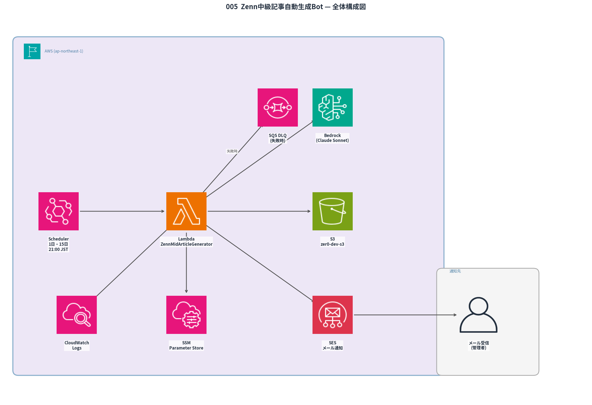

# 005 Zenn Article Bot（中級）

> 複合アーキテクチャ×ユースケース別の16トピックから毎月2回、10,000〜15,000文字の中級 AWS 技術記事を Bedrock Claude Sonnet で自動生成するシステム。002（初級Bot）の上位互換として設計。

[](https://aws.amazon.com)
[](https://python.org)
[](https://zenn.dev/zer0_infra)
[](https://aws.amazon.com/pricing)

## 概要

| 項目             | 内容                                                                     |
| ---------------- | ------------------------------------------------------------------------ |
| 生成頻度         | 毎月1日・15日 21:00 JST                                                  |
| 対応トピック     | 16種類（複合アーキテクチャ8 + ユースケース別8）                          |
| 記事ボリューム   | 10,000〜15,000文字（初級Botの約3倍）                                     |
| 差別化セクション | コスト最適化・セキュリティ設計・スケーラビリティの考慮点を追加           |
| 生成画像         | アーキテクチャ図 PNG × 2枚（AWS公式アイコン使用）                        |
| 使用モデル       | Amazon Bedrock **Claude Sonnet 4.6**（`jp.anthropic.claude-sonnet-4-6`） |
| 月額コスト       | ~$2.8（約420円）                                                         |

## アーキテクチャ



```text
EventBridge（毎月1日・15日 21:00 JST）
  └─▶ Lambda（Python 3.14 / 512MB / 900秒）
        ├─ Bedrock Claude Haiku（トピック選択: ~10 tokens）
        ├─ SSM からトピック履歴取得（直近4件除外）
        ├─ Bedrock Claude Sonnet（記事本文生成: ~12,000 tokens出力）
        ├─ diagram_generator.py（matplotlib + AWS公式アイコン）
        ├─ S3 PUT（MD + PNG × 2）
        ├─ SSM PUT（トピック履歴更新）
        └─ SES（生成完了メール通知）
```

## 初級Bot（002）との比較

| 項目           | 002（初級）          | 005（中級）                                  |
| -------------- | -------------------- | -------------------------------------------- |
| ターゲット     | AWS 入門者           | AWS 実務経験者                               |
| 文字数         | 3,000〜5,500 文字    | 10,000〜15,000 文字                          |
| 使用モデル     | Claude Haiku 4.5     | Claude Sonnet 4.6                            |
| トピック数     | 22種（単一サービス） | 16種（複合アーキテクチャ）                   |
| 追加セクション | なし                 | コスト最適化・セキュリティ・スケーラビリティ |
| 月額コスト     | ~$0.16               | ~$2.8                                        |
| Lambda メモリ  | 256MB                | 512MB                                        |

## 対応トピック（16種）

| 複合アーキテクチャ（8種）  | ユースケース別（8種） |
| -------------------------- | --------------------- |
| サーバーレス Web API       | CI/CD パイプライン    |
| マイクロサービス（ECS）    | ML モデル提供基盤     |
| イベント駆動アーキテクチャ | ログ収集・分析基盤    |
| データレイク構成           | コンテナ移行          |
| マルチリージョン冗長化     | セキュリティ監視      |
| ハイブリッドクラウド       | コスト最適化          |
| エッジコンピューティング   | 災害復旧（DR）        |
| 機械学習パイプライン       | モバイルバックエンド  |

## 実装のこだわり

### 1. 2段階 Bedrock 呼び出し設計

記事生成に Claude Sonnet（高精度・高コスト）を使いつつ、**トピック選択には Claude Haiku**（低コスト）を使い分け。トピック選択は数トークンの判断で十分なため、コストを抑えながら記事品質を最大化。月額コストを約30%削減。

### 2. 512MB メモリ設定の根拠

中級記事では matplotlib で生成する構成図が複合アーキテクチャのため複雑化し、256MB では OOM エラーが発生。プロファイリングにより 380〜420MB が実使用量であることを確認し、512MB に設定。

### 3. 初級Botとのコードベース分離

002 と 005 は別 Lambda・別 CloudFormation スタック・別デプロイスクリプトとして完全分離。一方のバグ修正が他方に影響しない設計。プロンプトも読者層に応じて独立してチューニング可能。

### 4. Function URL（AWS_IAM 認証）対応

本番から独立したテスト経路として Lambda Function URL（AWS_IAM 認証）を追加。EventBridge を停止せず、AWS CLI の署名付きリクエストで任意のタイミングでテスト実行できる。

## ディレクトリ構成

```text
005_Zenn_Mid_Article_Bot/
├── src/
│   ├── lambda_function.py    # メインロジック
│   ├── diagram_generator.py  # matplotlib 図生成エンジン
│   ├── deploy.sh             # デプロイスクリプト
│   └── tests/
│       └── test_lambda.py    # ユニットテスト（5件）
├── cfn-mid-article-generator.yaml
└── images/
    └── 005_architecture.png
```

## デプロイ

```bash
# 初回デプロイ（CloudFormation + Lambda）
SENDER_EMAIL=your@email.com RECIPIENT_EMAIL=your@email.com ./src/deploy.sh

# Layer も更新する場合
DEPLOY_LAYER=1 SENDER_EMAIL=your@email.com RECIPIENT_EMAIL=your@email.com ./src/deploy.sh
```

## テスト / 動作確認

```bash
# ユニットテスト（5件）
cd src && python -m pytest tests/ -v

# Function URL でテスト実行（AWS_IAM 認証）
aws lambda invoke --function-name zenn-mid-article-generator \
  --payload '{"dry_run": true}' /tmp/out.json --region ap-northeast-1
```

## コスト内訳

| サービス                                             | 月額                 |
| ---------------------------------------------------- | -------------------- |
| Lambda 実行（2回/月 × ~120秒 × 512MB）               | ~$0.002              |
| Bedrock Claude Sonnet（~12,000 tokens/回）           | ~$2.7                |
| Bedrock Claude Haiku（トピック選択 / ~10 tokens/回） | ~$0.001              |
| S3 ストレージ・PUT                                   | ~$0.01               |
| SES 送信（2通/月）                                   | ~$0                  |
| **合計**                                             | **~$2.8（約420円）** |

## 変更履歴

| 日付       | バージョン | 内容                                                        |
| ---------- | ---------- | ----------------------------------------------------------- |
| 2026-04-20 | v1         | 初版リリース。Claude Sonnet + 512MB Lambda + 16トピック体制                                                   |
| 2026-04-28 | v1.1       | 2段階Bedrock呼び出し（トピック選択にHaiku使用）。月額コスト約30%削減                                          |
| 2026-05-05 | v1.2       | `{DIAGRAM_N}` マーカー方式導入。Bedrockが図挿入位置と説明文を記事本文内に自然配置するよう改善                 |
| 2026-05-10 | v1.3       | AWS公式ドキュメント自動取得（primary_serviceのdocs.aws.amazon.com・最大6,000文字）を根拠情報として付与        |
| 2026-05-20 | v1.4       | Lambda Function URL（AWS_IAM認証）追加。EventBridgeスケジュールを止めずに任意タイミングでテスト実行可能に     |
