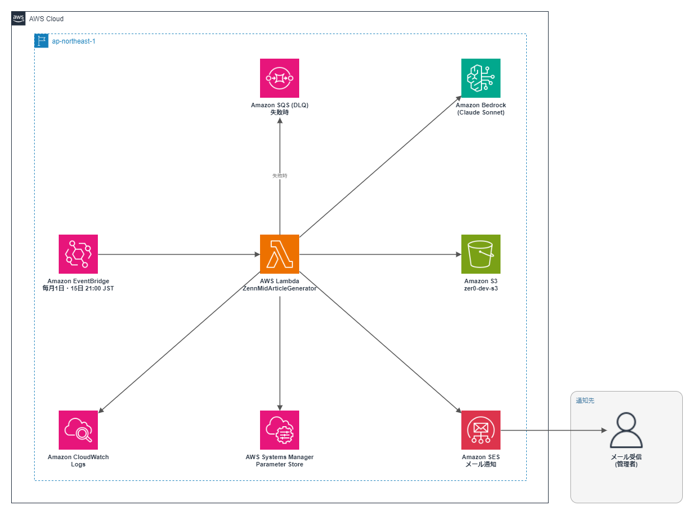

# 005 Zenn Article Bot（中級）

> 複合アーキテクチャ×ユースケース別の24トピックから毎月2回、15,000〜30,000文字の中級 AWS 技術記事を Bedrock Claude Sonnet で自動生成するシステム。002（初級Bot）の上位互換として設計。

[](https://aws.amazon.com)
[](https://python.org)
[](https://zenn.dev/zer0_infra)
[](https://aws.amazon.com/pricing)

## 概要

| 項目             | 内容                                                                     |
| ---------------- | ------------------------------------------------------------------------ |
| 生成頻度         | 毎月1日・15日 21:00 JST                                                  |
| 対応トピック     | 24種類（複合アーキテクチャ12 + ユースケース別12）                        |
| 記事ボリューム   | 15,000〜30,000文字（初級Botの約3倍）                                     |
| 差別化セクション | コスト最適化・セキュリティ設計・スケーラビリティの考慮点を追加           |
| 生成画像         | アーキテクチャ図 PNG × 1枚（AWS公式アイコン使用）                        |
| 使用モデル       | Amazon Bedrock **Claude Sonnet 4.6**（`jp.anthropic.claude-sonnet-4-6`） |
| 月額コスト       | ~$2.7（約410円）                                                         |

## アーキテクチャ



```text
EventBridge（毎月1日・15日 21:00 JST）
  └─▶ Lambda（Python 3.14 / 512MB / 900秒）
        ├─ Bedrock Claude Haiku（トピック選択: ~10 tokens）
        ├─ SSM からトピック履歴取得（直近12件除外）
        ├─ Bedrock Claude Sonnet（記事本文生成: ~12,000 tokens出力）
        ├─ diagram_generator.py（matplotlib + AWS公式アイコン）
        ├─ S3 PUT（MD + PNG × 1）
        ├─ SSM PUT（トピック履歴更新）
        └─ SES（生成完了メール通知）
```

## 初級Bot（002）との比較

| 項目           | 002（初級）          | 005（中級）                                  |
| -------------- | -------------------- | -------------------------------------------- |
| ターゲット     | AWS 入門者           | AWS 実務経験者                               |
| 文字数         | 3,000〜5,500 文字    | 15,000〜30,000 文字                          |
| 使用モデル     | Claude Haiku 4.5     | Claude Sonnet 4.6                            |
| トピック数     | 22種（単一サービス） | 16種（複合アーキテクチャ）                   |
| 追加セクション | なし                 | コスト最適化・セキュリティ・スケーラビリティ |
| 月額コスト     | ~$0.16               | ~$2.8                                        |
| Lambda メモリ  | 256MB                | 512MB                                        |

## 対応トピック（24種）

| 複合アーキテクチャ系（12種） | ユースケース別（12種）   |
| ----------------------------- | ------------------------- |
| サーバーレスECバックエンド    | CI/CDパイプライン構築     |
| 静的Webホスティング最適解     | 機械学習パイプライン自動化 |
| コンテナアプリ本番運用基盤    | ログ集約・分析基盤        |
| イベント駆動データ処理パイプライン | AWSコスト最適化実践   |
| マイクロサービス観測性基盤    | セキュリティ強化設計      |
| マルチリージョンDR構成        | バックアップ・DR設計      |
| リアルタイム通知・アラートシステム | マルチアカウント管理  |
| Bedrock RAGアーキテクチャ     | データレイク構築          |
| セキュアなVPCネットワーク基盤設計 | 運用監視・アラート基盤の構築 |
| 非同期ジョブオーケストレーション基盤 | CloudFrontエッジセキュリティ強化 |
| EC2 Blue/Greenデプロイパイプライン | 認証情報ローテーション基盤の構築 |
| Cognitoによるユーザー認証基盤 | データレイクガバナンス基盤 |

一部トピックはサービス組み合わせに変動枠を持ち、選択のたびに`random.choice`で確定する（詳細は[CHANGELOG.md](./CHANGELOG.md)の2026-07-16参照）。

## 実装のこだわり

### 1. トピック選択はコード側の乱択（Bedrock不使用）

当初はトピック選択にも Claude Haiku を使っていたが、実績を集計すると「ランダムに選んで」という指示でも特定トピックに強く偏ることが判明（全41回中1トピックが22%）。トピック選択のBedrock呼び出しを廃止し、Pythonの`random.choice`に置き換えることで偏りを解消しつつコスト・レイテンシも削減した。記事生成本体には引き続き Claude Sonnet（高精度）を使用。

### 2. 512MB メモリ設定の根拠

中級記事では matplotlib で生成する構成図が複合アーキテクチャのため複雑化し、256MB では OOM エラーが発生。プロファイリングにより 380〜420MB が実使用量であることを確認し、512MB に設定。

### 3. 初級Botとのコードベース分離

002 と 005 は別 Lambda・別 CloudFormation スタック・別デプロイスクリプトとして完全分離。一方のバグ修正が他方に影響しない設計。プロンプトも読者層に応じて独立してチューニング可能。

### 4. Function URL（AWS_IAM 認証）対応

本番から独立したテスト経路として Lambda Function URL（AWS_IAM 認証）を追加。EventBridge を停止せず、AWS CLI の署名付きリクエストで任意のタイミングでテスト実行できる。

## ディレクトリ構成

```text
005_Zenn_Mid_Article_Bot/
├── src/
│   ├── lambda_function.py            # メインロジック
│   ├── diagram_generator.py          # matplotlib 図生成エンジン
│   ├── deploy.sh                     # デプロイスクリプト
│   ├── cfn-mid-article-generator.yaml
│   └── tests/
│       └── test_lambda.py            # ユニットテスト（19件）
├── docs/                             # 非公開（システム仕様書）
├── docs-public/                      # 公開（README・CHANGELOG）
├── scripts/                          # 補助スクリプト（Layer構築・テスト実行等）
└── images/
    └── 005_architecture.png
```

> **Note**: `src/fonts/NotoSansCJK-Regular.ttc`（図解PNGの日本語描画用フォント、約19MB）はファイルサイズの都合上このリポジトリには含まれていません。ローカルでデプロイする場合は [Noto Sans CJK](https://github.com/notofonts/noto-cjk) から取得し `src/fonts/` に配置してください。

## デプロイ

```bash
# 初回デプロイ（CloudFormation + Lambda）
SENDER_EMAIL=your@email.com RECIPIENT_EMAIL=your@email.com ./src/deploy.sh

# Layer も更新する場合
DEPLOY_LAYER=1 SENDER_EMAIL=your@email.com RECIPIENT_EMAIL=your@email.com ./src/deploy.sh
```

## テスト / 動作確認

```bash
# ユニットテスト（19件）
cd src && python -m pytest tests/ -v

# Function URL でテスト実行（AWS_IAM 認証）
aws lambda invoke --function-name zenn-mid-article-generator \
  --payload '{"dry_run": true}' /tmp/out.json --region ap-northeast-1
```

## コスト内訳

| サービス                                             | 月額                 |
| ---------------------------------------------------- | -------------------- |
| Lambda 実行（2回/月 × ~120秒 × 512MB）               | ~$0.002              |
| Bedrock Claude Sonnet（~12,000 tokens/回・記事本文生成のみ） | ~$2.7                |
| S3 ストレージ・PUT                                   | ~$0.01               |
| SES 送信（2通/月）                                   | ~$0                  |
| **合計**                                             | **~$2.7（約410円）** |

## 変更履歴

直近1日分のみ表示。全履歴は [CHANGELOG.md](./CHANGELOG.md) を参照。

### 2026-08-06

#### メール本文のダウンロードコマンドをコピペで実行できる形に修正

- 案内コマンドが番号付きリストの行内（`1. bash ...`）に埋め込まれ、コピーすると先頭の`1. `が混入して実行できない状態だったため、コマンドを単独行に分離
- 実際の運用（`~/Zer0`をカレントディレクトリにして実行する）に合わせ、`cd ~/Zer0 && bash 005_Zenn_Mid_Article_Bot/scripts/download_article.sh`に変更

### 2026-07-16

#### トピック内サービス組み合わせの変動枠＋書き出しバリエーション追加（v3.5）

- 24トピックへの拡充（v3.4）後もトピック内の3サービス組み合わせは完全固定だったため、6トピックに`variants`（差分辞書）を追加し、選択時に`random.choice`で基本形かバリエーションかを確定する方式にした（例: `log_analytics`はS3⇔AWS Glue⇔Amazon Data Firehoseの3択）
- 新規サービス（Amazon Data Firehose・Aurora Serverless v2）の公式ドキュメントURL・公式アイコンをWebFetchで実在確認の上追加
- 記事の書き出し例文が7記事中6記事で同じ「失敗談引用型」に偏っていたため、プロンプトの完全な例文を廃止し5パターンの書き出しアプローチからコード側乱択で1つを指示する方式に変更。中盤2セクションの出現順序もコード側乱択で入れ替え
- ユニットテスト7件追加（全19件パス）。6トピック×全バリエーション計32通りをローカル構成図レンダリングで確認、人物アイコンへのフォールバックなし
- 本番Lambdaへデプロイ済み（記事生成を伴う実機テストは前回・前々回同様見送り、ユニットテスト・ローカル図生成・プロンプト整形検証で確認）
