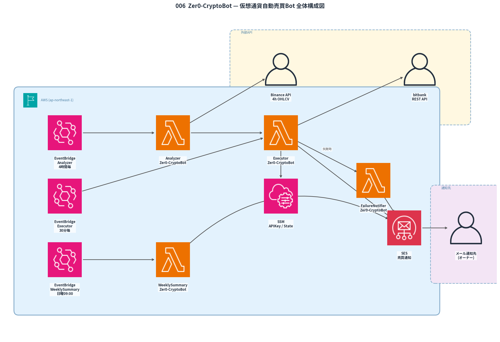

# 006_Zer0_CryptoBot — 仮想通貨自動売買Bot

SOL / AVAX / ARB を対象に、Binance のシグナルと bitbank の注文執行を組み合わせた現物自動売買 Bot。
EventBridge で 4 時間毎に起動し、テクニカル指標（200EMA + Supertrend + Volume）でエントリーを判定する。

## 全体構成図



## フォルダ構成

```
006_Zer0_CryptoBot/
├── lambda/
│   ├── analyzer/
│   │   ├── lambda_function.py   # シグナル判定 Lambda
│   │   └── requirements.txt
│   └── executor/
│       ├── lambda_function.py   # 注文執行・ポジション管理 Lambda
│       └── requirements.txt
├── backtest/
│   ├── backtest.py              # ローカルバックテスト（2年間）
│   ├── result.png               # バックテスト損益推移グラフ
│   └── requirements.txt        # バックテスト用ローカル依存
├── images/
│   └── 006_architecture.png    # 全体構成図
├── scripts/
│   ├── deploy.sh               # デプロイスクリプト
│   └── setup_ssm.sh            # SSM パラメータ登録スクリプト
├── README.md
├── システム仕様書.md
└── template.yaml               # SAM テンプレート
```

## 取引仕様

| 項目 | 内容 |
|------|------|
| 取引所 | bitbank（現物） |
| 対象コイン | SOL / AVAX / ARB |
| データソース | Binance API 4時間足（200本） |
| 最大同時保有 | 2コイン |
| 1ポジション投資額 | 3,000円 |

## エントリー条件（全て満たす場合に発注）

1. BTC が 200EMA 以上
2. 対象コインが 200EMA 以上
3. Supertrend が緑転換（ATR期間10・乗数3）
4. 出来高が直近20本平均より多い

## TP / SL

| 注文 | 価格 | 数量 |
|------|------|------|
| TP1 指値 | 取得価格 + ATR×2 | 30% |
| TP2 指値 | 取得価格 + ATR×4 | 70% |
| 損切り指値 | 取得価格 − ATR×1.5 | 100% |
| TP1約定後 | SL をブレイクイーブン（取得価格）へ更新 | — |

## バックテスト結果（直近2年・4時間足）

| 指標 | 値 | 合格基準 |
|------|----|---------|
| 勝率 | 56.8% | ≥50% ✓ |
| プロフィットファクター | 2.00 | ≥1.5 ✓ |
| 最大ドローダウン | 14.3% | ≤30% ✓ |
| 総トレード数 | 37回 | — |

## AWSリソース

| リソース | 名称 | 設定 |
|---------|------|------|
| Lambda | Zer0-CryptoBot-Analyzer | Python 3.14, 256MB, 120s |
| Lambda | Zer0-CryptoBot-Executor | Python 3.14, 256MB, 300s |
| EventBridge | Zer0-CryptoBot-Schedule | 4時間毎（UTC 0/4/8/12/16/20時） |
| SSM | /Zer0/CryptoBot/bitbank/api_key | SecureString |
| SSM | /Zer0/CryptoBot/bitbank/api_secret | SecureString |
| SSM | /Zer0/CryptoBot/state | String（ポジション状態JSON） |
| SES | — | 既存設定流用 |
| CloudWatch | /aws/lambda/Zer0-CryptoBot-* | 保存期間 7日 |

## デプロイ手順

```bash
# 1. SSM にAPIキーを登録（初回のみ）
bash scripts/setup_ssm.sh

# 2. デプロイ
export SENDER_EMAIL="your@email.com"
export RECIPIENT_EMAIL="notify@email.com"
bash scripts/deploy.sh
```

## 動作確認

```bash
# Analyzer を手動実行
aws lambda invoke \
  --function-name Zer0-CryptoBot-Analyzer \
  --payload '{}' /tmp/analyzer.json --region ap-northeast-1
cat /tmp/analyzer.json

# ログ確認
aws logs tail /aws/lambda/Zer0-CryptoBot-Analyzer --since 10m --region ap-northeast-1
aws logs tail /aws/lambda/Zer0-CryptoBot-Executor --since 10m --region ap-northeast-1

# SSM ポジション状態確認
aws ssm get-parameter --name "/Zer0/CryptoBot/state" --region ap-northeast-1
```

## バックテスト実行

```bash
pip install -r backtest/requirements.txt
python3 backtest/backtest.py
# → コンソールに勝率/PF/DD/トレード数を表示
# → backtest/result.png に損益推移グラフを保存
```
