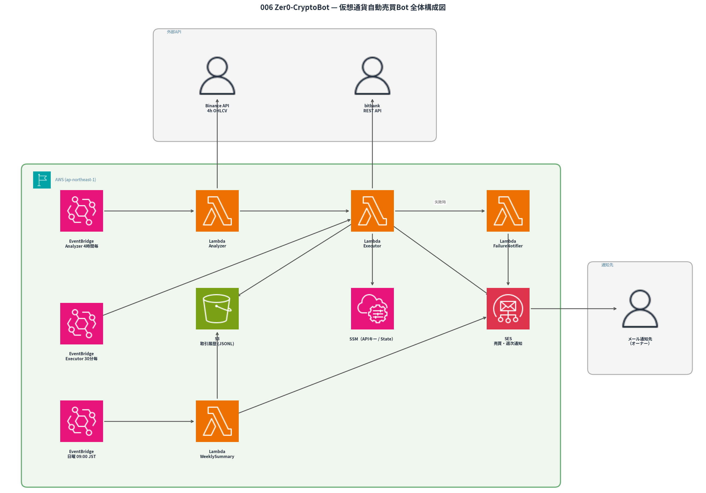

# 006 Zer0 CryptoBot

> BTC 200EMA で市場方向を判定し bitbank 信用取引で BTC/ETH/SOL をロング・ショート両方向に4時間毎自動売買するサーバーレスBot。5年バックテスト（LUNA崩壊・FTX破綻含む）で勝率73.5%、PF1.93を確認済み。全テスト完了・本番稼働中。

[](https://aws.amazon.com)
[](https://python.org)
[](https://bitbank.cc)
[](https://aws.amazon.com/pricing)

## 概要

| 項目           | 内容                                                                  |
| -------------- | --------------------------------------------------------------------- |
| 取引所         | bitbank（信用取引 / レバレッジ最大2倍）                               |
| 対象コイン     | BTC / ETH / SOL                                                       |
| 取引方向       | ロング + ショート 両方向                                              |
| シグナルデータ | Binance API（4時間足 OHLCV / リアルタイム出来高）                     |
| 実行頻度       | Analyzer: 4時間毎 / Executor: 30分毎                                  |
| リスク管理     | トレーリング SL / TP1 部分利確（30%） / 証拠金維持率監視              |
| 月額コスト     | AWS ~$0（無料枠内）/ 取引手数料：BTC 0% / ETH・SOL -0.04%（リベート） |

## アーキテクチャ



```text
EventBridge Scheduler（Analyzer: 4時間毎 / Executor: 30分毎）
  ├─▶ Analyzer Lambda
  │     ├─ Binance API（4時間足 OHLCV・出来高取得）
  │     ├─ BTC 200EMA で市場方向（ロング/ショート）判定
  │     ├─ Supertrend 転換 + Volume スパイク = エントリーシグナル
  │     └─ SSM に シグナル・State 書き込み
  │
  ├─▶ Executor Lambda
  │     ├─ SSM からシグナル・State 読み込み
  │     ├─ bitbank API（新規注文 / TP1 / トレーリング SL 更新）
  │     ├─ 証拠金維持率監視（危険水準で自動成行決済）
  │     ├─ 決済時に取引履歴を S3 へ追記（確定損益を記録）
  │     └─ SSM State 更新
  │
  ├─▶ FailureNotifier Lambda（Executor 非同期invoke 失敗時の OnFailure 先）
  │     └─ SES（エラーメール通知）
  │
  └─▶ WeeklySummary Lambda（毎週日曜 09:00 JST）
        ├─ S3 取引履歴から実現損益・勝率・PF を集計
        └─ SES（週次損益レポート: 含み損益 + 確定損益）
```

## エントリー条件

### 市場方向判定（BTC 4時間足）

- **ロングモード**: BTC 終値 > BTC 200EMA
- **ショートモード**: BTC 終値 < BTC 200EMA

### エントリーシグナル（BTC/ETH/SOL 各独立）

| 条件            | 詳細                                                                       |
| --------------- | -------------------------------------------------------------------------- |
| 200EMA クロス   | 終値が 200EMA を上抜け（ロング）/ 下抜け（ショート）                       |
| Supertrend 転換 | 上昇転換（ロング）/ 下降転換（ショート）                                   |
| dst フィルター  | 遅い Supertrend（ATR20×4.0）がシグナルと同方向（v3.1追加・ダマシ転換除外） |
| Volume スパイク | 直近20本の平均出来高より大きい                                             |

全条件同時成立時のみエントリー → dst フィルターで厳選度を高め、月平均約3〜4回の厳選エントリー

## リスク管理

| 仕組み               | 設定値                                        |
| -------------------- | --------------------------------------------- |
| TP1（部分利確）      | エントリー価格 ± ATR×1.25 で 30% 決済         |
| 初期 SL              | エントリー価格 ∓ ATR×2.5（70%）               |
| トレーリング SL      | TP1 約定後、最高値/最安値から ATR×0.75 を追従 |
| 最大保有ポジション   | 各コイン 1つ（BTC+ETH+SOL で最大3ポジション） |
| 緊急決済             | 証拠金維持率が危険水準を下回ると自動成行決済  |
| 24h 未約定キャンセル | エラー時の保険（成行は通常即時約定）          |

## バックテスト結果（v3.1 現実コスト最適化・2026-06-15）

スリッページ（建値 0.1%）と往復手数料（BTC 成行テイカー -0.06% / ETH・SOL メイカーリベート +0.08%）を織り込んだ「現実コスト込み」バックテストで再検証したところ、**旧 v2.8 パラメータは PF0.96 と負け越し**であることが判明。グリッドスイープ＋ウォークフォワード（IS前3年最適化→OOS後2年検証）で **TP1=1.25×ATR / 初期SL=2.5×ATR / トレール=0.75×ATR** を採用（旧: 1.75 / 2.0 / 1.0）。

| 構成（直近2年・現実コスト込み）          | 取引数 | 勝率      | PF       | 最大DD   | 資本成長   |
| ---------------------------------------- | ------ | --------- | -------- | -------- | ---------- |
| v2.8 旧パラメータ（参考）                | -      | -         | **0.96** | -        | 負け越し   |
| v3.1 新パラメータ（dstなし）             | 116    | 69.8%     | **1.03** | 8.4%     | +1.4%      |
| **v3.1 新パラメータ + dstフィルター**    | 70     | **72.9%** | **1.16** | **5.2%** | **+4.6%**  |

> トレール倍率の縮小（1.0→0.75）が最大効果。全期間で PF1.15、OOS（後2年検証）でも PF1.13 と頑健で過適合の疑いなし。dst フィルター（遅い Supertrend ATR20×4.0 が同方向）は PF を +0.13 押し上げつつ最大DDを 8.4%→5.2% に低減（ダマシ転換を除外するため）。現実コストを織り込むと PF1.5 の旧合格基準には届かないが、いずれも勝率60%以上・PF1.0以上のプラス収支を確保。

## バックテスト結果（v2.8 エグジット改善後・2026-06-11／※現実コスト未考慮の旧基準）

| 期間              | 取引数 | 勝率      | PF       | 最大DD | 資本成長    |
| ----------------- | ------ | --------- | -------- | ------ | ----------- |
| 2年（2024〜2026） | 123    | **74.8%** | **2.09** | 9.4%   | **+57.9%**  |
| 3年（2023〜2026） | 195    | **74.9%** | **2.10** | 9.4%   | **+104.9%** |
| 4年（2022〜2026） | 275    | **72.7%** | **1.88** | 11.5%  | **+136.5%** |
| 5年（2021〜2026） | 339    | **73.5%** | **1.93** | 11.5%  | **+234.1%** |

> LUNA崩壊（2022年5月）・FTX破綻（2022年11月）を含む最悪シナリオでも全期間で合格基準（勝率≥50%・PF≥1.5・DD≤30%）をクリア。コイン別勝率も BTC 77.0% / ETH 72.4% / SOL 70.3%（5年）と偏りなし。

### 勝率向上の検証（2026-06-11）

プロトレーダー系記事で推奨される改善案7種（エントリーフィルタ4種＋エグジット調整3種）を全期間（2/3/4/5年）で比較検証。エントリーフィルタは全滅、エグジット調整のみ有効と判明し、**TP1=1.75×ATR / 初期SL=2.0×ATR / トレール=1.0×ATR の組合せを採用**（旧: 2.0 / 1.5 / 1.5）。

| 改善案                              | 結果（5年）                      | 判定     |
| ----------------------------------- | -------------------------------- | -------- |
| RSIモメンタム整合（L>50/S<50）      | 転換条件と重複し効果ゼロ         | 不採用   |
| RSI過熱回避（L<70/S>30）            | 勝率・PF・成長率とも悪化         | 不採用   |
| MACD方向一致（12/26/9）             | 勝率+1.7ptだが成長率悪化         | 不採用   |
| ダブルSupertrend（ATR20×4.0）       | トレード数半減・成長率半減       | 不採用   |
| **TP1 1.75 + SL 2.0 + トレール1.0** | **勝率73.5% / PF1.93 / +234.1%** | **採用** |

採用案は勝率（+11〜13pt）・PF・成長率・DDの全指標が全期間で旧設定を上回る。検証ドライバ: `backtest/run_winrate_eval.py`

### 戦略改善の再検証（2026-06-10）

現行戦略に対する4つの改善案を全期間（2/3/4/5年）で比較検証した結果、**いずれも不採用**とし現行戦略を維持。

| 改善案                           | 結果（5年）                  | 判定   | 理由                                                       |
| -------------------------------- | ---------------------------- | ------ | ---------------------------------------------------------- |
| ADXフィルタ（レンジ相場除外）    | 勝率51.7% / PF1.05           | 不採用 | トレード数が1/4に減り、勝率・PFとも全期間で大幅悪化        |
| 日足Supertrendフィルタ（上位足） | 勝率58.7% / PF1.43           | 不採用 | 全期間で勝率・PF・成長率が悪化                             |
| 遅延エントリー（転換後2本以内）  | 成長率+264%だが PF1.46〜1.59 | 不採用 | 成長率は全期間改善するが、2年・4年でPFが合格基準1.5を割る  |
| XRP追加（4コイン化）             | 勝率61.3%（現行62.1%）       | 不採用 | 採用条件「現行勝率超え」に対し全期間でわずかに下回る       |

検証ドライバ: `backtest/run_brushup_eval.py`（エグジットは全案共通で本番相当の fix 戦略）

## 実装のこだわり

### 1. Analyzer / Executor の Lambda 分離設計

シグナル検出と注文実行を分離し、SSM Parameter Store で状態を受け渡す設計。Executor が高頻度（30分毎）でトレーリング SL を更新できるのに対し、Analyzer は4時間毎のバッチ処理で済む。処理の責務分離によりデバッグ・テストが容易になり、Executor のみ停止してシグナル確認だけ継続するような運用も可能。

### 2. Binance シグナル × bitbank 発注の設計

bitbank の板が薄いため価格シグナルに bitbank 価格を使うとノイズが大きい。**Binance の4時間足**（高流動性・信頼性の高い価格データ）でシグナル判定し、bitbank で**成行注文**を発注するアーキテクチャを採用。シグナルが出た瞬間に確実にエントリーすることを優先し、トレンドフォロー戦略としての整合性を高めている。

### 3. SSM による無人運用の実現

ポジション State（保有コイン・エントリー価格・SL水準）を SSM Parameter Store に保存することで、Lambda がステートレスに動作。再デプロイ・コールドスタート後も State が維持され、24時間無人運用を実現。

### 4. 証拠金維持率の多段階リスク制御

Executor が実行するたびに証拠金維持率を確認：

- **警告レベル**: SES でメール通知
- **危険レベル**: 全ポジションを自動成行決済
追証・ロスカットに到達する前に自動的にリスクをゼロにする仕組み。

## 技術スタック

| レイヤー         | 技術                                                                                                                   |
| ---------------- | ---------------------------------------------------------------------------------------------------------------------- |
| 実行基盤         | AWS Lambda（Python 3.14）× 4関数                                                                                       |
| スケジューリング | Amazon EventBridge Scheduler（2スケジュール）                                                                          |
| 状態管理         | AWS SSM Parameter Store（ポジション State・シグナル）                                                                  |
| 取引履歴         | Amazon S3（確定損益を 1決済=1オブジェクトで記録・週次集計に使用）                                                      |
| 通知             | Amazon SES（エラー通知・週次レポート）                                                                                 |
| 信頼性           | Lambda EventInvokeConfig（非同期invoke失敗時にFailureNotifierへ自動通知・リトライは無効化（0回、二重発注防止のため）） |
| データソース     | Binance API（REST）/ python-binance                                                                                    |
| 取引所 API       | bitbank API（python-bitbankcc）                                                                                        |
| IaC              | CloudFormation（22リソース全管理）                                                                                     |

## ディレクトリ構成

```text
006_Zer0_CryptoBot/
├── lambda/
│   ├── analyzer/        # シグナル検出
│   │   └── lambda_function.py
│   ├── executor/        # 注文実行・SL管理
│   │   └── lambda_function.py
│   ├── failure_notifier/ # 非同期invoke失敗時のエラー通知（OnFailure先）
│   └── weekly_summary/  # 週次レポート
├── backtest/
│   └── backtest.py      # 5年バックテスト
├── scripts/
│   ├── setup_ssm.sh     # SSM パラメータ初期化
│   ├── deploy.sh        # デプロイスクリプト
│   └── test_invoke.sh   # テストシナリオ（10種）
├── cfn-cryptobot.yaml
└── images/
    └── 006_architecture.png
```

## デプロイ

```bash
# 1. SSM パラメータ初期化（API キー設定）
bash scripts/setup_ssm.sh

# 2. CloudFormation + Lambda デプロイ
bash scripts/deploy.sh
```

## テスト / 動作確認

```bash
# シナリオ別テスト（10種）
bash scripts/test_invoke.sh [空シグナル|fulltest|SL強制|TP1強制|ロング|ショート|...]

# バックテスト実行
python3 backtest/backtest.py --years 5
python3 backtest/backtest.py --years 5 --multi  # BTC/ETH/SOL 複数同時
```

## 緊急停止

```bash
# EventBridge を無効化してBot停止（ポジションは保持）
aws scheduler update-schedule --name Zer0-CryptoBot-Schedule \
  --state DISABLED --region ap-northeast-1
aws scheduler update-schedule --name Zer0-CryptoBot-Executor-Schedule \
  --state DISABLED --region ap-northeast-1
```

## 注意事項

- 初期必要資金: bitbank 信用取引口座に最低10,000円
- APIキー権限: 取引権限・残高照会権限のみ（**出金権限は絶対に付与しない**）
- 本Botの運用は自己責任。過去のバックテスト結果は将来の利益を保証しない
- 2028年以降の確定申告では申告分離課税が適用予定（税率20%）

## 変更履歴

| 日付       | バージョン | 内容                                                                                                                                                                                                                                                                                           |
| ---------- | ---------- | ---------------------------------------------------------------------------------------------------------------------------------------------------------------------------------------------------------------------------------------------------------------------------------------------- |
| 2026-04-24 | v1         | 初版リリース。Binance分析→bitbank発注→SSMステート管理の基本フロー                                                                                                                                                                                                                              |
| 2026-04-24 | v2         | 信用取引対応（現物→信用）。ロング+ショート双方向対応                                                                                                                                                                                                                                           |
| 2026-04-28 | v2.2       | bitbank API修正（position_side必須・stop_limit SL・残30%自動クローズ）                                                                                                                                                                                                                         |
| 2026-04-28 | v2.3       | 安定性改善10件（証拠金維持率閾値・SSMリトライ・テストスクリプト拡充等）                                                                                                                                                                                                                        |
| 2026-04-28 | v2.4       | Executor 30分毎化・FailureNotifier Lambda追加                                                                                                                                                                                                                                                  |
| 2026-05-19 | v2.5       | 未確定足除外でSupertrend転換を正確に検出するバグ修正                                                                                                                                                                                                                                           |
| 2026-05-28 | v2.6       | エントリーを成行注文に変更                                                                                                                                                                                                                                                                     |
| 2026-06-10 | v2.7       | 取引履歴記録機能追加（決済時にS3へ確定損益を追記・週次レポートで実現損益/勝率/PF集計）。戦略改善4案（ADX・日足HTF・遅延エントリー・XRP追加）をバックテスト再検証し全て不採用、現行戦略維持を確定。deploy.sh の SIGPIPE バグ修正（`\| true`→`\|\| true`）                                       |
| 2026-06-11 | v2.8       | 勝率向上のためTP/SL倍率を変更（TP1 2.0→1.75 / 初期SL 1.5→2.0 / トレール 1.5→1.0）。全期間バックテストで勝率62%→73%・PF1.93・5年資本成長+234%に改善                                                                                                                                             |
| 2026-06-15 | v2.9       | コードレビュー反映: CloudWatch Logs保持を関数別に適正化（Executor 3日/他7日）。「SQS DLQ」誇大記載を実態（EventInvokeConfigのOnFailure通知）に修正。Executorに`ReservedConcurrentExecutions: 1`を設定し多重起動による二重発注を防止                                                            |
| 2026-06-15 | v3.0       | コードレビューMEDIUM 3件修正。M-2: 約定情報取得を`order_fill()`ヘルパーで安全化（欠落・型不正時は次回再評価へスキップ）。M-3: SOL/JPYの`price_prec`を0→1に修正。M-4: 取引履歴の1決済=1オブジェクト設計を明記し、WeeklySummaryの履歴読込をprefix集計へ修正                                      |
| 2026-06-15 | v3.1       | 現実コスト込みバックテストで旧v2.8がPF0.96と負け越しと判明。TP/SL倍率を再最適化（TP1 1.75→1.25/初期SL 2.0→2.5/トレール 1.0→0.75、全期間PF1.15）。Analyzerにdst（ダブルSupertrend）フィルターを追加し勝率72.9%・最大DD5.2%に改善                                                                |
| 2026-06-15 | v3.2       | bitbank公式API仕様照合でバグ1件修正: TP1注文喪失検知のstatus文字列が実際にAPIが返す値（`CANCELED_UNFILLED`等）と不一致で永久に発火しないデッドコードだったため修正。他のAPIパラメータ・レスポンス項目は仕様と一致を確認済み                                                                    |
| 2026-06-15 | v3.3       | 全Lambda徹底監査でバグ2件修正: ①緊急決済が`buy_pending`の約定済み建玉を決済せず残す問題（実約定数量を取得し成行決済するよう修正）②トレーリング移行時に旧SLキャンセル未確認のまま新SLを発注し二重決済注文になり得た問題（消滅確認できない場合は次回再試行）。`deploy.sh`に`SKIP_SYNC`フラグ追加 |
| 2026-06-19 | v3.4       | Phase B即時TP1/SL発注: 成行発注後に約定を最大20秒ポーリングしTP1/SLを即時発注（旧設計は次回定期実行まで最大30分のノーガード期間）。Opusレビュー修正: 二重TP1発注防止の冪等化・ポーリング30→20秒短縮・CANCELED即時脱出・PARTIALLY_FILLED対応・共通ヘルパー抽出                                  |
| 2026-06-27 | v3.5       | コードレビューLOWバグ修正: L-6 IAMポリシーから未使用の`ses:SendRawEmail`を全4ロールで削除（デプロイ済み）。L-5 Phase Bスキップ分岐に設計意図コメント追加。L-1〜L-4は調査の結果すでに対応済みと確認                                                                                             |
| 2026-07-03 | v3.6       | **第2巡Fableレビュー HIGH3件修正**: 緊急決済失敗時にstateを消去せず建玉を残す/トレーリングSL再発注失敗時の自己修復追加/部分約定エントリーの孤児化防止。MEDIUM: TP1数量丸め誤差修正・SL損益記録の実約定量化・EventInvokeConfigリトライ0化で二重発注防止                                         |
| 2026-07-03 | v3.7       | **CloudWatchアラーム2個追加**: Executor Errors（1件以上でメール通知）とExecutor死活監視（1時間呼び出しゼロで通知、TreatMissingData: breaching）をSNSメール通知付きで追加。可観測性ゼロだった状態を解消（無料枠10個中7個使用）                                                                  |
| 2026-07-03 | v3.8       | state⇄実建玉リコンサイル追加: `GET /user/margin/positions`で実建玉を取得し、SSM stateとの不一致（孤児state・孤児建玉・方向不一致）をExecutor実行毎に検知しメール通知（自動修復なし）。buy_pendingは対象外。本番実行で一致確認OK                                                                |
| 2026-07-03 | v3.9       | 週次サマリーに資金増額判断進捗（累計クローズN/20・N/30、実勝率/実PF/最大DDの基準達成○/△/×）を追加。無敗時に「クローズなし」と誤表示するバグ修正。陳腐化した参考値をv3.1基準（勝率72.9%/PF1.16/DD5.2%）に更新。本番メール送信確認済み                                                           |
| 2026-07-03 | v4.0       | セーフモード・キルスイッチ追加: SSMパラメータ`/Zer0/CryptoBot/mode`（normal/pause_entry/halt）でExecutorの挙動を切替。pause_entryは新規建てのみ停止、haltは全処理停止。未作成・不正値・読込失敗はnormal扱い（fail-safe）。本番でhalt→normalの実動作確認済み                                    |
| 2026-07-03 | v4.1       | **トレーリングSL更新メールを抑制**: 強トレンド時は30分毎に送信され得た`notify_trail_updated`をログのみに変更（メール送信廃止）。約定・クローズ・警告・緊急の重要通知がトレール更新メールに埋もれるのを防止。更新の事実はCloudWatch Logsに引き続き記録される                                    |
| 2026-07-03 | v4.2       | **ドキュメント鮮度修正**: v3.6で`MaximumRetryAttempts`を2→0にした後も残っていた「最大2回リトライ」「3回連続起動失敗時」等の記述をFailureNotifier docstring・README・システム仕様書・アーキテクチャ図から一掃。件名も「🚨Executor 起動失敗（リトライ上限）」→「🚨Executor 起動失敗」に修正      |
| 2026-07-03 | v4.3       | Binance APIフォールバックホスト追加: `fetch_binance`を同一ホスト3回再試行からapi.binance.com→api1〜4→data-api.binance.visionのホストローテーションに変更。単一ホスト障害・レート制限時のシグナル欠落を防止。本番疎通確認済み                                                                   |
| 2026-07-03 | v4.4       | pytestテスト整備: `tests/`にpytest 27件を新設（純関数・リコンサイル・セーフモード・Binanceフォールバック・analyze_coin）。backtest.py（pandas）とanalyzer（純Python）のATR/Supertrend一致を検証するパリティテストを追加し、二重実装のドリフトを検知可能に                                      |
| 2026-07-04 | v4.5       | **stats.json用語整理**: update_public_stats→update_stats_json改名。バケットは完全非公開のため「public-read」という古い記述をコメント・ログから削除。閲覧経路は004 SSR Lambdaのs3:GetObjectのみに統一（004側でBasic認証ページ実装・本番検証済み）                             |
