# 006 Zer0 CryptoBot

> BTC 200EMA で市場方向を判定し bitbank 信用取引で BTC/ETH/SOL をロング・ショート両方向に4時間毎自動売買するサーバーレスBot。5年バックテスト（LUNA崩壊・FTX破綻含む、公式手数料込み）で勝率71.6%・PF1.11のプラス収支を確認済み。全テスト完了・本番稼働中。

[](https://aws.amazon.com)
[](https://python.org)
[](https://bitbank.cc)
[](https://aws.amazon.com/pricing)

## 概要

| 項目           | 内容                                                                  |
| -------------- | --------------------------------------------------------------------- |
| 取引所         | bitbank（信用取引 / レバレッジ最大2倍）                               |
| 対象コイン     | BTC / ETH / SOL                                                       |
| 取引方向       | ロング + ショート 両方向                                              |
| シグナルデータ | Binance API（4時間足 OHLCV / リアルタイム出来高）                     |
| 実行頻度       | Analyzer: 4時間毎 / Executor: 30分毎                                  |
| リスク管理     | トレーリング SL / TP1 部分利確（30%） / 証拠金維持率監視              |
| 月額コスト     | AWS ~$0（無料枠内）/ 取引手数料：往復約0.1%＋建玉金利0.04%/日     |

## アーキテクチャ



```text
EventBridge Scheduler（Analyzer: 4時間毎 / Executor: 30分毎）
  ├─▶ Analyzer Lambda
  │     ├─ Binance API（4時間足 OHLCV・出来高取得）
  │     ├─ BTC 200EMA で市場方向（ロング/ショート）判定
  │     ├─ Supertrend 転換 + Volume スパイク = エントリーシグナル
  │     └─ SSM に シグナル・State 書き込み
  │
  ├─▶ Executor Lambda
  │     ├─ SSM からシグナル・State 読み込み
  │     ├─ bitbank API（新規注文 / TP1 / トレーリング SL 更新）
  │     ├─ 証拠金維持率監視（危険水準で自動成行決済）
  │     ├─ 決済時に取引履歴を S3 へ追記（確定損益を記録）
  │     └─ SSM State 更新
  │
  ├─▶ FailureNotifier Lambda（Executor 非同期invoke 失敗時の OnFailure 先）
  │     └─ SES（エラーメール通知）
  │
  └─▶ WeeklySummary Lambda（毎週日曜 09:00 JST）
        ├─ S3 取引履歴から実現損益・勝率・PF を集計
        └─ SES（週次損益レポート: 含み損益 + 確定損益）
```

## エントリー条件

### 市場方向判定（BTC 4時間足）

- **ロングモード**: BTC 終値 > BTC 200EMA
- **ショートモード**: BTC 終値 < BTC 200EMA

### エントリーシグナル（BTC/ETH/SOL 各独立）

| 条件            | 詳細                                                                       |
| --------------- | -------------------------------------------------------------------------- |
| 200EMA クロス   | 終値が 200EMA を上抜け（ロング）/ 下抜け（ショート）                       |
| Supertrend 転換 | 上昇転換（ロング）/ 下降転換（ショート）                                   |
| dst フィルター  | 遅い Supertrend（ATR20×4.0）がシグナルと同方向（v3.1追加・ダマシ転換除外） |
| Volume スパイク | 直近20本の平均出来高より大きい                                             |

全条件同時成立時のみエントリー → dst フィルターで厳選度を高め、月平均約3〜4回の厳選エントリー

## リスク管理

| 仕組み               | 設定値                                        |
| -------------------- | --------------------------------------------- |
| TP1（部分利確）      | エントリー価格 ± ATR×1.25 で 30% 決済         |
| 初期 SL              | エントリー価格 ∓ ATR×2.5（70%）               |
| トレーリング SL      | TP1 約定後、最高値/最安値から ATR×0.75 を追従 |
| 最大保有ポジション   | 各コイン 1つ（BTC+ETH+SOL で最大3ポジション） |
| 緊急決済             | 証拠金維持率が危険水準を下回ると自動成行決済  |
| 24h 未約定キャンセル | エラー時の保険（成行は通常即時約定）          |

## バックテスト結果（v3.1 現実コスト最適化・2026-06-15）

スリッページ（建値 0.1%）と往復手数料（当時の設定値。2026-10-02に公式値の往復-0.10%へ修正）を織り込んだ「現実コスト込み」バックテストで再検証したところ、**旧 v2.8 パラメータは PF0.96 と負け越し**であることが判明。グリッドスイープ＋ウォークフォワード（IS前3年最適化→OOS後2年検証）で **TP1=1.25×ATR / 初期SL=2.5×ATR / トレール=0.75×ATR** を採用（旧: 1.75 / 2.0 / 1.0）。

| 構成（直近2年・現実コスト込み）          | 取引数 | 勝率      | PF       | 最大DD   | 資本成長   |
| ---------------------------------------- | ------ | --------- | -------- | -------- | ---------- |
| v2.8 旧パラメータ（参考）                | -      | -         | **0.96** | -        | 負け越し   |
| v3.1 新パラメータ（dstなし）             | 116    | 69.8%     | **1.03** | 8.4%     | +1.4%      |
| **v3.1 新パラメータ + dstフィルター**    | 70     | **72.9%** | **1.16** | **5.2%** | **+4.6%**  |
| 同上・公式手数料で再計算（2026-10-02）   | 78     | 71.8%     | 1.14     | 5.5%     | +4.5%      |

> ※ 下記は2026-06-15時点の旧手数料設定での評価。公式手数料で再計算した値は上表の最終行と「方針」を参照。
> トレール倍率の縮小（1.0→0.75）が最大効果。全期間で PF1.15、OOS（後2年検証）でも PF1.13 と頑健で過適合の疑いなし。dst フィルター（遅い Supertrend ATR20×4.0 が同方向）は PF を +0.13 押し上げつつ最大DDを 8.4%→5.2% に低減（ダマシ転換を除外するため）。現実コストを織り込むと PF1.5 の旧合格基準には届かないが、いずれも勝率60%以上・PF1.0以上のプラス収支を確保。

## バックテスト結果（v2.8 エグジット改善後・2026-06-11／※現実コスト未考慮の旧基準）

| 期間              | 取引数 | 勝率      | PF       | 最大DD | 資本成長    |
| ----------------- | ------ | --------- | -------- | ------ | ----------- |
| 2年（2024〜2026） | 123    | **74.8%** | **2.09** | 9.4%   | **+57.9%**  |
| 3年（2023〜2026） | 195    | **74.9%** | **2.10** | 9.4%   | **+104.9%** |
| 4年（2022〜2026） | 275    | **72.7%** | **1.88** | 11.5%  | **+136.5%** |
| 5年（2021〜2026） | 339    | **73.5%** | **1.93** | 11.5%  | **+234.1%** |

> LUNA崩壊（2022年5月）・FTX破綻（2022年11月）を含む最悪シナリオでも全期間で合格基準（勝率≥50%・PF≥1.5・DD≤30%）をクリア。コイン別勝率も BTC 77.0% / ETH 72.4% / SOL 70.3%（5年）と偏りなし。

### 勝率向上の検証（2026-06-11）

プロトレーダー系記事で推奨される改善案7種（エントリーフィルタ4種＋エグジット調整3種）を全期間（2/3/4/5年）で比較検証。エントリーフィルタは全滅、エグジット調整のみ有効と判明し、**TP1=1.75×ATR / 初期SL=2.0×ATR / トレール=1.0×ATR の組合せを採用**（旧: 2.0 / 1.5 / 1.5）。

- **RSIモメンタム整合（L>50/S<50）**: 転換条件と重複し効果ゼロ（5年）→ **不採用**
- **RSI過熱回避（L<70/S>30）**: 勝率・PF・成長率とも悪化（5年）→ **不採用**
- **MACD方向一致（12/26/9）**: 勝率+1.7ptだが成長率悪化（5年）→ **不採用**
- **ダブルSupertrend（ATR20×4.0）**: トレード数半減・成長率半減（5年）→ **不採用**
- **TP1 1.75 + SL 2.0 + トレール1.0**: **勝率73.5% / PF1.93 / +234.1%**（5年）→ **採用**

採用案は勝率（+11〜13pt）・PF・成長率・DDの全指標が全期間で旧設定を上回る。検証ドライバ: `backtest/run_winrate_eval.py`

### 戦略改善の再検証（2026-06-10）

現行戦略に対する4つの改善案を全期間（2/3/4/5年）で比較検証した結果、**いずれも不採用**とし現行戦略を維持。

- **ADXフィルタ（レンジ相場除外）**: 勝率51.7% / PF1.05（5年）→ **不採用**。トレード数が1/4に減り、勝率・PFとも全期間で大幅悪化
- **日足Supertrendフィルタ（上位足）**: 勝率58.7% / PF1.43（5年）→ **不採用**。全期間で勝率・PF・成長率が悪化
- **遅延エントリー（転換後2本以内）**: 成長率+264%だが PF1.46〜1.59（5年）→ **不採用**。成長率は全期間改善するが、2年・4年でPFが合格基準1.5を割る
- **XRP追加（4コイン化）**: 勝率61.3%（現行62.1%・5年）→ **不採用**。採用条件「現行勝率超え」に対し全期間でわずかに下回る

検証ドライバ: `backtest/run_brushup_eval.py`（エグジットは全案共通で本番相当の fix 戦略）

## 実装のこだわり

### 1. Analyzer / Executor の Lambda 分離設計

シグナル検出と注文実行を分離し、SSM Parameter Store で状態を受け渡す設計。Executor が高頻度（30分毎）でトレーリング SL を更新できるのに対し、Analyzer は4時間毎のバッチ処理で済む。処理の責務分離によりデバッグ・テストが容易になり、Executor のみ停止してシグナル確認だけ継続するような運用も可能。

### 2. Binance シグナル × bitbank 発注の設計

bitbank の板が薄いため価格シグナルに bitbank 価格を使うとノイズが大きい。**Binance の4時間足**（高流動性・信頼性の高い価格データ）でシグナル判定し、bitbank で**成行注文**を発注するアーキテクチャを採用。シグナルが出た瞬間に確実にエントリーすることを優先し、トレンドフォロー戦略としての整合性を高めている。

### 3. SSM による無人運用の実現

ポジション State（保有コイン・エントリー価格・SL水準）を SSM Parameter Store に保存することで、Lambda がステートレスに動作。再デプロイ・コールドスタート後も State が維持され、24時間無人運用を実現。

### 4. 証拠金維持率の多段階リスク制御

Executor が実行するたびに証拠金維持率を確認：

- **警告レベル**: SES でメール通知
- **危険レベル**: 全ポジションを自動成行決済
追証・ロスカットに到達する前に自動的にリスクをゼロにする仕組み。

## 技術スタック

| レイヤー         | 技術                                                                                                                           |
| ---------------- | ------------------------------------------------------------------------------------------------------------------------------ |
| 実行基盤         | AWS Lambda（Python 3.14）× 4関数                                                                                               |
| スケジューリング | Amazon EventBridge Scheduler（2スケジュール）                                                                                  |
| 状態管理         | AWS SSM Parameter Store（ポジション State・シグナル）                                                                          |
| 取引履歴         | Amazon S3（確定損益を 1決済=1オブジェクトで記録・週次集計に使用）                                                              |
| ポジション連携   | Amazon S3（`zer0-cryptobot-stats-s3`：`positions.json`をPhase A毎に上書き。004ポートフォリオの「現在のポジション」表示に使用） |
| 通知             | Amazon SES（エラー通知・週次レポート）                                                                                         |
| 信頼性           | Lambda EventInvokeConfig（非同期invoke失敗時にFailureNotifierへ自動通知・リトライは無効化（0回、二重発注防止のため））         |
| データソース     | Binance API（REST）/ python-binance                                                                                            |
| 取引所 API       | bitbank API（python-bitbankcc）                                                                                                |
| IaC              | CloudFormation（22リソース全管理）                                                                                             |

## ディレクトリ構成

```text
006_Zer0_CryptoBot/
├── lambda/
│   ├── analyzer/        # シグナル検出
│   │   └── lambda_function.py
│   ├── executor/        # 注文実行・SL管理
│   │   └── lambda_function.py
│   ├── failure_notifier/ # 非同期invoke失敗時のエラー通知（OnFailure先）
│   └── weekly_summary/  # 週次レポート
├── backtest/
│   └── backtest.py      # 5年バックテスト
├── scripts/
│   ├── setup_ssm.sh     # SSM パラメータ初期化
│   ├── deploy.sh        # デプロイスクリプト
│   └── test_invoke.sh   # テストシナリオ（10種）
├── infra/
│   └── cfn-cryptobot.yaml
└── images/
    ├── 006_architecture_plugin.drawio        # 構成図（draw.ioで手動編集する一次情報源）
    └── 006_architecture_plugin_flowdot.svg   # 上記からエクスポートした画像（本ドキュメントで表示）
```

## デプロイ

```bash
# 1. SSM パラメータ初期化（API キー設定）
bash scripts/setup_ssm.sh

# 2. CloudFormation + Lambda デプロイ
bash scripts/deploy.sh
```

## テスト / 動作確認

```bash
# シナリオ別テスト（10種）
bash scripts/test_invoke.sh [空シグナル|fulltest|SL強制|TP1強制|ロング|ショート|...]

# バックテスト実行
python3 backtest/backtest.py --years 5
python3 backtest/backtest.py --years 5 --multi  # BTC/ETH/SOL 複数同時
```

## 緊急停止

EventBridgeスケジュールを無効化する前に、まずSSMパラメータ`/cryptobot/mode`での切替を検討する（既存ポジションのSL管理を止めずに新規建てだけ止められる。パラメータ未作成・不正値・読込失敗は全て`normal`扱いのfail-safe）。

```bash
# 新規建てのみ停止（既存ポジションのTP1/SL/トレーリング管理は継続）
aws ssm put-parameter --name /cryptobot/mode --value pause_entry --type String --overwrite --region ap-northeast-1

# 全処理停止（既存ポジション管理も止まる。ポジションがある状態での長時間停止は非推奨）
aws ssm put-parameter --name /cryptobot/mode --value halt --type String --overwrite --region ap-northeast-1

# 復帰
aws ssm put-parameter --name /cryptobot/mode --value normal --type String --overwrite --region ap-northeast-1
```

それでも停止しない場合はEventBridgeスケジュール自体を無効化する（ポジションは保持されるが、既存ポジションのSL/トレーリング管理も止まる点に注意）。

```bash
aws scheduler update-schedule --name Zer0-CryptoBot-Schedule \
  --state DISABLED --region ap-northeast-1
aws scheduler update-schedule --name Zer0-CryptoBot-Executor-Schedule \
  --state DISABLED --region ap-northeast-1
```

## 注意事項

- 初期必要資金: bitbank 信用取引口座に最低10,000円
- APIキー権限: 取引権限・残高照会権限のみ（**出金権限は絶対に付与しない**）
- 本Botの運用は自己責任。過去のバックテスト結果は将来の利益を保証しない
- 2028年以降の確定申告では申告分離課税が適用予定（税率20%）

## 変更履歴

直近1日分のみ表示。全履歴は [CHANGELOG.md](./CHANGELOG.md) を参照。

### 2026-10-02

#### バックテストの手数料を公式値に修正

- `backtest.py`の`FEE_RATES`がETH/SOLを往復+0.08%のリベート扱いにしており、成行エントリーのテイカー手数料0.12%が入っていなかった
- bitbank公式API（`/v1/spot/pairs`）の値に合わせ、成行で建てて指値で決済した場合の往復手数料を全ペア-0.10%に修正した（BTC: テイカー0.1%+メイカー0%、ETH/SOL: テイカー0.12%+メイカー-0.02%）
- 本番構成（`fix`・`flip_dst`・リスク基準サイジング）で再計算した結果、2年でPF1.25→1.14・成長+7.7%→+4.5%となり、PFは全期間で約0.1下がった
- 勝率（71〜72%）は変わらず、全期間でプラス収支は維持している
- 仕様書・READMEの手数料表記（BTCテイカー0.12%、ETH/SOL往復-0.04%等）も公式値に修正した
- 建玉金利（0.04%/日）とSL・トレーリングSL（stop_limit）のテイカー約定は、まだバックテストに入っていない

#### 取引記録をbitbankの実損益（手数料・利息控除後）と一致させた

- これまでの`pnl_jpy`は価格差×数量で計算しており、手数料と建玉金利が引かれていなかった
- 2026-06-23以降の28件で、記録の合計+1,566.1円に対し、実際の損益は+1,321.83円だった（手数料175.77円・利息68.04円の差）
- Executorの`record_trade()`を、決済注文の約定履歴（`/user/spot/trade_history`）から`profit_loss`（bitbankが手数料・利息を控除した実現損益）を合計して記録する方式に変更した
- 新しく`gross_pnl_jpy`・`fee_jpy`・`interest_jpy`・`order_id`・`expected_amount`・`pnl_source`を記録し、金額は小数点以下4桁で保存する
- 約定履歴の数量合計が実際の決済数量と一致した時だけ確定値とし、反映が遅れた・一部しか出ていない場合は`pnl_source=pending`で仮記録する
- 仮記録は次回以降のExecutor実行時に`reconcile_trade_records()`が実績値で上書きし、6時間たっても確定しない場合はメールで通知する
- 注文IDがある決済は記録のキーを`order_{pair}_{order_id}.json`に固定し、再実行で同じ注文が二重に記録されないようにした
- 既存の28件は、注文IDと1対1で対応付けたうえで実績値に置き換え、`stats.json`も再生成した
- 2026-07-21のSOL実弾テスト（-1.12円）は、従来どおり戦略の実績には含めていない

#### 口座照合を追加（残高と記録の1円単位の突き合わせ）

- 毎回のExecutor実行で「JPY残高 = 元本10,000円 + 取引記録の合計 + 記録対象外」を確認する`check_account()`を追加した
- 記録対象外は-137.0931円で、取引記録の運用開始前（6/23より前）の約定-135.9720円と、7/21のSOL実弾テスト-1.1212円の合計
- 2026-10-02時点で、残高11,184.7337円 = 10,000 + 1,321.8268 - 137.0931 となり、差額は0.0000円だった
- 差額が0.01円以上ずれた場合（手動決済・ロスカット・一部約定後のキャンセル等の記録漏れ）はメールで通知し、同じ差額では再送しない
- 照合結果と、保有中の建玉の未実現手数料・利息（`/user/margin/positions`）を`positions.json`に書き出し、004の実績ページに表示する

#### Fableレビューで見つかった記録漏れ等を修正

- 「TP1約定→旧SLキャンセル失敗→SLも約定済み」の経路で、SL分だけ記録して終了しており、TP1（30%）の記録が丸ごと抜けていたのを修正した
- 仮記録の照合で、壊れたオブジェクトが1件あると全件の照合が止まる問題を、1件ずつ独立して処理する形に直した
- `stats.json`の累計は、floatの足し算による丸め誤差が出ないようDecimalで集計するようにした
- 決済通知メールに、値幅の損益とは別に実損益（手数料・利息控除後）の行を追加した
- 一部約定した後にキャンセルされた注文の約定分は、まだ自動では記録しない（口座照合で検知してメールで知らせる）

#### 004実績ページに手数料・利息・口座照合を表示

- 損益の内訳（控除前・手数料・利息・実損益）、戦略の利益率（元本比）、PF、平均利益と平均損失、増額判断までの進捗（20件・30件）を追加した
- 口座照合パネルを追加し、JPY残高・元本・戦略トレードの損益・記録対象外・差額と、口座全体の損益（+1,184.73円、元本比11.85%）を表示する
- 保有中のポジションに、手数料・利息を引いた含み損益を表示するようにした
- 取引一覧は新しい順に並べ、スマホ・タブレットでは1取引1カード、PC（幅1024px以上）では表で表示して横スクロールをなくした
- pytestは全68件が成功し、Executorは`update-function-code`、004は`scripts/deploy.sh`で本番に反映した
