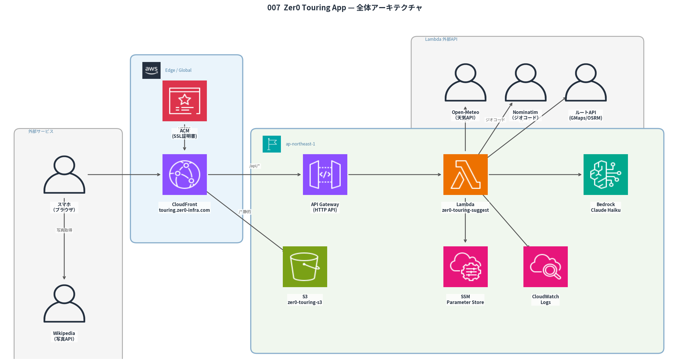

# 007 Zer0 Touring App

> 現在地とリアルタイム天気から Bedrock Claude Haiku が日帰りバイクツーリングコース3ルートを提案する PWA。GPS → Open-Meteo → Bedrock の3ステップを全自動化し、片道・往復時間・帰路提案・特徴タグ・Googleマップナビ連携まで一括生成する。

[](https://aws.amazon.com)
[](https://astro.build)
[](https://touring.zer0-infra.com)
[](https://aws.amazon.com/pricing)

## 概要

| 項目         | 内容                                                                                    |
| ------------ | --------------------------------------------------------------------------------------- |
| URL          | https://touring.zer0-infra.com                                                          |
| 現在地取得   | ブラウザ Geolocation API（許可後30秒タイムアウト）                                      |
| 天気取得     | Open-Meteo API（無料・APIキー不要）                                                     |
| AI提案       | Amazon Bedrock Claude Haiku（片道・往復時間・帰路・特徴タグを含む詳細コース生成）       |
| コース内容   | 近距離・中距離・長距離 + タグ・ルートサマリー・立ち寄りスポット（経路順）・帰路提案    |
| シェア       | Xシェア・URLコピー（?course= Base64でコース情報を復元可能）                             |
| ナビ         | Googleマップ連携（Android: ナビ直起動 / iOS: アプリ直起動 / Web: 経路表示）            |
| ホスティング | CloudFront + S3（PWA / Service Worker 対応）                                            |
| 月額コスト   | ~$0.40（100回利用想定）/ 1回 ~$0.005（約0.7円）                                         |

## アーキテクチャ



```text
[スマホ/PC ブラウザ]
  ├─ GPS（Geolocation API）
  ├─ 天気（Open-Meteo API / 直接 fetch）
  └─ POST /api/suggest
        └─▶ CloudFront（touring.zer0-infra.com）
              ├─ /* → S3（Astro static / HTML・CSS・JS）
              └─ /api/* → API Gateway → Lambda → Bedrock Claude Haiku
```

## 技術スタック

| レイヤー       | 技術                                                                                                     |
| -------------- | -------------------------------------------------------------------------------------------------------- |
| フロントエンド | Astro（`output: 'static'`）+ PWA（Web Manifest + Service Worker）                                        |
| 現在地取得     | ブラウザ Geolocation API                                                                                 |
| 天気取得       | Open-Meteo API（無料・APIキー不要）                                                                      |
| AI提案         | Amazon Bedrock **Claude Haiku 4.5**（`jp.anthropic.claude-haiku-4-5-20251001-v1:0` / max_tokens: 2,048） |
| API            | AWS Lambda（Python 3.14）+ API Gateway HTTP API                                                          |
| ホスティング   | Amazon CloudFront + S3（OAC 署名付きアクセス）                                                           |
| 写真（詳細）   | Wikipedia REST API（`/api/rest_v1/page/summary/{spot}`）/ 失敗時はグラデーション+🏍️                      |
| IaC            | CloudFormation（2スタック: メイン + ACM 証明書）                                                         |

## UI フロー

```text
Landing（コースを探す）
  └─▶ Loading（GPS取得中 → 天気確認中 → AI生成中）
        └─▶ コース一覧（3カラムグリッド / 1画面に全3コース）
              │  各カード: 特徴タグ・ルートサマリー・片道/往復時間・距離バー
              └─▶ コース詳細
                    │  写真 / 見どころ / 道路タイプ / 立ち寄りスポット / 帰路 / 地図
                    ├─ 🗺 Googleマップでナビ開始
                    ├─ 𝕏 でシェア
                    └─ 🔗 URLをコピー（?course= で復元可能）
```

## 実装のこだわり

### 1. API 設計：CloudFront のパスベースルーティング

フロントエンド（S3）と API（Lambda）を**同一ドメイン**に統合。CloudFront のキャッシュビヘイビアで `/api/*` を API Gateway Origin に振り分けることで、CORS 不要・同一オリジン通信を実現。

### 2. GPS タイムアウト設計

初回 GPS 取得はブラウザの初期化処理があるため時間がかかる。当初10秒タイムアウトで設定したが、初回利用時にタイムアウトエラーが頻発する問題が発生。**30秒に延長**し、エラーコード別のメッセージ（`code=1`: 拒否 / `code=3`: タイムアウト）で UX を改善。

### 3. Bedrock プロンプト設計（構造化 JSON 出力）

プロンプトで JSON スキーマを厳密に定義。立ち寄りスポットは**現在地 → スポット1 → スポット2 → 目的地**の地理的順序で並べること、一般道40km/h・高速60km/hで計算した現実的な所要時間にすること、を明示してプロンプトで制御。

### 4. Googleマップナビ：プラットフォーム別 URL 振り分け

GPS 座標を `origin` として保持し、タップ時に OS を検出して最適なスキームで起動。

```javascript
if (isAndroid) return `google.navigation:q=${dest}&mode=d`;          // ワンタップでナビ開始
if (isIOS)     return `comgooglemaps://?saddr=${coord}&daddr=${dest}`; // アプリ直起動
return `https://www.google.com/maps/dir/?api=1&origin=${coord}&destination=${dest}&travelmode=driving`;
```

### 5. URLシェア・コース復元（Base64エンコード）

詳細画面を開くと `?course=<Base64>` が URL に付与され、URL をコピーして共有すると受信者がそのコースを直接詳細画面で閲覧できる。

```javascript
// エンコード（日本語対応）
btoa(encodeURIComponent(JSON.stringify(courseData)))
// デコード
JSON.parse(decodeURIComponent(atob(param)))
```

### 6. Service Worker：ネットワークファーストで常に最新を取得

`index.html` はネットワーク優先で取得してキャッシュ更新。ハッシュ付き静的アセット（`_astro/*.js`）はキャッシュファーストで高速配信。

```javascript
// index.html → network-first（デプロイ直後に反映）
// _astro/*.js → cache-first（コンテンツハッシュで変更検知）
```

### 7. Astro `define:vars` ではなく `import.meta.env` を使用

`define:vars` を使うと Astro がスクリプトを IIFE でラップし、Vite のバンドル処理と競合してスクリプト内容が消える問題が発生。`import.meta.env.PUBLIC_API_URL` を直接使うことで Vite がビルド時に環境変数を安全に置換する方式に変更。

## ディレクトリ構成

```text
007_Zer0_TouringApp/
├── frontend/                    # Astro static PWA
│   ├── src/pages/index.astro    # 全画面（Landing/Loading/一覧/詳細/Error）
│   ├── public/
│   │   ├── manifest.json        # PWA マニフェスト
│   │   ├── sw.js                # Service Worker（ネットワークファースト）
│   │   └── icons/               # アプリアイコン（192px / 512px）
│   ├── astro.config.mjs
│   └── package.json
├── backend/
│   ├── lambda_function.py       # Bedrock コース提案 API
│   └── deploy.sh                # Lambda デプロイ
├── infra/
│   ├── cloudformation-certificate.yaml  # ACM（us-east-1）
│   ├── cloudformation-touring.yaml      # メインリソース
│   └── deploy-infra.sh                  # フルデプロイ
├── generate_diagram.py          # アーキテクチャ図生成
└── images/
    └── 007_architecture.png
```

## デプロイ

```bash
# Lambda のみ更新
cd backend && zip -j /tmp/touring.zip lambda_function.py
aws lambda update-function-code --function-name zer0-touring-suggest \
  --zip-file fileb:///tmp/touring.zip --region ap-northeast-1

# フロントエンドのみ更新
cd frontend && npm run build
aws s3 sync dist/ s3://zer0-touring-s3 --delete
aws cloudfront create-invalidation --distribution-id E1Z92GZIT4IDGA --paths "/*"
```

## API リファレンス

### POST /api/suggest

**リクエスト**

```json
{ "latitude": 35.6762, "longitude": 139.6503, "temperature": 22, "weather_condition": "晴れ" }
```

**レスポンス**

```json
{
  "courses": [{
    "name": "江の島・鎌倉海岸コース",
    "distance_km": 65,
    "duration_hours": 3.5,
    "return_hours": 3.0,
    "return_note": "134号線で帰還、来た道を折り返す",
    "highlights": ["江の島弁財天", "鎌倉大仏"],
    "destination": "江の島",
    "photo_spot": "江の島",
    "difficulty": "初級",
    "road_types": ["国道", "海岸線"],
    "rest_spots": [
      {"name": "道の駅 湘南江の島", "type": "道の駅"},
      {"name": "しらす料理 食堂", "type": "食事処"}
    ],
    "caution": "海岸線は強風注意",
    "best_season": "3月〜10月",
    "tags": ["🌊 海沿い", "🌸 景色良し", "🐟 グルメ"]
  }]
}
```

**所要時間計算基準：** 一般道 40km/h・高速 60km/h + 休憩・観光 1〜2時間加算。

## コスト内訳

| サービス                                              | 月額（100回利用）    |
| ----------------------------------------------------- | -------------------- |
| Bedrock Claude Haiku（in: ~720 / out: ~1,200 tokens） | ~$0.40               |
| Lambda 実行（~3秒 / 256MB）                           | ~$0.001              |
| API Gateway・CloudFront・S3                           | ~$0                  |
| **合計**                                              | **~$0.40（約60円）** |
