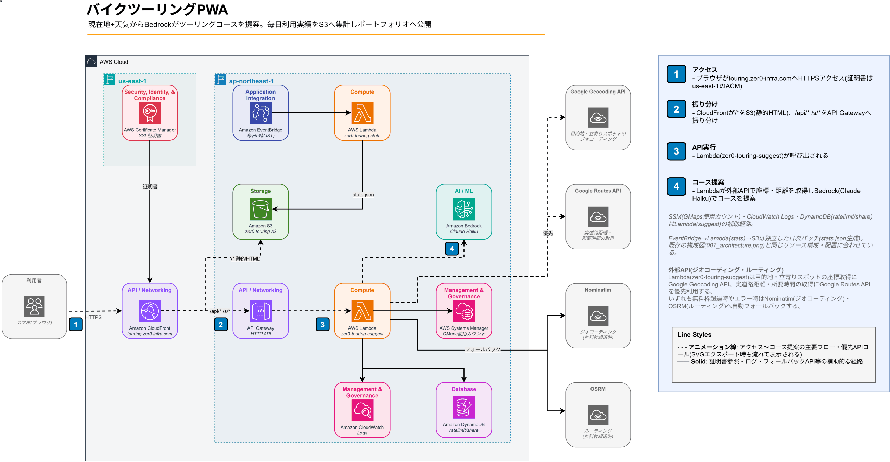

# 007 Zer0 Touring App

> 出発地（現在地 or 手動入力）とリアルタイム天気から Bedrock Claude Haiku が日帰りバイクツーリングコース3ルートを提案する PWA。GPS → Open-Meteo → Bedrock の3ステップを全自動化し、好みスタイルタグ（峠道・海沿い・温泉・グルメ・絶景・自然・歴史・ガッツリ走る・のんびり）によるコース調整、現在地・目的地の天気比較・片道/往復時間・帰路提案・特徴タグ・Googleマップナビ連携・OGP付きURL短縮シェアまで一括生成する。

[](https://aws.amazon.com)
[](https://astro.build)
[](https://touring.zer0-infra.com)
[](https://aws.amazon.com/pricing)

## 概要

| 項目 | 内容 |
| --- | --- |
| URL | `https://touring.zer0-infra.com` |
| 出発地取得 | 現在地（ブラウザ Geolocation API）または手動入力（Nominatim ジオコーディング） |
| 天気取得 | Open-Meteo API（現在地・目的地の両方／無料・APIキー不要） |
| AI提案 | Amazon Bedrock Claude Haiku（好みタグ反映・片道/往復時間・帰路・特徴タグ含む詳細コース生成） |
| コース内容 | 初級（往復20〜49km）・中級（往復50〜99km）・上級（往復100km〜） + タグ・立ち寄りスポット（経路順）・帰路提案 |
| 距離・時間 | **Google Maps Directions API（優先）** / OSRM（フォールバック）による往復の実道路距離・走行時間。詳細表示で実測値へ更新 |
| 天気比較 | 詳細画面に現在地 🏍️→ 目的地の天気比較ウィジェット（バイク走行アニメーション付き） |
| 週間天気 | 現在地・目的地の7日間天気予報ストリップ（狙い目日ハイライト） |
| シェア | Xシェア・URL短縮コピー（`POST /api/share` → `https://touring.zer0-infra.com/s/abc123`。OGP対応でSNS展開時にコース情報プレビューを表示） |
| ナビ | Googleマップ連携（立ち寄りスポット含む / 全デバイス統一 Google Maps URL） |
| ホスティング | CloudFront + S3（PWA / Service Worker 対応） |
| 月額コスト | ~$0.40（100回利用想定）/ 1回 ~$0.005（約0.7円） |

## アーキテクチャ



```text
[スマホ/PC ブラウザ]
  ├─ GPS（Geolocation API）
  ├─ 天気（Open-Meteo API / 直接 fetch）
  └─ POST /api/suggest
        └─▶ CloudFront（touring.zer0-infra.com）
              ├─ /* → S3（Astro static / HTML・CSS・JS）
              └─ /api/* → API Gateway → Lambda → Bedrock Claude Haiku
                                                     ├─ Nominatim（ジオコーディング）
                                                     ├─ Google Maps Directions API（走行時間）
                                                     ├─ OSRM（フォールバック距離）
                                                     └─ Open-Meteo（目的地天気）

[EventBridge Scheduler（毎日5:00 JST）] ─▶ [Lambda zer0-touring-stats] ─▶ [S3 stats.json]
  （利用実績集計バッチ。/api/suggest成功時のカスタムメトリクスを集計しポートフォリオサイトのグラフに公開）
```

## 技術スタック

| レイヤー | 技術 |
| --- | --- |
| フロントエンド | Astro（`output: 'static'`）+ PWA（Web Manifest + Service Worker） |
| 現在地取得 | ブラウザ Geolocation API |
| 天気取得 | Open-Meteo API（現在地・目的地・7日間予報 / 無料・APIキー不要） |
| AI提案 | Amazon Bedrock **Claude Haiku 4.5**（`jp.anthropic.claude-haiku-4-5-20251001-v1:0` / max_tokens: 2,048） |
| 距離・走行時間 | **Google Maps Directions API**（優先・月10,000件無料） + Nominatim（OSM ジオコーディング）→ OSRM フォールバック |
| API | AWS Lambda（Python 3.14）+ API Gateway HTTP API |
| 使用数管理 | Amazon DynamoDB（`zer0-touring-ratelimit` / `gmaps#{YYYY-MM}` キーで月間 Google Maps 使用数をアトミック管理） |
| レートリミット | Amazon DynamoDB（`zer0-touring-ratelimit`：IP 別・日別 3回制限 / TTL で翌々日自動削除） |
| URL短縮・OGP | Amazon DynamoDB（`zer0-touring-share`：6文字ID・30日 TTL / Lambda が OGP HTML + リダイレクトを返す） |
| コース履歴保存 | Amazon DynamoDB（`zer0-touring-history`：端末ID紐づけ・180日 TTL・最大30件 / `x-device-id`ヘッダーで識別） |
| 使用回数UI | GET /api/status でトップ画面にドット形式の残回数バッジを表示（管理者モード対応） |
| ホスティング | Amazon CloudFront + S3（OAC 署名付きアクセス） |
| APIオリジン認証 | SSM Parameter Store `/touring/edge_secret`（SecureString、CloudFrontとLambdaのみ参照） |
| 写真（詳細） | Wikipedia REST API（`/api/rest_v1/page/summary/{spot}`）/ 失敗時はグラデーション+🏍️ |
| IaC | CloudFormation（2スタック: メイン + ACM 証明書） |

## UI フロー

```text
Landing（コースを探す）
  │  📍現在地 / ✏️出発地を入力（Nominatim ジオコーディング）
  │  好みスタイルタグ: 🏔峠道 🌊海沿い ♨️温泉 🍜グルメ 🌅絶景 🌳自然 🏯歴史 🛣ガッツリ走る ☕のんびり（3×3グリッド・複数選択可）
  └─▶ Loading（GPS/出発地取得中 → 天気確認中 → AI生成中）
        └─▶ コース一覧（スワイプカード / 1枚ずつ表示・横スワイプで切り替え）
              │  各カード: 初級🟢（往復20〜49km）/中級🔵（往復50〜99km）/上級🟣（往復100km〜）
              │            ルートサマリー（📍現在地 → 立ち寄り → 目的地）
              │            往復目安距離・片道/往復時間・目的地天気バッジ（📌 ☀️ 22℃）
              │            特徴タグ（🌊 海沿い / ⛰ 峠あり / ♨️ 温泉あり 等）
              │  画面下部: 現在地の週間天気予報ストリップ（最高/最低気温）
              └─▶ コース詳細
                    │  写真 / 現在地⇔目的地 天気比較ウィジェット（🏍️ アニメーション）
                    │  見どころ / 道路タイプ / 立ち寄りスポット / 帰路 / 地図
                    │  目的地の週間天気予報ストリップ（最高/最低気温）
                    ├─ 🗺 Googleマップでナビ開始（立ち寄りスポット含む）
                    ├─ 𝕏 でシェア（短縮URL付き）
                    └─ 🔗 URLをコピー（短縮URL: /s/abc123 / OGP付き）
```

## 実装のこだわり

### 1. API 設計：CloudFront のパスベースルーティング

フロントエンド（S3）と API（Lambda）を**同一ドメイン**に統合。CloudFront のキャッシュビヘイビアで `/api/*` を API Gateway Origin に振り分けることで、CORS 不要・同一オリジン通信を実現。

### 2. GPS タイムアウト設計

初回 GPS 取得はブラウザの初期化処理があるため時間がかかる。当初10秒タイムアウトで設定したが、初回利用時にタイムアウトエラーが頻発する問題が発生。**30秒に延長**し、エラーコード別のメッセージ（`code=1`: 拒否 / `code=3`: タイムアウト）で UX を改善。

### 3. Bedrock プロンプト設計（構造化 JSON 出力）

プロンプトで JSON スキーマを厳密に定義。立ち寄りスポットは**現在地 → スポット1 → スポット2 → 目的地**の地理的順序で並べること、純粋な走行時間（休憩・観光時間を含まない）で計算することを明示してプロンプトで制御。

### 4. Googleマップナビ：立ち寄りスポット含む全ルート案内

立ち寄りスポットを waypoints として含めた状態で起動。全デバイスで同一の `https://` URL に統一（iOS `comgooglemaps://` は廃止）。

```javascript
// iOS / Android / Web 全デバイス統一
// 目的地・waypoints はジオコード済み座標を優先使用（名前フォールバックあり）
https://www.google.com/maps/dir/?api=1&origin=LAT,LON&destination=DEST_LAT,DEST_LON&waypoints=spot1_lat,spot1_lon|spot2_lat,spot2_lon&travelmode=driving
```

- `comgooglemaps://` は廃止。iOS でも `https://` で開くと Google マップアプリが起動する
- `google.navigation:` スキームは waypoints 非対応のため使用しない
- 行き経由地（`outbound_spots`）を waypoints として含める。帰り立ち寄り（`return_spots`）は別管理

### 5. URLシェア・コース復元（Base64エンコード）

詳細画面を開くと `?course=<Base64>` が URL に付与され、URL をコピーして共有すると受信者がそのコースを直接詳細画面で閲覧できる。

```javascript
// エンコード（日本語対応）
btoa(encodeURIComponent(JSON.stringify(courseData)))
// デコード
JSON.parse(decodeURIComponent(atob(param)))
```

### 6. Google Maps 優先 / OSRM フォールバック（高速対応ルーティング）

AI が推測した距離・時間を実際の道路データで上書きする。**月10,000件の無料枠内は Google Maps Directions API を優先**し、枠超過時は OSRM にフォールバックする。

1. 目的地名を **Nominatim**（OpenStreetMap ジオコーダー）で GPS 座標に変換
2. **DynamoDB Conditional Update** で今月の Google Maps 使用カウントをアトミックに確認・予約（9,900 超なら OSRM へ）
3. **Google Maps**: 高速道路を含む実走行時間・距離を取得
4. **OSRM フォールバック**: 実道路距離を取得し、距離帯別平均速度で所要時間を算出
   - ≥80km: 70km/h（高速想定）/ 40〜80km: 55km/h / <40km: 40km/h
5. ジオコーディング失敗・異常値（500km超）は AI 推定値にフォールバック

GMAPS_FREE_LIMIT を 10,000 ではなく **9,900** にしているのは 100 件のバッファを確保するため。DynamoDB Conditional Update によりアトミックに増分するため並列実行時でも上限を正確に守れる。

### 7. 天気連動表示（現在地 + 目的地）

現在地の天気を結果画面へフィードバックするだけでなく、Lambda が Nominatim でジオコーディングした目的地座標で **Open-Meteo を再取得**し、目的地の現在天気も返す。

- **カード**: 目的地天気バッジ `📌 ☀️ 22℃` をカードヘッダー左下に表示
- **詳細画面**: 現在地 ↔ 目的地の天気を横並び比較。中央にバイク🏍️が左から右へ走るアニメーション
- **週間予報**: 現在地（コース一覧下部）・目的地（詳細画面内）それぞれに7日間ストリップを表示し、スコア最高日に「★ 狙い目」バッジ

### 8. Service Worker：ネットワークファーストで常に最新を取得

`index.html` はネットワーク優先で取得してキャッシュ更新。ハッシュ付き静的アセット（`_astro/*.js`）はキャッシュファーストで高速配信。

```javascript
// index.html → network-first（デプロイ直後に反映）
// _astro/*.js → cache-first（コンテンツハッシュで変更検知）
```

### 9. Astro `define:vars` ではなく `import.meta.env` を使用

`define:vars` を使うと Astro がスクリプトを IIFE でラップし、Vite のバンドル処理と競合してスクリプト内容が消える問題が発生。`import.meta.env.PUBLIC_API_URL` を直接使うことで Vite がビルド時に環境変数を安全に置換する方式に変更。

### 10. iOS Safari のバックグラウンドリロード対応

iOS Safari はバックグラウンドに回った後に再フォアグラウンドするとページをリロードする。詳細画面の URL `/?course=xxx` でリロードされた場合でもコースを Base64 URL から復元して詳細画面を直接表示できる。また、ブラウザネイティブの戻るジェスチャー（`popstate` イベント）でも詳細 → 一覧への遷移を正しく処理する。

### 11. Waypoint ジオコード＋方向フィルタ

AI が生成した立ち寄りスポット名を Lambda 内で Nominatim（OSM）によりジオコーディングし、`origin → destination` のバウンディングボックス外のスポットをナビ・地図用の経由点から除外する。表示用の提案スポットは別配列に残すため、ジオコード失敗や方向不一致で観光地・道の駅・温泉／銭湯の表示が消えない。Google マップには検証済みの `lat,lon` 座標を優先して渡すことで誤ジオコーディングによるルート崩壊を防ぐ。

行き経由地（`outbound_spots`）と帰り立ち寄り（`return_spots`）を分離し、目的地を含めた全スポットをコース間でも重複排除する。端末内には直近60件を保存し、次回のAI提案ではデータ境界付きの除外条件として渡すことで、同じ場所の反復も抑える（1回の生成で目的地+スポットが最大12件程度増えるため、18件では2回の再検索で最初の除外対象が押し出され同じコースが再提案される不具合があり、2026-09-04に60件へ拡張）。AI出力は初級・中級・上級の3件すべてが距離帯・必須スポット・重複なしの条件を満たす場合だけ返す。各コースは観光地または展望台を含み、3コース全体では道の駅を1件以上、温泉・日帰り温泉・銭湯を1件以上必須とする。

### 12. 詳細取得APIの悪用防止

`POST /api/enrich` はNominatim・Google Maps Directions・OSRMを呼び出すため、IP別・日別に9回（提案3回×各3コース）へ制限する。目的地・経由地点・座標も外部API呼び出し前に検証し、任意地点の検索プロキシとして使えないようにする。地図とGoogleマップナビには座標検証済みの経由地点だけを渡し、詳細取得前は目的地直行にする。

### 13. IPレートリミット（DynamoDB）

DynamoDB の Conditional Update で IP 別・日別のカウントをアトミックに管理。1日3回を超えると 429 を返す。TTL で翌々日0時に自動削除。トップ画面には残回数をドットバッジで表示（3/3 形式）。管理者は `X-Admin-Token` ヘッダーでレート制限をバイパスできる。

### 14. URL短縮 + OGP（DynamoDB + Lambda HTML レスポンス）

静的サイト（S3 + CloudFront）は動的 OGP メタタグを生成できないため、Lambda が `/s/{id}` に対して OGP メタタグ付き HTML を直接返し、その後アプリへリダイレクトする方式で解決。

```text
SNS にシェア → /s/abc123 → Lambda が OGP HTML 返却 → SNS クローラーがプレビュー生成
              → ユーザーがタップ → JS で /?course=... へリダイレクト → アプリがコース復元
```

- 6文字英数字 ID（`random.choices`）を DynamoDB に保存（TTL 30日で自動削除）
- `og:image` は Wikipedia REST API から目的地の写真を取得（失敗時はアプリアイコン）
- コースデータは `base64(url_encode(JSON.stringify()))` 形式でリダイレクト URL に埋め込み（Python/JS で相互変換可能）
- `/s/*` は CloudFront のキャッシュビヘイビアで API Gateway オリジンへルーティング

### 15. コース別景観シルエット（CSS clip-path）

カードヘッダー背景をコース種別で視覚的に差別化。`::before`/`::after` 擬似要素に `clip-path: polygon()` を使って地形シルエットを描画し、JavaScript による DOM 変更なしに純粋な CSS で実装。

| コース | 背景色 | シルエット形状                   |
| ------ | ------ | -------------------------------- |
| 初級 | 濃緑   | 低い丘と木立（緩やかな波形）     |
| 中級 | 紺青   | 海の水平線（波とグラデーション） |
| 上級 | 深紫   | ギザギザ山脈（2層：前景と背景）  |

## ディレクトリ構成

```text
007_Zer0_TouringApp/
├── frontend/                    # Astro static PWA
│   ├── src/pages/index.astro    # 全画面（Landing/Loading/一覧/詳細/Error）
│   ├── public/
│   │   ├── manifest.json        # PWA マニフェスト
│   │   ├── sw.js                # Service Worker（ネットワークファースト）
│   │   └── icons/               # アプリアイコン（192px / 512px）
│   ├── astro.config.mjs
│   └── package.json
├── backend/
│   ├── lambda_function.py       # Bedrock コース提案 API
│   └── deploy.sh                # Lambda デプロイ
├── infra/
│   ├── cfn-certificate.yaml  # ACM（us-east-1）
│   ├── cfn-touring.yaml      # メインリソース
│   └── deploy-infra.sh                  # フルデプロイ
├── scripts/
│   └── generate_diagram.py      # アーキテクチャ図生成（matplotlib版、2026-08-10以降は未使用）
└── images/
    ├── 007_architecture.drawio  # 構成図（draw.ioで手動編集する一次情報源）
    └── 007_architecture.png     # 上記からエクスポートした画像（本ドキュメントで表示）
```

## デプロイ

```bash
# Lambda のみ更新
cd backend && zip -j /tmp/touring.zip lambda_function.py
aws lambda update-function-code --function-name zer0-touring-suggest \
  --zip-file fileb:///tmp/touring.zip --region ap-northeast-1

# フロントエンドのみ更新
cd frontend && npm run build
# stats.jsonはzer0-touring-stats Lambdaが日次生成する動的ファイルでビルド成果物に含まれないため、
# --deleteで誤って消さないよう必ず--excludeすること（2026-08-09に一度誤削除する事故あり）
aws s3 sync dist/ s3://zer0-touring-s3 --delete --exclude "stats.json"
aws cloudfront create-invalidation --distribution-id E1Z92GZIT4IDGA --paths "/*"
```

## API リファレンス

### POST /api/suggest

**リクエスト**  

```json
{
  "latitude": 35.6762,
  "longitude": 139.6503,
  "temperature": 22,
  "weather_condition": "晴れ",
  "preferences": ["峠道", "温泉"]
}
```

`preferences` は省略可（空配列または未指定でAIに完全おまかせ）。指定可能な値: `峠道` / `海沿い` / `温泉` / `グルメ` / `絶景` / `自然` / `歴史` / `ガッツリ走る` / `のんびり`（`ガッツリ走る` と `のんびり` は排他）。

**レスポンス**  

```json
{
  "courses": [{
    "name": "江の島・鎌倉海岸コース",
    "distance_km": 65,
    "duration_hours": 1.5,
    "return_hours": 1.5,
    "return_note": "134号線で帰還、来た道を折り返す",
    "highlights": ["江の島弁財天", "鎌倉大仏"],
    "destination": "江の島",
    "photo_spot": "江の島",
    "difficulty": "初級",
    "road_types": ["国道", "海岸線"],
    "outbound_spots": [
      {"name": "道の駅 湘南江の島", "type": "道の駅", "lat": 35.31, "lon": 139.48}
    ],
    "return_spots": [
      {"name": "しらす料理 食堂", "type": "食事処", "lat": 35.32, "lon": 139.45}
    ],
    "caution": "海岸線は強風注意",
    "best_season": "3月〜10月",
    "tags": ["🌊 海沿い", "🌸 景色良し", "🐟 グルメ"],
    "dest_lat": 35.3013,
    "dest_lon": 139.4797,
    "dest_temp": 21,
    "dest_weather_code": 1
  }]
}
```

**所要時間**：純粋な走行時間のみ（休憩・観光時間は含まない）。Google Maps / OSRM の実データで AI 推定値を上書き。フロントエンド表示は「約X時間Y分」形式、分は10分単位で切り上げ。

### GET /api/status

**レスポンス**  

```json
{ "used": 1, "limit": 3, "remaining": 2 }
```

管理者トークン一致時は `{ "used": 0, "limit": 3, "remaining": 3, "admin": true }`。

### POST /api/share

コースデータを DynamoDB に保存し、短縮URLを返す。

**リクエスト**  

```json
{ "course": { /* POST /api/suggest レスポンスのコースオブジェクト */ } }
```

**レスポンス**  

```json
{ "url": "https://touring.zer0-infra.com/s/abc123" }
```

### GET /s/{id}

OGP メタタグ付き HTML を返しアプリへリダイレクト。SNS シェア時にコース名・目的地・写真がプレビューとして表示される（TTL: 30日）。

### POST /api/history

コース生成結果を端末ID（`x-device-id` ヘッダー）に紐づけて DynamoDB（`zer0-touring-history`）に保存する。1日3回の生成上限で消えてしまう候補コースをあとから見返せるようにする機能。レートリミット対象外、TTL: 180日。

### GET /api/history

端末IDに紐づく履歴一覧を新しい順に最大30件返す。

## 初回セットアップ

### Google Maps API キー

1. [Google Cloud Console](https://console.cloud.google.com/) でプロジェクトを作成（または既存選択）
2. **Maps Platform → Directions API** を有効化
3. 認証情報 → API キーを作成
4. Lambda 環境変数に設定:

```bash
aws lambda update-function-configuration \
  --function-name zer0-touring-suggest \
  --environment "Variables={BEDROCK_MODEL_ID=jp.anthropic.claude-haiku-4-5-20251001-v1:0,GOOGLE_MAPS_API_KEY=YOUR_API_KEY,DAILY_LIMIT=3}" \
  --region ap-northeast-1
```

月10,000件の無料枠。月9,900件超で自動的に OSRM フォールバックへ切り替わるため実質0円で運用可能。

### Admin Token（レートリミットバイパス）

テスト時にIP制限（1日3回）を回避するための管理者トークン。

```bash
# Lambda 環境変数に追加（GOOGLE_MAPS_API_KEY等と合わせて設定）
aws lambda update-function-configuration \
  --function-name zer0-touring-suggest \
  --environment "Variables={BEDROCK_MODEL_ID=jp.anthropic.claude-haiku-4-5-20251001-v1:0,GOOGLE_MAPS_API_KEY=YOUR_GMAPS_KEY,DAILY_LIMIT=3,ADMIN_TOKEN=YOUR_ADMIN_TOKEN}" \
  --region ap-northeast-1

# 使用方法（curl）
curl -X POST https://touring.zer0-infra.com/api/suggest \
  -H "Content-Type: application/json" \
  -H "X-Admin-Token: YOUR_ADMIN_TOKEN" \
  -d '{"latitude": 35.6762, "longitude": 139.6503, ...}'
```

## 運用コマンド

```bash
# Lambda ログ確認
aws logs tail /aws/lambda/zer0-touring-suggest --follow --region ap-northeast-1

# Google Maps 月間使用カウント確認（DynamoDB管理）
aws dynamodb get-item --table-name zer0-touring-ratelimit --key '{"pk":{"S":"gmaps#'$(date +%Y-%m)'"}}' --region ap-northeast-1

# フロントエンド再デプロイ（コード変更後、stats.jsonは--excludeで誤削除を防止）
cd 007_Zer0_TouringApp/frontend && npm run build && \
aws s3 sync dist/ s3://zer0-touring-s3 --delete --exclude "stats.json" && \
aws cloudfront create-invalidation --distribution-id E1Z92GZIT4IDGA --paths "/*"
```

> **CFn スタック更新時の注意**: `CertificateArn` を省略するとカスタムドメインが消える。  
> 必ず CLAUDE.md のコマンドを使うこと。

## トラブルシューティング

- **コース提案が返らない**
  - 原因: Bedrock モデルアクセス未承認
  - 対処: AWS Console → Bedrock → モデルアクセスで Claude Haiku 4.5 を有効化
- **Google Maps の時間が表示されない**
  - 原因: API キー未設定 or 枠超過
  - 対処: Lambda 環境変数 `GOOGLE_MAPS_API_KEY` を確認。超過時は翌月自動復帰
- **1日3回制限に引っかかる（開発中）**
  - 原因: IP レートリミット
  - 対処: `X-Admin-Token` ヘッダーを付けてリクエスト
- **GPS が取得できない（モバイル）**
  - 原因: HTTP 環境 or 権限拒否
  - 対処: HTTPS（touring.zer0-infra.com）でアクセス。ブラウザの位置情報を許可
- **シェアURLが機能しない**
  - 原因: DynamoDB TTL 30日超過
  - 対処: 再度コース提案 → シェアボタンから新しいURLを生成
- **CloudFront のキャッシュが古い**
  - 原因: デプロイ後のキャッシュ残留
  - 対処: `aws cloudfront create-invalidation ... --paths "/*"` で手動クリア
- **立ち寄りスポットの座標がずれる**
  - 原因: Nominatim ジオコーディング誤認識
  - 対処: CloudWatch Logs でスポット名と座標を確認。日本語正式名称に変更

## コスト内訳

| サービス                                              | 月額（100回利用）    |
| ----------------------------------------------------- | -------------------- |
| Bedrock Claude Haiku（in: ~720 / out: ~1,200 tokens） | ~$0.40               |
| Lambda 実行（~3秒 / 256MB）                           | ~$0.001              |
| Google Maps Directions API（300回/月以内）            | $0（無料枠内）       |
| DynamoDB（ratelimit + share / PAY_PER_REQUEST）       | ~$0（無料枠内）      |
| API Gateway・CloudFront・S3                           | ~$0                  |
| **合計**                                              | **~$0.40（約60円）** |

## 変更履歴

直近1日分のみ表示。全履歴は [CHANGELOG.md](./CHANGELOG.md) を参照。

### 2026-09-05

#### コース距離帯の変更（近距離をより短く）

- 初級20〜70km・中級80〜150km・上級160〜250kmだった距離帯を、初級20〜49km（近距離）・中級50〜99km（中距離）・上級100〜300km（長距離）へ変更
- AI提案プロンプトの距離帯指示・実道路距離取得後の帯域検査（`COURSE_PROFILES`）・フロント表示ラベルの3箇所を同時に更新

#### 同じ出発地で毎回同じコースが出る不具合の修正

- 原因は「直近提案済みの場所」除外リストの上限が18件だったこと。1回の生成で目的地+立ち寄りスポットが最大12件程度増えるため、2回の再検索で最初の除外対象が押し出され、同じコースが再提案されていた
- 除外リストの上限を端末側（`localStorage`）・Lambda側（`normalize_excluded_places`）ともに18件から60件（約5回分）へ拡張
- AIプロンプトに「目的地は除外リストと大きく異なる方角・地域を選ぶこと」の指示を追加し、除外指示の遵守を強化

#### Googleマップナビが目的地「見つかりません」になる不具合の修正

- ユーザー報告により、詳細画面・一覧カードの「Googleマップでナビ開始」ボタンをenrich（座標取得）完了前にクリックすると、目的地が座標でなくテキスト名のままGoogleマップへ渡り、湖・峠等の自然地名で検索に失敗することが判明
- 両ボタンをクリック時にenrich完了（または断念）まで待ってから座標付きURLで開く方式に変更。`enrichCourseDetail`の実行中Promiseをコースオブジェクトにキャッシュし、複数箇所からの呼び出しで二重フェッチしないようにした

#### Fableモデルによる徹底コードレビューで発見した不具合7件を修正

- return_spots（帰りの立ち寄り先）の温泉・日帰り温泉・銭湯必須はプロンプト上「3コース全体で最低1箇所」だったが、実装はコース単位で強制しており、AIが妥当な「食事処」等を選ぶだけで`/api/suggest`全体が却下され1日3回の生成枠を無駄に消費していた。コース単位ではスポット種別全体を許容するよう修正
- 共有リンク・自分自身の`?course=`URLに埋め込むbase64が標準アルファベット（`+` `/`を含みうる）のままURLエンコードされておらず、`+`を含む場合に`URLSearchParams`が半角スペースへデコードして`atob`が壊れ、無言でコースが開けなくなる不具合をバックエンド・フロントエンド両方で修正
- 詳細画面のルート地図で、目的地マーカーのポップアップに`destination`がHTMLエスケープされないまま渡っており、細工した共有リンク経由でスクリプトが実行されうる状態だったため`escHtml`を適用（XSS対策）
- GPS/手動検索を一度も行わずに履歴・共有リンクから詳細画面を開くと、目的地天気ウィジェットが「取得中...」のまま永久に固着する不具合（2026-08-09に一度解消した固着バグの再発）を修正
- ブラウザ・iOSの「戻る」操作とアプリの「戻る」ボタンの両方から同じ処理を呼んでいたため、戻る操作1回に対しJS側が余分に履歴を積み増し、アプリを完全に離脱するのに余分な操作が必要になっていた不具合を修正
- 詳細画面で前/次ボタンを素早く連打すると、後から解決した写真取得が先に表示していたコースの写真を上書きしてしまう競合状態を修正（呼び出しごとの通し番号で判定）
- 一覧画面を見ている間に裏で完了した別コースのenrichが、閲覧中のスライド位置・共有URLキャッシュを無条件にリセットしていた不具合を修正。バックグラウンド更新時は状態を保持するオプションを追加
- `localStorage`アクセス失敗時（Safari「すべてのCookieをブロック」等）に例外を投げ、コース生成自体が起動しなくなる箇所に防御的な`try/catch`を追加
