# アーキテクチャ・技術スタック・UIフロー

アーキテクチャ構成図、使用技術スタック、画面遷移（UIフロー）。

[← 目次に戻る](../README.md)

---

## アーキテクチャ



```text
[スマホ/PC ブラウザ]
  ├─ GPS（Geolocation API）
  ├─ 天気（Open-Meteo API / 直接 fetch）
  └─ POST /api/suggest
        └─▶ CloudFront（touring.zer0-infra.com）
              ├─ /* → S3（Astro static / HTML・CSS・JS）
              └─ /api/* → API Gateway → Lambda → Bedrock Claude Haiku
                                                     ├─ Google Geocoding API（ジオコーディング優先）/ Nominatim（フォールバック）
                                                     ├─ Google Routes API（走行時間・距離優先）
                                                     ├─ OSRM（フォールバック距離）
                                                     └─ Open-Meteo（目的地天気）

[EventBridge Scheduler（毎日5:00 JST）] ─▶ [Lambda zer0-touring-stats] ─▶ [S3 stats.json]
  （利用実績集計バッチ。/api/suggest成功時のカスタムメトリクスを集計しポートフォリオサイトのグラフに公開）
```

## 技術スタック

| レイヤー | 技術 |
| --- | --- |
| フロントエンド | Astro（`output: 'static'`）+ PWA（Web Manifest + Service Worker） |
| 現在地取得 | ブラウザ Geolocation API |
| 天気取得 | Open-Meteo API（現在地・目的地・7日間予報 / 無料・APIキー不要） |
| AI提案 | Amazon Bedrock **Claude Haiku 4.5**（`jp.anthropic.claude-haiku-4-5-20251001-v1:0` / max_tokens: 2,048） |
| ジオコーディング | **Google Geocoding API**（優先・月10,000件無料）→ Nominatim（OSM、フォールバック） |
| 距離・走行時間 | **Google Routes API**（`computeRoutes`、優先・月10,000件無料）→ OSRM フォールバック |
| API | AWS Lambda（Python 3.14）+ API Gateway HTTP API |
| 使用数管理 | Amazon DynamoDB（`zer0-touring-ratelimit` / `gmaps#{YYYY-MM}`＝Routes API・`geocode-gmaps#{YYYY-MM}`＝Geocoding API、それぞれ独立カウンタでアトミック管理） |
| レートリミット | Amazon DynamoDB（`zer0-touring-ratelimit`：IP 別・日別 3回制限 / TTL で翌々日自動削除） |
| URL短縮・OGP | Amazon DynamoDB（`zer0-touring-share`：6文字ID・30日 TTL / Lambda が OGP HTML + リダイレクトを返す） |
| コース履歴保存 | Amazon DynamoDB（`zer0-touring-history`：端末ID紐づけ・180日 TTL・最大30件 / `x-device-id`ヘッダーで識別） |
| 使用回数UI | GET /api/status でトップ画面にドット形式の残回数バッジを表示（管理者モード対応） |
| ホスティング | Amazon CloudFront + S3（OAC 署名付きアクセス） |
| APIオリジン認証 | SSM Parameter Store `/touring/edge_secret`（SecureString、CloudFrontとLambdaのみ参照） |
| 写真（詳細） | Wikipedia REST API（`/api/rest_v1/page/summary/{spot}`）/ 失敗時はグラデーション+🏍️ |
| IaC | CloudFormation（2スタック: メイン + ACM 証明書） |

## UI フロー

```text
Landing（コースを探す）
  │  📍現在地 / ✏️出発地を入力（Google Geocoding API優先・Nominatimフォールバック）
  │  好みスタイルタグ: 🏔峠道 🌊海沿い ♨️温泉 🍜グルメ 🌅絶景 🌳自然 🏯歴史 🛣ガッツリ走る ☕のんびり（3×3グリッド・複数選択可）
  └─▶ Loading（GPS/出発地取得中 → 天気確認中 → AI生成中）
        └─▶ コース一覧（スワイプカード / 1枚ずつ表示・横スワイプ or PC矢印ボタンで切り替え）
              │  各カード: 初級🟢（往復20〜49km）/中級🔵（往復50〜99km）/上級🟣（往復100km〜）
              │            ルートサマリー（📍現在地 → 立ち寄り → 目的地）
              │            目的地名（🏁）・目的地天気バッジ（📌 ☀️ 22℃）※距離数値・所要時間は非表示（2026-09-06〜）
              │            特徴タグ（🌊 海沿い / ⛰ 峠あり / ♨️ 温泉あり 等）
              │  画面下部: 現在地の週間天気予報ストリップ（最高/最低気温）
              └─▶ コース詳細
                    │  写真 / 現在地⇔目的地 天気比較ウィジェット（🏍️ アニメーション）
                    │  見どころ / 道路タイプ / 立ち寄りスポット / 帰路 / 地図
                    │  目的地の週間天気予報ストリップ（最高/最低気温）
                    ├─ 🗺 Googleマップでナビ開始（立ち寄りスポット含む）
                    ├─ 𝕏 でシェア（短縮URL付き）
                    └─ 🔗 URLをコピー（短縮URL: /s/abc123 / OGP付き）
```
