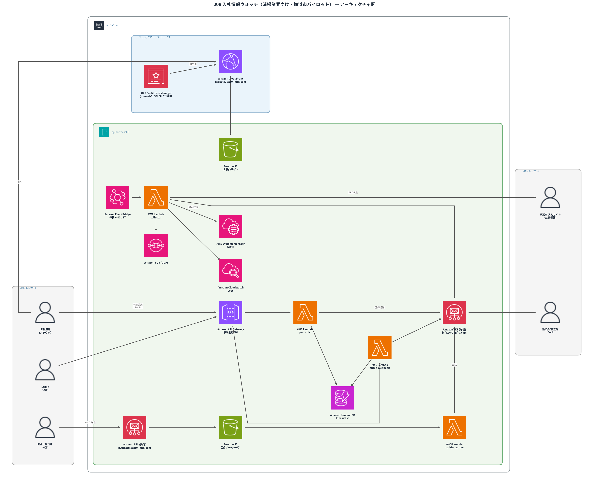

# 008 入札情報ウォッチ（旧称: 入札情報通知Bot、清掃業界向け・横浜市パイロット）

> 横浜市が公開する入札（調達）公告を自動収集し、清掃・ビルメンテナンス業を営む中小企業・個人事業主向けに、清掃関連キーワードに合致する案件だけをメールで自動通知するサブスクリプションサービス。プロジェクト内部の識別子（AWSリソース名・ディレクトリ名等）は`nyusatsu`のまま変更していない。

**現在のステータス: パイロット実装・AWS上でテスト運用中（横浜市単体）。メール通知に加えLINE公式アカウントでの通知にも対応済み。特定商取引法に基づく表記・利用規約・プライバシーポリシーも実装済み。神奈川県から2026-07-24付の回答を受領済みで、残る主な作業はStripe Payment Links発行。東京都への展開は同都からの回答待ち**  

## 概要

| 項目       | 内容                                                                |
| ---------- | ------------------------------------------------------------------- |
| 対象自治体 | 横浜市（「ヨコハマ・入札のとびら」発注情報）                        |
| 対象業種   | 清掃・ビルメンテナンス業                                            |
| 収集頻度   | 毎日 6:00 JST（EventBridge Scheduler）                              |
| 通知方法   | Amazon SES によるメール送信、または LINE公式アカウント（購読者が選択） |
| 収集元URL  | `https://keiyaku.city.yokohama.lg.jp/epco/servlet/p?job=KokokuList` |

## アーキテクチャ



```text
EventBridge（毎日6:00 JST）
  └─▶ Lambda（zer0-nyusatsu-collector）
        ├─ SSM Parameter Store から通知先メール・SES送信元・キーワードを取得
        ├─ 横浜市入札サイトから公告一覧(KokokuList)を取得し、公告番号(kokoku_no)を抽出
        ├─ DynamoDB(zer0-nyusatsu-processed-kokoku) と照合し未処理の号のみ処理
        ├─ 各号の案件一覧(KokokuAnkenList)を取得し「委託」セクションのみ解析
        ├─ 案件名または工種等区分がキーワード(清掃・美化・害虫防除ほか計10語)に合致すれば詳細ページから
        │    種目・参加資格・履行場所・履行期間・開札予定日時を取得(追加リクエストなし)
        ├─ マッチ案件をDynamoDB(zer0-nyusatsu-match-history)に記録(60日TTL)
        ├─ 運営者+DynamoDB(zer0-nyusatsu-lp-waitlist)のactive購読者へ個別SES送信
        └─ 処理済みの号をDynamoDBに記録（重複通知防止）
              失敗時はSQS(DLQ)へ退避
```

SES送信にはConfiguration Set（`zer0-nyusatsu-config-set`）を付与し、バウンス・苦情をSNS経由で検知。Permanentバウンス・苦情アドレスはLambda（`zer0-nyusatsu-bounce-handler`）が自動で`unsubscribed`にする。登録確認時（`GET /confirm`）には、`zer0-nyusatsu-match-history`から直近1ヶ月のマッチ実績をバックフィルしたウェルカムメールを送信する。

## 背景・課題

- 官公庁の入札案件は発注機関ごとにサイトがバラバラで、中小・個人事業主が自力で探すのは負担が大きい
- 告知から締切まで約10日程度と短く、見逃すと機会損失になる
- 既存の最大手サービス（NJSS）は初期費用30万円＋年間約77万円と高額で、中小企業・個人事業主には手が届かない
- 一方、月8,000〜8,800円帯には既に廉価版競合が複数存在するため、**月3,000〜5,000円のセルフサーブ帯**を狙う

## 提供する価値

清掃・ビルメンテナンス業の中小企業・個人事業主に対し、清掃関連キーワードに合う入札案件だけを自動で毎日メール通知する。役所サイトを自分で巡回する手間と見逃しリスクをなくし、NJSSを払えない層でも案件を取りこぼさず受注機会を増やせるようにする。

## なぜ横浜市を最初のターゲットにしたか

Fableでの調査比較の結果、以下の理由で横浜市を選定した。

- 案件一覧・詳細ともに**GET URLのみでセッション不要**に取得でき、技術的に最も実装しやすい（愛知県・神奈川県は規約上の制約やCSRFトークンが必要）
- 横浜市の公式著作権ポリシーで「数値データ・簡単な表は著作権保護対象外で自由利用可」と明記されており、案件名・番号等の事実データ通知は法的に問題が少ない
- 自動収集に関する明示的な禁止規定なし（robots.txt制限もなし）
- 一方、愛知県（あいち電子調達共同システム）は約60団体を1本のシステムでカバーできる強みがあるが、利用規約に「目的外利用禁止」条項がありグレーゾーン。商用利用の可否は運営協議会へ事前照会が必要なため、パイロットでは見送った

## 法的な留意事項

- 収集対象は横浜市の**ログイン不要の公開ページ**のみ（規約でスクレイピング禁止と明記されたサイトは対象外方針）
- 通知するのは案件名・契約番号・入札方式・担当部局等の**事実データ**のみで、原文・画像の転載は行わない
- アクセス間隔は3秒以上空け、日次1回のみ実行し対象サーバーに負荷をかけない設計

## ビジネスモデル

| 項目 | 内容 |
| --- | --- |
| 提供形態 | メールによる定期通知 |
| 料金 | 月額3,000円（予定）。セルフサーブ帯での検討を経て確定（未確定要素あり・現在は無料テスト運用） |
| 決済 | Stripe Payment Links を利用予定（[docs_payment_setup.md](../docs/docs_payment_setup.md)参照）。自前の決済システムは開発しない |
| 収集元 | 横浜市発注情報（パイロット）。将来的にエリア拡大を検討 |

## AWSリソース（デプロイ済み）

リソース種別ごとに分けて記載する。全リソースは5つのCloudFormationスタックで管理（詳細は最後の一覧を参照）。

### Lambda関数（すべてPython 3.14）

| 関数名                         | 役割                                       |
| ------------------------------ | ------------------------------------------ |
| `zer0-nyusatsu-collector`      | 日次収集・案件マッチ・メール/LINE通知送信  |
| `zer0-nyusatsu-bounce-handler` | SESバウンス・苦情受信 → 自動配信停止       |
| `zer0-nyusatsu-lp-waitlist`    | LP登録・確認・配信停止・LINE連携API        |
| `zer0-nyusatsu-stripe-webhook` | Stripe決済イベント処理・購読者突合         |
| `zer0-nyusatsu-mail-forwarder` | 問合せメールを個人メールへ転送             |
| `zer0-nyusatsu-activate-ruleset` | SES受信ルールセット有効化（カスタムリソース） |

### DynamoDBテーブル

| テーブル名                        | 用途                                                |
| --------------------------------- | ---------------------------------------------------- |
| `zer0-nyusatsu-processed-kokoku`  | 処理済み公告番号の記録（重複通知防止）               |
| `zer0-nyusatsu-match-history`     | マッチ案件履歴（60日TTL、バックフィルウェルカムメール用） |
| `zer0-nyusatsu-lp-waitlist`       | 購読者情報（email・status・channel等）               |
| `zer0-nyusatsu-weekly-stats`      | 週次稼働サマリー集計（シングルトン項目）             |

### S3バケット / CloudFront

| リソース名                  | 用途                              |
| ---------------------------- | --------------------------------- |
| `zer0-nyusatsu-mail-s3`      | 受信した問合せメールの一時保管    |
| `zer0-nyusatsu-lp-s3`        | LP静的サイトの配信元              |
| `nyusatsu.zer0-infra.com`    | LP公開ドメイン（CloudFront経由）  |

### API Gateway（HTTP API: `zer0-nyusatsu-lp-api`）

| メソッド・パス          | 用途                         |
| ------------------------ | ---------------------------- |
| `POST /register`         | 事前登録・チャネル切替       |
| `GET /confirm`           | メール確認リンク             |
| `GET`/`POST /unsubscribe`| 配信停止                     |
| `POST /line/link`        | LIFF連携（LINE本人確認）     |
| `POST /line/webhook`     | LINEブロック等のイベント受信 |
| `GET /favicon.ico`       | favicon配信                  |
| `POST /stripe/webhook`   | Stripe決済イベント受信       |

### SQS / SNS

| リソース名                          | 用途                                       |
| ------------------------------------ | ------------------------------------------ |
| `zer0-nyusatsu-notify-bot-dlq`（SQS）| 通知送信失敗時の退避先                     |
| `zer0-nyusatsu-alarm-topic`（SNS）   | DLQ滞留アラームの通知先                    |
| `zer0-nyusatsu-ses-events-topic`（SNS）| SESバウンス・苦情通知（Lambda購読）      |

### CloudWatch Alarm

| アラーム名                                     | 内容                       |
| ------------------------------------------------ | -------------------------- |
| `zer0-nyusatsu-dlq-messages-alarm-01`            | 通知送信DLQの滞留検知      |
| `zer0-nyusatsu-bounce-handler-errors-alarm-01`   | bounce_handlerのエラー検知 |
| `zer0-nyusatsu-mail-forwarder-dlq-alarm-01`      | mail_forwarderのDLQ滞留検知|
| `zer0-nyusatsu-stripe-webhook-errors-alarm-01`   | stripe_webhookのエラー検知 |
| `zer0-nyusatsu-lp-waitlist-errors-alarm-01`      | lp_waitlist（登録/LINE連携/Stripe Webhook受付等）のエラー検知（2026-07-16追加） |

### SES

| 項目                 | 内容                                                        |
| --------------------- | ------------------------------------------------------------ |
| Configuration Set     | `zer0-nyusatsu-config-set`（バウンス・苦情検知用）           |
| 送信ドメイン          | `info.zer0-infra.com`（Easy DKIM、検証済み）                 |
| 送信元アドレス        | `notify@info.zer0-infra.com`                                 |
| 受信ルールセット      | `zer0-nyusatsu-rules`（`nyusatsu@zer0-infra.com`宛を受信）   |

### EventBridge

| ルール名                        | スケジュール                            |
| --------------------------------- | ---------------------------------------- |
| `zer0-nyusatsu-daily-schedule`   | `cron(0 21 * * ? *)` = 毎日6:00 JST      |

### SSM Parameter（`/zer0/008-nyusatsu/` 配下）

`notify-email` / `ses-sender` / `keywords` / `hmac-secret` / `unsubscribe-base-url` / `payment-required` / `stripe-webhook-secret` / `line-channel-access-token` / `line-channel-secret` / `line-liff-id`

### CloudFormationスタック一覧

| スタック名                    | 内容                                        |
| ------------------------------ | -------------------------------------------- |
| `zer0-nyusatsu-notify-bot`     | 収集Lambda・DLQ・アラーム                    |
| `zer0-nyusatsu-ses-domain`     | SES送信ドメイン検証                          |
| `zer0-nyusatsu-lp-backend`     | LP登録API・LINE連携・Stripe Webhook          |
| `zer0-nyusatsu-mail-relay`     | 問合せメール受信転送                         |
| `zer0-nyusatsu-lp-cert`        | LP用ACM証明書（us-east-1）                   |
| `zer0-nyusatsu-lp-hosting`     | LP配信（S3+CloudFront）                      |

## ランディングページ（LP）・事前登録

集客用LP `https://nyusatsu.zer0-infra.com` を公開（S3 + CloudFront + ACM）。Apple風のスクロール連動アニメーションで、課題提起・仕組み・対象エリア/業種・料金・FAQを掲載し、メールアドレス入力の事前登録フォームを設置。フッターには問合せ用アドレス`nyusatsu@zer0-infra.com`とプライバシーポリシー（`privacy.html`）・利用規約（`terms.html`）・特定商取引法に基づく表記（`tokushoho.html`）を記載し、問合せメールはSES受信ルール→S3→Lambda（`zer0-nyusatsu-mail-forwarder`）で個人メールへ自動転送する。LP・法務ページの配色は通知メール・確認/配信停止ページと同じ白背景+青系アクセント（`#2b6cb0`）で統一している（v0.21）。独自ブランドのfavicon（虫眼鏡アイコン）・OGP画像（SNS等でURL共有時のプレビュー画像）も全ページに設定済み（v0.24）。

**登録〜配信停止フロー（v0.9、二重オプトイン）**: フォーム送信は`zer0-nyusatsu-lp-api`（HTTP API）経由でLambda（`zer0-nyusatsu-lp-waitlist`）が`zer0-nyusatsu-lp-waitlist`（DynamoDB、`status: pending/active/unsubscribed`）に保存し、登録者本人へ確認メール（広告要素なしのトランザクショナルメール）を送信する。メール内の確認リンク（HMAC-SHA256署名付きトークン、`GET /confirm`）をクリックすると`active`になり運営者へ通知される。通知メール・週次サマリーメールには`List-Unsubscribe`/`List-Unsubscribe-Post`ヘッダー（RFC 8058 One-Click対応）と本文中のワンクリック解除リンク（`GET+POST /unsubscribe`）を付与。フォームには非表示のhoneypotフィールドでbot登録を弾く。確認完了時には、`zer0-nyusatsu-match-history`から直近1ヶ月のマッチ実績を参照したバックフィルウェルカムメールを送る（v0.11。実績がない場合も稼働状況を伝える文面）。

## 動作確認済み事項（2026-07-07）

- ブートストラップ実行（既存81号を通知なしで処理済み登録）が正常完了
- 2回目以降の実行で新規号0件時に即時終了することを確認
- 未処理号を1件人為的に作り、実データで「委託」セクション抽出→キーワードマッチ→SES送信→DynamoDB記録の一連の流れがエラーなく完走することを確認
- SESは本番アクセス取得済み（2026-07-08）。送信上限50,000通/日・14通/秒で任意の宛先へ送信可能
- LP事前登録API: 登録・重複登録判定・不正メール形式の拒否をcurlで確認済み
- 問合せメール転送: S3への直接投入でLambda転送処理（DynamoDB不要、SES送信のみ）が正常完了することを確認済み。MXレコードはお名前.comに追加済みでDNS反映待ち

## 動作確認済み事項（2026-07-09）

ユーザーから「登録者に確認メールは届くのか、配信停止はワンクリックか」と問われ監査した結果判明した重大なギャップ（LP登録と実通知が未接続・確認メールなし・配信停止が手動返信のみ）を修正し、実メールで全フローを検証した（v0.9）。続けて配信停止URLの長さ指摘を受けリンク埋め込み化（v0.9.1）、実配信の接続とバウンス・苦情対応を実装（v0.10）。

- 登録→確認メール受信→確認リンククリック→`active`化→運営者通知、の一連を実メール（Gmail）で確認済み
- honeypotフィールドを埋めた送信が実際にDynamoDBへ登録されないことを確認済み
- 配信停止: `GET /unsubscribe`は確認ページを返すのみで状態変化なし、`POST /unsubscribe`で実際に`unsubscribed`になることを確認済み。不正トークンは400で拒否
- HTML版メールで「配信停止はこちら」「登録を確定する」がクリック可能なリンクとして表示されることをGmailで確認済み
- **実配信接続（B-1）**: テスト購読者を`active`化した状態で`send_notification`を実行し、運営者宛+購読者宛の両方に個別メールが届くことを確認済み
- **バウンス・苦情対応（B-3）**: SESシミュレーターアドレス（`bounce@simulator.amazonses.com`・`complaint@simulator.amazonses.com`）宛に実送信し、Permanentバウンス・苦情それぞれがSNS経由でLambda（`zer0-nyusatsu-bounce-handler`）に届き、該当アドレスが自動で`unsubscribed`になることを確認済み
- 監査の過程で、問合せメール転送Lambda（`zer0-nyusatsu-mail-forwarder`）が実コード未反映（プレースホルダーのまま）で受信メールが消失する状態になっていたことを発見。実コードを反映し、滞留していたメールも手動再処理して復旧

## 動作確認済み事項（2026-07-09、v0.11）

ユーザーから「顧客へのサービス提供は完璧か、お金を払っても使いたいレベルか」と問われ、Fableに率直な品質レビューを依頼。実測データ（横浜市の入札公告は原則毎週火曜発行、直近6週で計19件・うち3週はゼロ件）を踏まえ「今すぐ実装すべき」4項目を実装・実データで検証した。

- **参加資格情報の追加**: 実際の詳細ページ（`kokoku_no=18104`、貯水槽清掃案件）で種目・所在地区分/順位・企業規模・履行場所・履行期間・開札予定日時が正しく抽出できることを確認済み（既存の締切取得と同じ1回のPOSTで完結、追加リクエストなし）
- **バックフィルウェルカムメール**: テスト登録・確認後、直近1ヶ月の実マッチ案件7件（貯水槽清掃・点検業務委託×7）が種目・参加資格・履行場所・履行期間付きで実際に届くことをGmailで確認済み
- **週次サマリーの購読者配信**: 委託案件チェック総数（例:152件）を含む文面で、オーナー宛・購読者宛の両方に届くことを確認済み
- **副次的に発見・修正したバグ**: 問合せメール転送（`zer0-nyusatsu-mail-forwarder`）の転送件名が、元メールのRFC 2047エンコード済みSubjectヘッダーをデコードせずに連結していたため`=?utf-8?B?...?=`という文字列がそのまま表示される不具合を発見。モダンな`email.policy.default`でのパース+`EmailMessage`での再構築に修正し、件名が正しく表示されること・添付`.eml`が`message/rfc822`として認識されることを確認済み

## 今後の進め方

課金開始前必須だった法務対応（特商法表記・利用規約・プライバシーポリシー）は実装済み。特商法の所在地・電話番号は消費者庁Q&amp;Aに基づき「開示請求があれば開示」方式を採用し、バーチャルオフィス契約は不要と判断した。LINE通知（メール/LINE選択制）も実装・実機検証済み。

1. **Stripe決済連携**（[docs_payment_setup.md](../docs/docs_payment_setup.md)）— アカウント開設・KYCは完了済み。Payment Links発行とWebhookエンドポイント設定が残タスク（ユーザー自身の作業）
2. **神奈川県回答に沿った利用条件の反映**: 2026-07-24付で本回答を受領済み。明確な禁止規定は示されなかったが、個別の商用利用承認ではない。公共データ利用規約（PDL1.0）、対象サイト固有の規約、出典・加工表示、第三者権利、個別法令を確認してから対象自治体を拡大する
3. 流量計測を継続し、価格・対象エリアを最終判断（現状は横浜市単体・キーワード10語）
4. 複数自治体への拡大: 神奈川県回答と各利用条件を満たす設計を確認後、「かながわ電子入札共同システム」経由の一括対応を検討する。東京都は同都からの回答を待つ。横浜市単体では公告が週1回のため通知頻度に構造的な上限がある
5. LPでの集客開始・横浜市での検証が安定したら対象エリア拡大を検討
6. 購読者管理のマルチテナント化は保留（エリア/業種のフィルタ軸が実際に増える段階になるまで不要というFable判断）

## 変更履歴

直近1日分のみ表示。全履歴は [CHANGELOG.md](./CHANGELOG.md) を参照。

### 2026-08-09

#### 構成図をAWS公式ベストプラクティスに準拠させる

- サービス名を正式名称に統一し、ラベルは2行以内・単語途中で改行しないルールを徹底（「Lambda」→「AWS Lambda」等）
- 図全体を囲む「AWS Cloud」外枠を新設し、ap-northeast-1リージョン枠をその内側に配置する2階層構造に変更
- ユーザー指摘で二重内包の冗長性が判明し、CloudFront・ACM(us-east-1)をリージョン外の「エッジ/グローバルサービス」クラスターへ分離。矢印がラベル文字にかぶる問題もmatplotlibの実測境界を使って解消
- クラスター枠の重なり（`FancyBboxPatch`のpad分を計算に入れ忘れていたのが原因）、Lambda 2つの雑然とした配置もユーザー指摘を受けて修正
- lp-waitlist LambdaをAPI Gateway・SES送信と一直線に、S3(LP静的サイト)をCloudFrontの真下に配置し直して経路を直線化。ラベル衝突の検証スクリプト自体にオフセット誤りがあった問題も、本番コードと同一条件で再検証する形に修正して解消
- 「配置がルール化されていない」との指摘を受け、水平座標を3.5間隔の統一グリッドに再編（既存列x=9.5を基準にCloudFront・S3・ACM・SES送信・mail-forwarderを整列）
- 「文字の下から矢印」の再指摘で検証スクリプト自体の不具合（実描画区間でなく消える断片をチェックしていた）を発見。cf→s3lp等「一直線」の経路が実は出発・到着ノード自身のラベルを貫通していた9箇所にいったん迂回経由点を追加したが、ユーザー確認の結果「自分自身のラベルに矢印がかかるのはOK、直線優先」との意図が判明し撤去（直線に復元）

#### 構成図の線の交差を解消

- 構成図（`008_architecture.png`）でStripe Webhook関連の線が既存の線と複数箇所で交差していた問題を解消
- lp-waitlist系統を上トラック、stripe-webhook系統を下トラックに分離し、線分交差・ラベル接触をスクリプトで機械的に検証しながら座標を再設計

#### Lambdaランタイムのバージョン統一

- 全Lambda関数のPythonランタイムがpython3.13とpython3.14で混在していたため、最新のpython3.14に統一
- 対象は本プロジェクトの6関数（activate-ruleset・bounce-handler・mail-forwarder・collector・lp-waitlist・stripe-webhook）
- CloudFormationで3スタック（notify-bot・mail-relay・lp-backend）を更新し、全関数がActive/Successfulであることを確認

### 2026-07-16

#### 低優先度ドキュメント整備

- `docs_payment_setup.md`への相対リンク切れを修正（README.mdからは`../docs/docs_payment_setup.md`が正しいパスだった）
- 概要表の通知手段が「メールのみ」のまま古く、LINE通知（購読者選択制）が未反映だったため修正
- 冒頭のステータス表記・「今後の進め方」を実態に合わせて更新（特商法対応・利用規約・プライバシーポリシーは実装済み、残るは主にStripe Payment Links発行と神奈川県回答待ち）

#### lp_waitlist LambdaのCloudWatchアラーム追加

- 登録・確認・配信停止・LINE連携・Stripe Webhook受付の全APIを処理する中核Lambdaにエラー検知アラームが一つも無いことが判明
- AWSアカウント全体で無料枠10個中10個が上限のため、007(TouringApp)の`Zer0-touring-lambda-errors`を削除して枠を確保（Fableに削除候補の妥当性を独立検証してもらった上でユーザー承認を得て実施）
- `zer0-nyusatsu-lp-waitlist-errors-alarm-01`を追加しCFnデプロイ、最終的なアラーム総数が10個であることを確認
