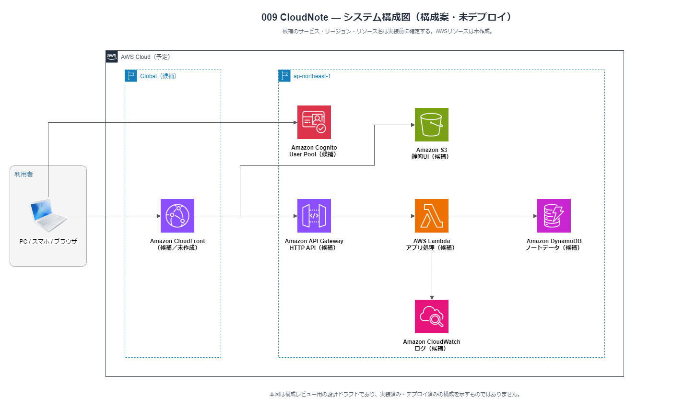

# 009 CloudNote

> Notebook / Section / Page の階層で知識を整理し、タグ・検索・自動保存を提供するノートアプリケーションの計画プロジェクト。

**現在のステータス: 学習用の設計・ローカルUI試作は完了。AWSリソース、認証、API、永続化、デプロイは未実装です。時間のあるときに手動構築Labとして進めます。**

## 目指す体験

- Notebook、Section、Pageを切り替えながら、考えや資料を整理できる
- 編集内容が安全に自動保存され、書き忘れを減らせる
- タグと検索で、後から必要な情報をすぐに探せる
- PCとスマートフォンのどちらでも扱いやすい

## 背景と提供価値

メモや調査結果は、作成時には簡単でも、後から必要な情報を探す・整理し直す・書きかけを失わずに残すことが難しくなりがちです。CloudNoteは、Notebook / Section / Pageという軽い階層、タグと検索、自動保存を組み合わせ、個人の知識整理を継続しやすくすることを目指します。

## 計画中の機能

- サインインとユーザーごとのノート分離
- Notebook / Section / Page の作成、並べ替え、編集、削除
- 下書き状態を含む自動保存と保存状態表示
- タグ付け、全文検索、絞り込み
- エラー表示、レスポンシブUI、操作証跡の記録

## 資料

- 非公開の計画・設計: `../docs/`
- 公開用の変更履歴: [CHANGELOG.md](./CHANGELOG.md)

## システム構成（ドラフト）



構成図はレビュー用の設計案であり、AWSリソースの作成・デプロイは行っていない。レビュー観点は`../docs/構成図レビューガイド.md`を参照する。

```text
ブラウザ
  ├─ ログイン ──> Amazon Cognito（候補）
  └─ HTTPS ──> Amazon CloudFront（候補）
                    ├─ 静的UI ──> Amazon S3（候補）
                    └─ /api/* ──> HTTP API ──> AWS Lambda（候補）
                                                  ├─ ノート・タグ・revision ──> Amazon DynamoDB（候補）
                                                  └─ 最小限の障害イベント ──> Amazon CloudWatch（候補）
```

## 技術選定の考え方

| 構成                                | 採用候補とする理由                                                             |
| ----------------------------------- | ------------------------------------------------------------------------------ |
| Astro + S3 + CloudFront             | 静的UIを低運用負荷で配信し、UIとAPIを同一オリジンにまとめるため                |
| Cognito + Authorization Code + PKCE | アプリ側でパスワードを持たず、安全な標準認証フローを使うため                   |
| HTTP API + JWT Authorizer           | 不正なJWTをLambda到達前に除外し、認証済みの`sub`を所有者分離に使うため         |
| Lambda + DynamoDB                   | 常時稼働サーバーを置かず、CRUD・自動保存の条件付き更新・冪等処理を実現するため |
| CloudWatch                          | 本文を残さず、保存処理などの障害を把握するため                                 |

## 費用の考え方

本プロジェクトは未デプロイであり、請求は発生していません。サーバーレス構成により常時稼働サーバーの固定費を避け、利用量に応じて課金される方式を採る計画です。

- 静的配信、API、関数、データベース、ログは、配信量・リクエスト・実行時間・保存量に応じて変動します。
- 静的配信、API、関数、データベース、ログの利用量を、デプロイ前にAWS Pricing Calculatorで月額上限として確認します。
- 無料枠は見積もりの前提にせず、税・為替・契約条件を含めてユーザー承認後にのみAWS環境を作成します。

料金方式の公式情報: [CloudFront](https://aws.amazon.com/jp/cloudfront/pricing/)、[S3](https://aws.amazon.com/jp/s3/pricing/)、[Cognito](https://aws.amazon.com/jp/cognito/pricing/)、[API Gateway](https://aws.amazon.com/jp/api-gateway/pricing/)、[Lambda](https://aws.amazon.com/jp/lambda/pricing/)、[DynamoDB](https://aws.amazon.com/jp/dynamodb/pricing/)、[CloudWatch](https://aws.amazon.com/cloudwatch/pricing/)。確認日: 2026-08-23。

## 要件との対応状況

現行の候補構成で、認証・利用者別のノート分離・階層CRUD・タグ・自動保存・検索・レスポンシブUIは実現可能です。ただし、次の設計判断を終えるまでは実装着手しません。

1. 検索方式と対象件数・本文長の上限
2. トークン保管/更新/ログアウト、復元・保持期間、DynamoDBアクセスパターン
3. アラーム通知先と、本文を運用者が閲覧しない監視境界

詳細は非公開の`../docs/設計判断記録.md`と`../docs/システム化計画.md`で管理する。

実装対象、公開URL、最終費用見積もりは、上記の決定・ローカル検証・独立レビュー後に更新する。
